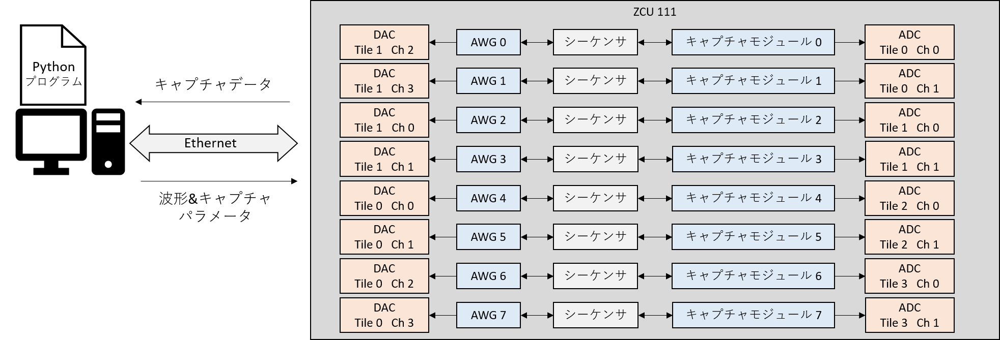

# e-treesカスタマイズバージョンrftool-client向けPython API利用ガイド

ZCU111を利用して任意の波形出力とその応答波形のキャプチャを柔軟かつ簡便に行えることを目的としてしたファームウェアを
制御するPython API利用ガイドです．

ファームウェアの持つ，

- 複数の波形を任意のインターバルでDACから出力
- DAC出力に対する応答をADCからDRAMまたはBRAMにキャプチャ(保存)
- AWGの出力と連動したディジタル出力

の各機能の出力波形のパラメータやキャプチャのタイミングなどを設定することができます．

システム構成は以下の図の通りです．

## 機能別設定手順

- [出力波形設定手順](awg-ja.md) 
- [キャプチャ設定手順](capture-ja.md) 
- [ディジタル出力設定手順](digital-ja.md) 
- [波形シーケンス可視化機能](wave-sequence-vis-ja.md) 

## サンプルプログラム

- [ホスト PC と ZCU 111 の接続を確認する](../examples/setup_verify/README.md)
- [8つのAWGから10サイクルの正弦波を出力しキャプチャする(DRAM/BRAM利用)](awg-x8-send-recv-ja.md)
- [8つのAWGからI/Q変調した波形を出力しADCでI/Qミキサをかけてキャプチャ(DRAM/BRAM利用)](awg-x8-iq-send-iq-recv-ja.md)
- [ディジタル出力の利用](awg-digital-output-ja.md)
- [キャプチャを連続で行う](../examples/continuous_send_recv/README.md)
- [BRAM を使った波形データの送受信](../examples/bram_send_recv/README.md)

### サンプルプログラムの実行に必要な環境

- ZCU111およびe-trees.Japan製ZCU111ファームウェア
- Python 3.7.5
- NumPy, matplotlib，など

