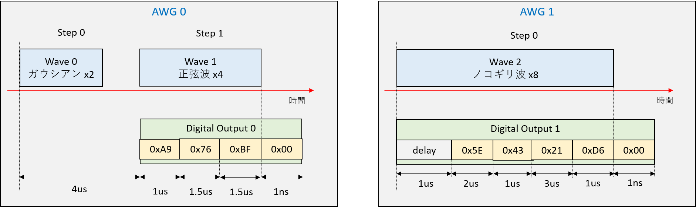
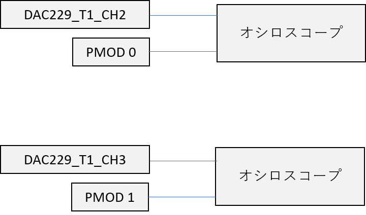
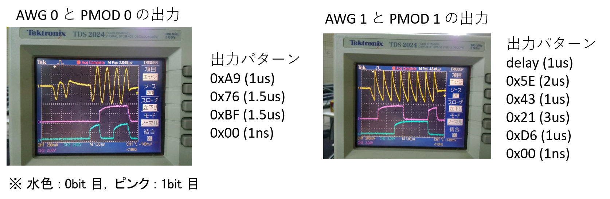

# ディジタル出力の利用例

[awg_digital_output.py](../awg_digital_output.py) は，2つの DAC から波形を出力して，それと連動するデジタル値を出力するものです．
AWGから出力される波形は，
- AWG 0 (DAC Tile1, Ch2) → ガウシアンx2, 正弦波ｘ4   (1MHz)
- AWG 1 (DAC Tile1, Ch3) → ノコギリ派x8  (1MHz)
で，出力波形とディジタル出力パタンのタイミングは次の図の通りです．



## セットアップ

DAC と PMOD とオシロスコープを以下のように接続します．



## 実行

```
python awg_digital_output.py
```

として実行します．実行時のDACとPMOD下位2bitをオシロスコープで観察すると，以下のように動作を確認することができます．


