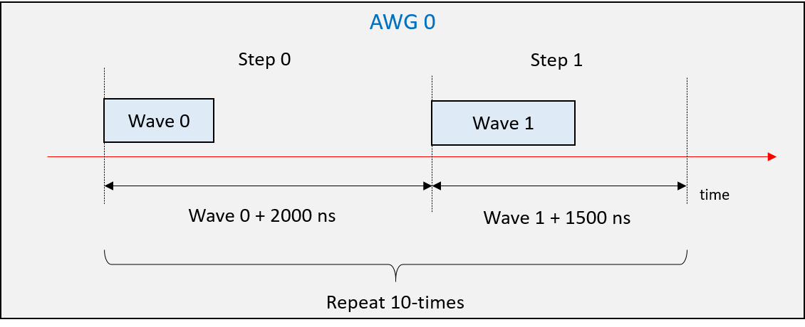

# 出力波形設定手順

AWGから波形を出力するには，以下の3つの手順を実行します．

1. 波形の定義
1. 波形の出力順と出力タイミングの決定(= 波形シーケンスの定義)
1. 波形シーケンスのAWGへの登録


## 波形の定義 - 組み込み波形の利用

波形の定義には `awgsa` パッケージの `AwgWave`クラスを利用します．
このクラスのコンストラクタで，各波形のパラメタ(周波数，位相，出力サイクル数など)を設定し出力波形を定義します．

### API使用例

10MHzの正弦波を4周期分出力する場合

```
wave_0 = awgsa.AwgWave(
    wave_type = awgsa.AwgWave.SINE,
	frequency = 10.0,
	phase = 0,
	amplitude = 30000,
	num_cyles = 4)
```

8MHzのノコギリ波を3周期分出力する場合

```
wave_1 = awgsa.AwgWave(
    wave_type = awgsa.AwgWave.SAWTOOTH,
	frequency = 8.0,
	phase = 0,
	amplitude = 30000,
	num_cyles = 3,
	crest_pos = 1.0)
```

## 波形の定義 - 任意波形出力機能の利用

任意波形出力機能は，ユーザが独自に定義した波形を出力する機能です．
出力値は Python スクリプトで作成します．(要 NumPy)
AWG の組み込みの波形を AwgWave クラスで定義するのに対し，任意波形は以下の様に AwgAnyWave クラスを用いて定義します．

```
wave_0 = awgsa.AwgAnyWave(samples = samples, num_cyles = 10)
```

`samples`は出力値の配列です．`dtype` が `numpy.int16` の `numpy.ndarray` 型の値を設定します．`num_cycles`は`samples`で指定したデータを繰り返し出力する回数です．

## 波形シーケンスの定義

波形シーケンスの定義には，`awgsa` パッケージの `WaveSequence` クラスとそのメソッド `add_step` を使用します．
この API により `AwgWave` で定義した波形にステップ ID を割り当て、シーケンス内の出力順序と出力間隔を決定します．
`post_blank` は，波形ステップの波形に続く空白期間となります．引数を省略した場合は 0 となります．

たとえば，次のように波形シーケンスを定義します．

```
wave_sequence_0 = (awgsa.WaveSequence(DAC_FREQ)
    .add_step(step_id = 0, wave = wave_0, post_blank = 2000)
    .add_step(step_id = 1, wave = wave_1, post_blank = 1500))
```

定義される波形シーケンスは次の通りです．


## 波形シーケンスのAWGへの登録

波形シーケンスのAWGへの登録には，`RftoolClient` パッケージの `AwgSaCommand` クラスとそのメソッド `set_wave_sequence` を使用します．この API で波形シーケンスとそれを出力する AWG の対応付けが行われます．

たとえば，次のようにAPIを利用します．

```
awg_sa_cmd.set_wave_sequence(
    awg_id = awgsa.AwgId.AWG_0, # AWG_0〜AWG_7まで設定可能
	wave_sequence = wave_sequence_0,
	num_repeats = 10)
```



## 波形ステップの空白期間に関する補足

波形ステップの空白期間は，前述の `post_blank` によって指定できますが，実際の HW が出力する波形の空白期間は，指定値より増える場合があります．
実際の空白期間は，波形ステップ全体の出力サンプル数によって決まり，以下の式で算出できます．

A = post_blank [ns]  
B = DAC サンプリングレート [Msps]  
C = 出力波形の周波数 [MHz]  
D = 出力波形のサイクル数  
E = floor (A * B / 1000)  
F = E + floor (B / C) * D  

**【F が96 未満の場合】**  
空白期間 [ns] = 1000 * (96 - F + E) / B

**【F が 96 以上でかつ 32 の倍数でない場合】**  
G = ceil (F / 32) * 32 - F + E  
空白期間 [ns] = 1000 * G / B  

**【F が 96 以上でかつ 32 の倍数の場合】**  
空白期間 [ns] = 1000 * E / B  

※ floor (x) = x の小数点以下を切り捨てた値  
※ ceil (x) = x の小数点以下を切り上げた値  

実際の波形間の空白期間は，エクセルシート([examples/awg_measure_wave_gap/wave_gap_calc.xlsx](../examples/awg_measure_wave_gap/wave_gap_calc.xlsx)) でも計算できます．
