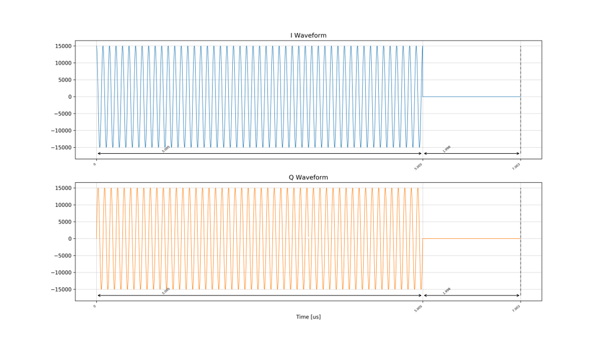
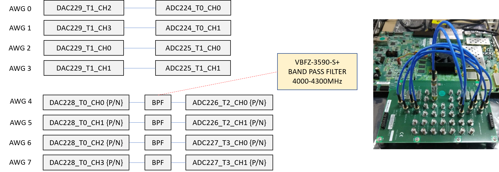
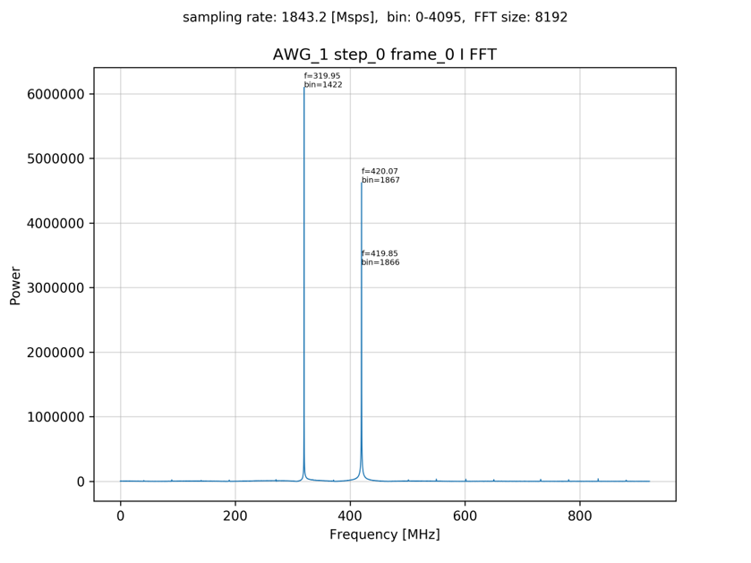
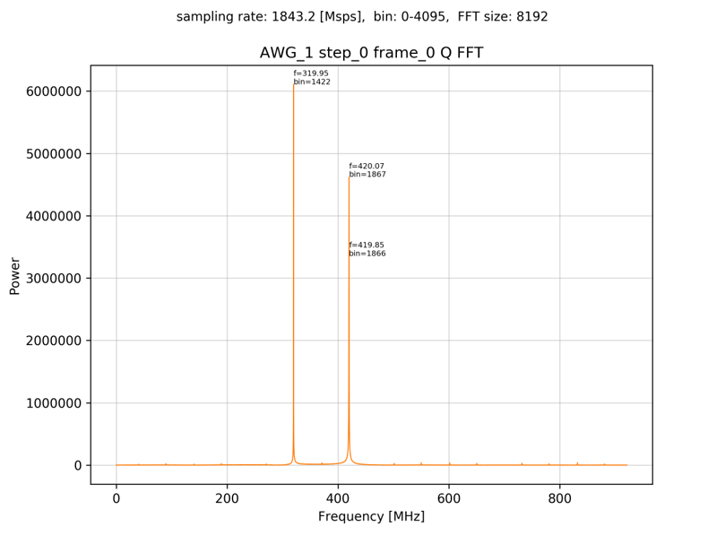
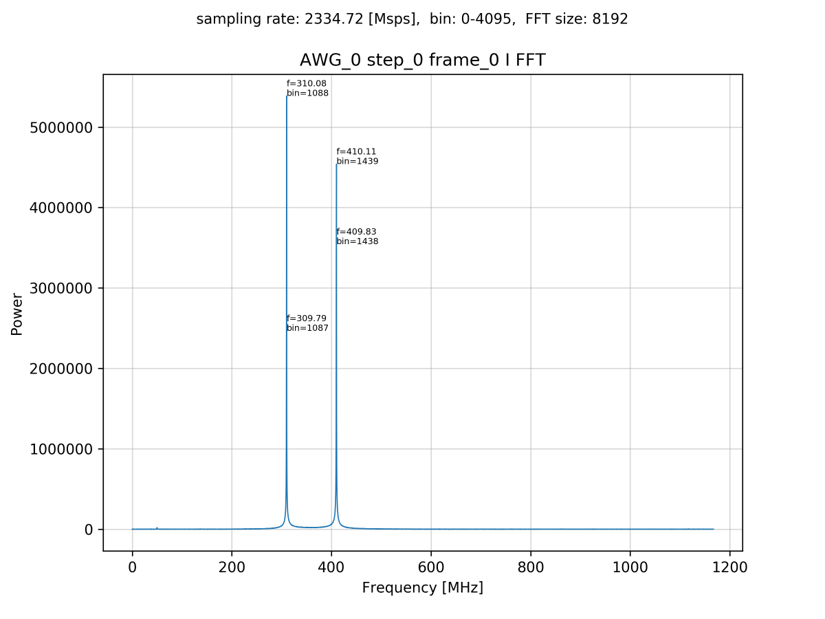
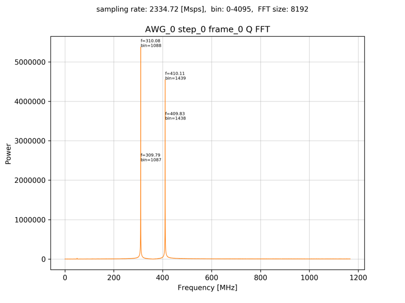

# 8つのAWGからI/Q変調した波形を出力しADCでI/Qミキサをかけてキャプチャ

[awg_x8_iq_send_iq_recv.py](../awg_x8_iq_send_iq_recv.py) は，8つの AWG からI/Q変調した波形を出力し，それをADCでI/Qミキサをかけてキャプチャするものです．結果はキャプチャした波形のスペクトルをIとQに分けて出力します．



## セットアップ

ADCとDACを以下のように接続します．



差動入出力を接続する際は，付属の BPF を取り付けた SMA ケーブルで接続します．

## DRAM利用

```
python awg_x8_iq_send_iq_recv.py
```

として実行します．

カレントディレクトリの下の `plot_awg_x8_iq_send_iq_recv` ディレクトリの中に各 AWG ごとに I データと Q データのスペクトルのグラフが作成されます．スペクトルのピークが現れる位置は，同スクリプトのファイルコメントを参照してください．

キャプチャモジュール1のIデータスペクトル  


キャプチャモジュール1のQデータスペクトル  


## BRAM利用

```
python awg_x8_iq_send_iq_recv.py prv_cap_ram
```

として実行します．

カレントディレクトリの下の `plot_awg_x8_iq_send_iq_recv_prv_cap_ram` ディレクトリの中に各 AWG ごとに I データと Q データのスペクトルのグラフが作成されます．スペクトルのピークが現れる位置は，同スクリプトのファイルコメントを参照してください．

キャプチャモジュール1のIデータスペクトル  


キャプチャモジュール1のQデータスペクトル  


