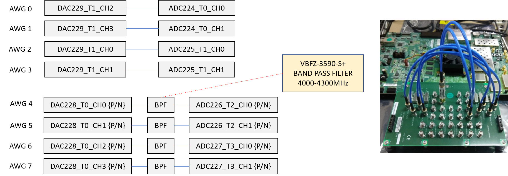
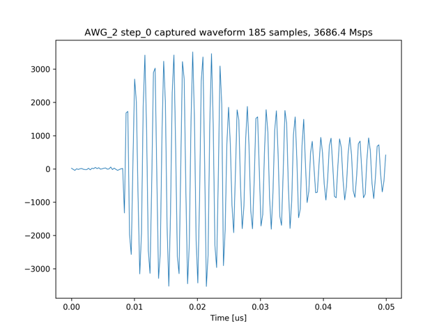

# 8つのAWGから10サイクルの正弦波を出力しキャプチャする

[awg_x8_send_recv.py](../awg_x8_send_recv.py) は，8つの AWG から特定の周波数の波形を出力し，それをキャプチャするものです．
出力される波形は、10サイクルの正弦波と出力期間 2.5[us] の正弦波で，どちらも周波数は同じです．
キャプチャデータのうち，10サイクルの正弦波はそのままグラフとして出力され，2.5[us] の正弦波は FFT スペクトルの計算に使用されます．


## セットアップ

次のようにADCとDACを接続します．



差動入出力を接続する際は，付属の BPF を取り付けた SMA ケーブルで接続します．

## DRAMを利用する場合

以下のコマンドを実行します．

```
python awg_x8_send_recv.py
```

8つの AWG に対応するキャプチャ波形とスペクトルのグラフが，カレントディレクトリの下の `plot_awg_x8_send_recv` ディレクトリ以下に8枚ずつ作成されます．

LPF内蔵ポート(AWG0とAWG1のDAC/ADCポート)のキャプチャの波形例


HPF内蔵ポート(AWG2とAWG3のDAC/ADCポート)のキャプチャの波形例


差動入出力ポート(AWG4〜AWG7のDAC/ADCポート)のキャプチャの波形例


LPF内蔵ポート(AWG0とAWG1のDAC/ADCポート)のキャプチャ波形のスペクトル例


HPF内蔵ポート(AWG2とAWG3のDAC/ADCポート)のキャプチャ波形のスペクトル例


差動入出力ポート(AWG4〜AWG7のDAC/ADCポート)のキャプチャ波形のスペクトル例


## BRAMを利用する場合

以下のコマンドを実行します．

```
python awg_x8_send_recv.py prv_cap_ram
```

8つの AWG に対応するキャプチャ波形とスペクトルのグラフが，カレントディレクトリの下の `plot_awg_x8_send_recv_prv_cap_ram` ディレクトリ以下に8枚ずつ作成されます．

LPF内蔵ポート(AWG0とAWG1のDAC/ADCポート)のキャプチャの波形例


HPF内蔵ポート(AWG2とAWG3のDAC/ADCポート)のキャプチャの波形例


差動入出力ポート(AWG4〜AWG7のDAC/ADCポート)のキャプチャの波形例


LPF内蔵ポート(AWG0とAWG1のDAC/ADCポート)のキャプチャ波形のスペクトル例


HPF内蔵ポート(AWG2とAWG3のDAC/ADCポート)のキャプチャ波形のスペクトル例


差動入出力ポート(AWG4〜AWG7のDAC/ADCポート)のキャプチャ波形のスペクトル例

