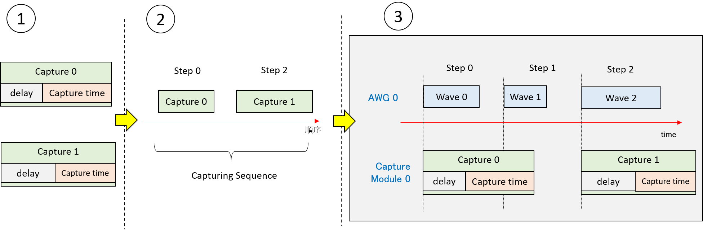
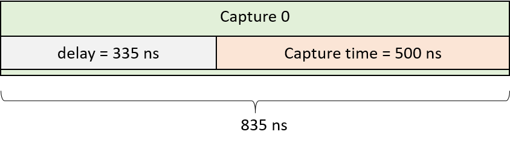
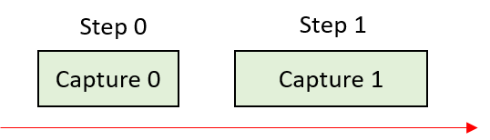
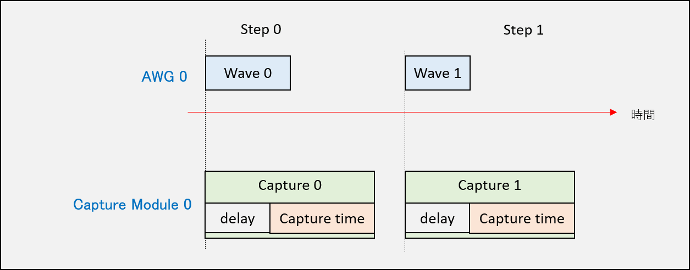
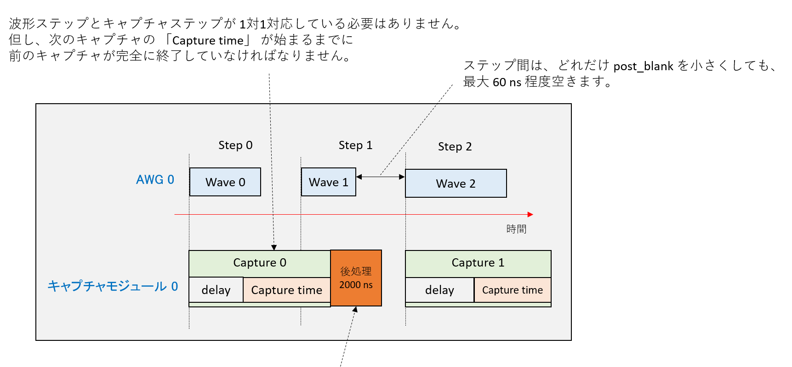

# キャプチャ設定手順

ADC から入力される波形をキャプチャするには，以下の3つの手順を実行します．

1. キャプチャの定義
1. キャプチャの実行順序の決定  (= キャプチャシーケンスの定義)
1. キャプチャシーケンスの登録 – キャプチャ開始タイミングをキャプチャモジュールと対応づける



## キャプチャの定義

キャプチャの定義には，`awgsa` パッケージの `AwgCapture` クラスを使用します．
このクラスのコンストラクタで，各キャプチャのパラメータ (ディレイ、キャプチャ時間，積算の有効・無効) を設定します．
ディレイとは，キャプチャの起点となる時刻 (具体的には，キャプチャが登録されたステップの開始時刻) から，実際に ADC データを取り込むまでの時間です．
積算を有効にすると，波形シーケンスを繰り返し実行したときに，各シーケンスでキャプチャした値を同じステップごとに積算して保存します．

次のようにAPIを利用します．

```
capture_0 = awgsa.AwgCapture(
    time = 500,
	delay = 335,
	do_accumulation = False)
```

次のようなキャプチャ設定が定義されます．




## キャプチャシーケンスの定義

キャプチャシーケンスの定義には，`awgsa` パッケージの `CaptureSequence` クラスとそのメソッド `add_step` を使用します．
この API により `AwgCapture` で定義したキャプチャにステップ ID を割り当てます．
`delay` を含めたキャプチャは，割り当てたステップ ID と同じ ID の波形ステップが始まるタイミングで実行されます．
そのため，キャプチャに割り当てるステップID と同じ ID の波形ステップが AWG に登録済みでなければなりません．
波形ステップが存在しないステップ ID にキャプチャを割り当てた場合，キャプチャモジュールへのキャプチャシーケンスの登録に失敗します．

API使用例は次の通りです．

```
capture_sequence_0 = (awgsa.CaptureSequence(ADC_FREQ, is_iq_data = False)
    .add_step(step_id = 0, capture = capture_0)
    .add_step(step_id = 1, capture = capture_1))
```

定義されるキャプチャシーケンスは次の通りです．



## キャプチャシーケンスの登録

キャプチャシーケンスの登録では，以下の2つのクラスとメソッドを使用します
- `CaptureConfig` クラスと `add_capture_sequence` メソッド (`awgsa` パッケージ)
- `AwgSaCommand` クラスとそのメソッド `set_capture_config` (`RftoolClient` パッケージ)
これらの API でキャプチャシーケンスとそれを実行するキャプチャモジュールの対応付けが行われます．

### 注意事項
`set_capture_config` は `set_wave_sequence` で波形シーケンスを登録した後に呼ばなければなりません．
また，キャプチャモジュールに設定する全てのキャプチャシーケンスは `CaptureConfig` オブジェクトにひとまとめにして，全て同時に `set_wave_sequence` で登録しなければなりません．

### 使用例

APIの使用例とその動作例は次の通りです．

```
# キャプチャシーケンスとキャプチャモジュールを対応づける
capture_config = (awgsa.CaptureConfig()
    .add_capture_sequence(awgsa.AwgId.AWG_0, capture_sequence_0) # AWG_0〜AWG_7を設定可能
    .add_capture_sequence(awgsa.AwgId.AWG_1, capture_sequence_1))
# キャプチャモジュールにキャプチャシーケンスを設定する
awg_sa_cmd.set_capture_config(capture_config)
```



## キャプチャシーケンスに関する補足



