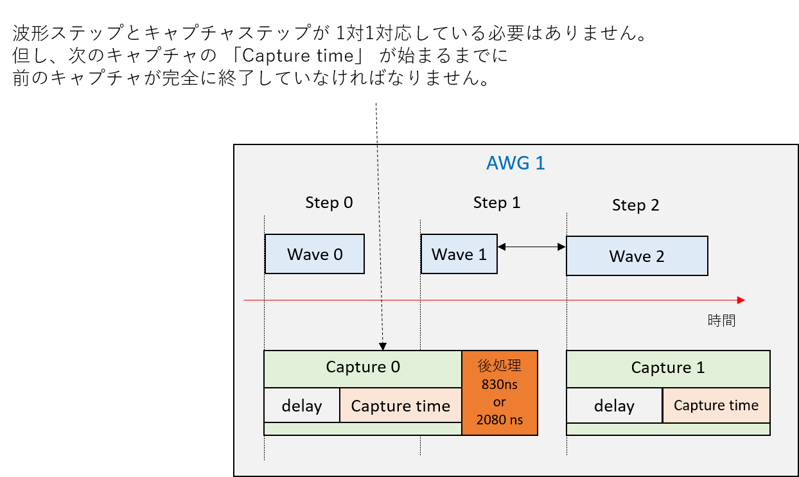

# キャプチャ設定手順

ADC から入力される波形をキャプチャするには，以下の3つの手順を実行します．

1. キャプチャの定義
1. キャプチャの実行順序の決定  (= キャプチャシーケンスの定義)
1. キャプチャシーケンスの登録 – キャプチャ開始タイミングをキャプチャモジュールと対応づける


## キャプチャの定義

キャプチャの定義には、ウィンドウ付きとウィンドウなしの 2 種類が存在し、それぞれ使用する API とキャプチャデータの処理方法が異なります。

### ウィンドウなしキャプチャの定義

ウィンドウなしキャプチャの定義には，`rftoolclient.awgsa` パッケージの `AwgCapture` クラスを使用します．
このクラスのコンストラクタで，各キャプチャのパラメータ (ディレイ、キャプチャ時間，積算の有効・無効) を設定します．
ディレイとは，キャプチャの起点となる時刻 (具体的には，キャプチャが登録されたステップの開始時刻) から，実際に ADC データを取り込むまでの時間です．
積算を有効にすると，波形シーケンスを繰り返し実行したときに，ループ間で同じ ID を持つステップのキャプチャデータをサンプルごとに積算して保持します。

次のようにAPIを利用します．

```
import rftoolclient.awgsa as awgsa

capture_0 = awgsa.AwgCapture(
    time = 500,
	delay = 335,
	do_accumulation = False)
```

次のようなキャプチャ設定が定義されます．


### ウィンドウ付きキャプチャの定義

ウィンドウ付きキャプチャの定義には，`rftoolclient.awgsa` パッケージの `WindowedAwgCapture` クラスを使用します．
このクラスのコンストラクタで，各キャプチャのパラメータ (ディレイ、ウィンドウ幅，ウィンドウの数) を設定します．
ウィンドウ付きキャプチャでは，ウィンドウ単位で ADC データをキャプチャし，ウィンドウ同士をサンプルごとに足し合わせて保持します。
波形シーケンスを繰り返し実行した場合，各ループでの積算結果を全て足し合わせてキャプチャデータを保持します。

パラメータ設定時の注意事項として，ウィンドウ幅は，この間にキャプチャされる ADC サンプル数が 16 以上になるように設定しなければなりません。また、ウィンドウの数に負の値を指定すると，強制停止するまでウィンドウ同士の積算を続けます．

次のようにAPIを利用します．

```
import rftoolclient.awgsa as awgsa

capture_0 = awgsa.AwgWindowedCapture(
    time = 100, # ns
    num_windows = 3,
    delay = 335)
```

次のようなキャプチャ設定が定義されます．
この例では，3 つのウィンドウがサンプルごとに足し合わされ，キャプチャデータとして 100[ns] 分のサンプルが保持されます．


※ウィンドウ付きキャプチャは，Non-MTS DRAM キャプチャ版 AWG SA デザインでのみ使用可能です．

## キャプチャシーケンスの定義

キャプチャシーケンスの定義には，`rftoolclient.awgsa` パッケージの `CaptureSequence` クラスとそのメソッド `add_step` を使用します．
この API により `AwgCapture` で定義したキャプチャにステップ ID を割り当てます．
`delay` を含めたキャプチャは，割り当てたステップ ID と同じ ID の波形ステップが始まるタイミングで実行されます．
そのため，キャプチャに割り当てるステップID と同じ ID の波形ステップが AWG に登録済みでなければなりません．
波形ステップが存在しないステップ ID にキャプチャを割り当てた場合，キャプチャモジュールへのキャプチャシーケンスの登録に失敗します．

API使用例は次の通りです．

```
import rftoolclient.awgsa as awgsa

capture_sequence_0 = (awgsa.CaptureSequence(ADC_FREQ, is_iq_data = False)
    .add_step(step_id = 0, capture = capture_0)
    .add_step(step_id = 1, capture = capture_1))
```

定義されるキャプチャシーケンスは次の通りです．


## キャプチャシーケンスの登録

キャプチャシーケンスの登録では，以下の2つのクラスとメソッドを使用します
- `rftoolclient.awgsa.CaptureConfig` クラスとそのメソッド `add_capture_sequence`
- `rftoolclient.AwgSaCommand` クラスとそのメソッド `set_capture_config`

### 注意事項
`set_capture_config` は `set_wave_sequence` で波形シーケンスを登録した後に呼ばなければなりません．
また，キャプチャモジュールに設定する全てのキャプチャシーケンスは `CaptureConfig` オブジェクトにひとまとめにして，同時に `set_capture_config` で登録しなければなりません．

### 使用例

APIの使用例とその動作例は次の通りです．

```
import rftoolclient as rftc
import rftoolclient.awgsa as awgsa

with rftc.RftoolClient(logger) as client:
    # キャプチャシーケンスとキャプチャモジュールを対応づける
    capture_config = (awgsa.CaptureConfig()
        .add_capture_sequence(awgsa.AwgId.AWG_0, capture_sequence_0) # AWG_0〜AWG_7を設定可能
        .add_capture_sequence(awgsa.AwgId.AWG_1, capture_sequence_1))

    # キャプチャモジュールにキャプチャシーケンスを設定する
    client.awg_sa_cmd.set_capture_config(capture_config)
```


## キャプチャデータの取得

キャプチャデータの取得には，`AwgSaCommand` クラスの `read_capture_data` メソッドを使用します．
キャプチャパラメータの設定によっては，キャプチャステップがスキップされたり，ADC データの取りこぼしが発生する場合があるので，
キャプチャデータの取得前には，同クラスの `is_capture_step_skipped` メソッドと `is_capture_data_fifo_overflowed` メソッドを使って，これらのエラーが発生していないかチェックしてください．

### 使用例

APIの使用例とその動作例は次の通りです．

```
import rftoolclient as rftc
import rftoolclient.awgsa as awgsa

with rftc.RftoolClient(logger) as client:
    # キャプチャエラーチェック
    if client.awg_sa_cmd.is_capture_step_skipped(awgsa.AwgId.AWG_0, step_id = 1):
        raise Exception("キャプチャモジュール 0 のキャプチャステップ 1 がスキップされました")

    if client.awg_sa_cmd.is_capture_data_fifo_overflowed(awgsa.AwgId.AWG_0, step_id = 1):
        raise Exception("キャプチャモジュール 0 のキャプチャステップ 1 で ADC データの取りこぼしが発生しました")

    # キャプチャデータの取得
    capture_data = client.awg_sa_cmd.read_capture_data(awgsa.AwgId.AWG_0, step_id = 1)

```

## キャプチャシーケンスに関する補足



### キャプチャの後処理
各キャプチャには後処理が必要で，BRAMキャプチャ版および MTS 版では 830 ns 程度かかり，DRAM キャプチャ版では 2080 ns 程度かかります．通常，キャプチャのタイミングは，この後処理時間を考慮して決めなければなりませんが，ADC のサンプリングレートやキャプチャ時間などの条件によっては，後処理を次のキャプチャの間に終えることができるので，
その場合，後処理が無いものとしてキャプチャのタイミングを決められます．
詳細は，example/awg_x8_continuous_send_recv 以下の [README.md](../examples/awg_x8_continuous_send_recv/README.md) ファイルを参照してください．
