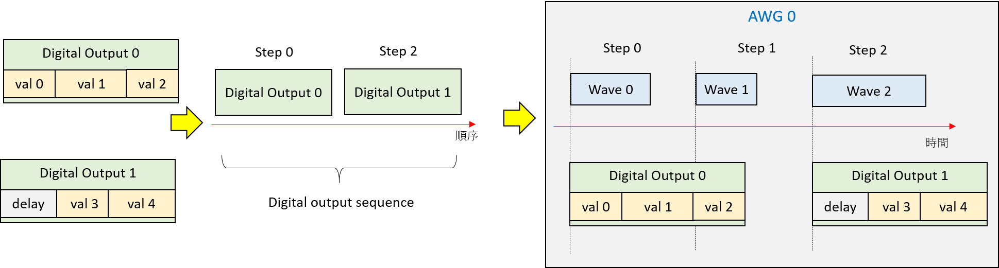
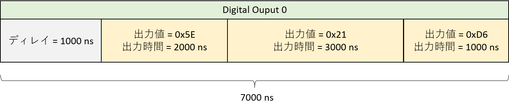
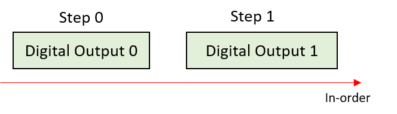
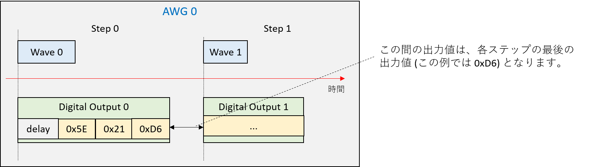
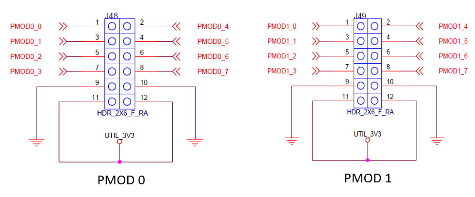

# ディジタル出力機能

ディジタル出力機能を利用するには，以下の3つの手順を実行します．

- 出力パターンの定義
- パターンの出力順序の決定  (= ディジタル出力シーケンスの定義)
- ディジタル出力シーケンスの AWG への登録



## ディジタル出力パタンの定義

ディジタル出力パタンの定義には，`rftoolclient.awgsa` パッケージの `DigitalOutputVector` クラスを使用します．
このクラスのメソッドで，各パタンのパラメータ (出力値，出力時間，ディレイ) を設定します．
ディレイとは，ディジタル出力の基準となる時刻 (具体的には，ディデジタル出力パタンが登録されたステップの開始時刻) から，実際にディジタル値を出力するまでの時間です．

```
import rftoolclient.awgsa as awgsa

dout_1 = (awgsa.DigitalOutputVector(delay=1000.0)
    .append_data(0x5E, 2000)
	.append_data(0x21, 3000)
	.append_data(0xD6, 1000))
```

次のような出力パタンが定義されます．



## ディジタル出力シーケンスの定義

デジタル出力シーケンスの定義には，`rftoolclient.awgsa` パッケージの `DigitalOutputSequence` クラスとそのメソッド `add_step` を使用します．
この API により `DigitalOutputVector` で定義した出力パターンに，ステップ ID を割り当てます．
ディレイを含めたデジタル値の出力は，ここで割り当てたステップ ID と同じ ID の波形ステップが始まるタイミングで開始されます．
よって，出力パターンに割り当てるステップID と同じ ID の波形ステップが AWG に登録済みでなければなりません．
波形ステップが存在しないステップ ID にデジタル出力パターンを割り当てた場合，AWG へのデジタル出力シーケンスの登録に失敗します．

```
import rftoolclient.awgsa as awgsa

dout_sequence_0 = (awgsa.DigitalOutputSequence()
    .add_step(step_id = 0, dout_vec = dout_0)
	.add_step(step_id = 1, dout_vec = dout_1))
```

次のようなディジタル出力シーケンスが定義されます．



## ディジタル出力シーケンスの登録

デジタル出力シーケンスのAWGへの登録には，`rftoolclient` パッケージの `AwgSaCommand` クラスとそのメソッド `set_digital_output_sequence` を使用します．この API でデジタル出力シーケンスとそれを出力する AWG の対応付けが行われます．

```
import rftoolclient as rftc
import rftoolclient.awgsa as awgsa

with rftc.RftoolClient(logger) as client:
	client.awg_sa_cmd.set_digital_output_sequence(
		awg_id = awgsa.AwgId.AWG_0,
		dout_sequence = dout_sequence_0)
```

シーケンスは次のようにAWGと関連づけされます．



## AWGと出力インターフェースの対応関係

Python API で設定したデジタル値は，ZCU111 の PMOD インタフェースから出力されます．設定時に指定した AWG によって，出力先の PMOD インタフェースが変わります．

AWG と PMOD の対応は次の通りです．

- AWG 0 -> PMOD 0
- AWG 1 -> PMOD 1

次の図の `PMOD*_0` ～ `PMOD*_7` が設定時の出力値の `0` ～ `7`bit 目に対応します．


