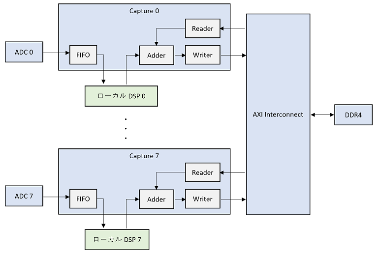
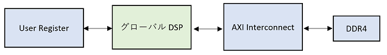
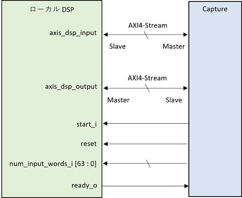
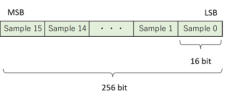
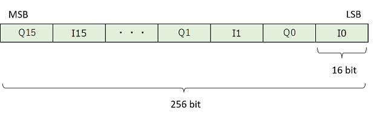
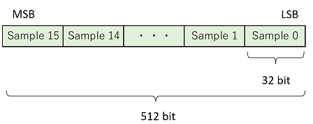
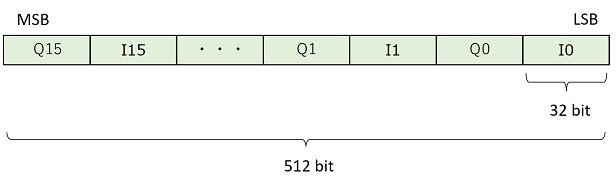
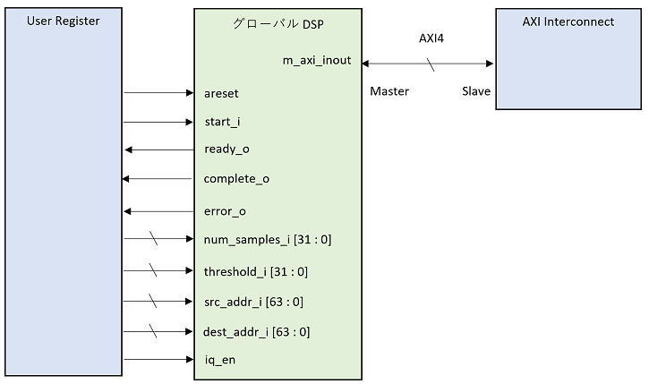

# DSP デザイン概要

DSP デザインは，既存の DRAM 版 AWG SA デザインに，ユーザ独自のデジタル信号処理を加える際のサンプルとなるデザインです．
DSP デザインは，DRAM 版 AWG SA デザインから Spectrum Analyzer を取り除き，2 種類の DSP モジュール (ローカルとグローバル) を追加したものです．
ローカル DSP モジュールは，AWG から DRAM への各データパス上に接続されており，
グローバル DSP モジュールは，DRAM と AXI Interconnect を介して接続されています．

**ローカル DSP の配置**  

**グローバル DSP の配置**  

DSP デザインでは，ローカル DSP としてタップ数 17 の FIR フィルタが実装されており，
グローバル DSP として二値化処理が実装されています．
これらのモジュールを独自の DSP モジュールと置き換えることで，デザインのカスタマイズが可能になっています．その際，DSP モジュールのインタフェースは以下の仕様に従わなければなりません．

## ローカル DSP のインタフェース仕様

| ポート/バス名 | 説明  |
| ---- | ---- |
| axis_dsp_input  | キャプチャモジュールから DSP モジュールへとキャプチャデータが送られる AXI4-Stream バス．|
| axis_dsp_output | DSP モジュールからキャプチャモジュールへと DSP 結果データが送られる AXI4-Stream バス．  |
| start_i | 処理開始信号．各キャプチャステップの開始時に 1 サイクルのパルス信号が入力される．この信号が Hi になってから各 AXI4-Stream バスのデータ転送を始めること．  |
| reset | リセット信号．キャプチャモジュールがリセットされたときとターミネートされたときに Hi になる．|
| num_input_words_i | 各キャプチャステップで処理するキャプチャワード数を示す．start_i が Hi になった後，このポートの値だけ axis_dsp_input のデータポート (s_axis_tdata_i) からデータ読み出し，同じ数だけ axis_dsp_output データポート (m_axis_tdata_o) にデータを書き込むこと．start_i が Hi のとき有効な値が入力される． |
| ready_o | 動作準備完了フラグ．DSP モジュールの処理を開始可能な場合 Hi にしておき，処理中は Lo にしておく．キャプチャモジュールは，この信号を元に start_i によって処理の開始を命令する． |

ローカル DSP が受信するサンプリングデータのフォーマットは以下の通りです．

**axis_dsp_input のデータポートの Real データフォーマット**  

**axis_dsp_input のデータポートの I/Q データフォーマット**  

キャプチャ時のオプション機能である「積算」を有効にする場合は，ローカル DSP から送信するサンプルデータを以下のフォーマットに合わせてください．

**axis_dsp_output のデータポートの Real データフォーマット**  

**axis_dsp_output のデータポートの I/Q データフォーマット**  

## グローバル DSP のインタフェース仕様

| ポート/バス名 | 説明  |
| ---- | ---- |
| m_axi_inout | DRAM にアクセスするための AXI4 バス．DRAM から読みだした際のデータフォーマットは，ローカル DSP の axis_dsp_output のフォーマットと同じ．|
| areset | 非同期リセット信号． `AwgSaCommand.reset_dsp` メソッドを呼ぶと Hi → Lo と変化する．|
| start_i | 処理開始信号. `AwgSaCommand.start_dsp` メソッドを呼ぶと Hi → Lo と変化する．立ち上がりを検出すること．|
| ready_o | 動作準備完了フラグ．Hi のとき，`AwgSaCommand.is_dsp_ready` メソッドが True を返す．|
| complete_o | 処理完了信号．`AwgSaCommand.is_dsp_complete` メソッドで状態を取得可能．|
| error_o | エラーフラグ．`AwgSaCommand.is_dsp_complete` メソッドで状態を取得可能．|
| num_samples_i | 処理サンプル数． `AwgSaCommand.set_dsp_param` で値を設定可能．|
| src_addr_i | 処理するデータの先頭アドレス． `AwgSaCommand.set_dsp_param` で値を設定可能．|
| dest_addr_i | 処理結果の格納先アドレス． `AwgSaCommand.set_dsp_param` で値を設定可能．| 
| iq_en | I/Q データフラグ．`AwgSaCommand.set_dsp_param` で値を設定可能．|
| dsp_param_0 ~ 3 | 汎用パラメータレジスタ．`AwgSaCommand.set_dsp_param` で値を設定可能．|

完了/エラーフラグと `AwgSaCommand.is_dsp_complete` の戻り値の関係
|complete_o | error_o | AwgSaCommand.is_dsp_complete の戻り値|
| ---- | ---- | ---- |
Lo | Lo | AwgSaCmdResult.DSP_NOT_COMPLETE |
Lo | Hi | AwgSaCmdResult.DSP_ERROR |
Hi | Lo | AwgSaCmdResult.DSP_COMPLETE |
Hi | Hi | AwgSaCmdResult.DSP_ERROR |

`AwgSaCommand.set_dsp_param` のパラメータ ID とポートの関係
| パラメータ ID | ポート |
| ---- | ---- |
DspParamId.SRC_ADDR | src_addr_i |
DspParamId.DEST_ADDR | dest_addr_i |
DspParamId.NUM_SAMPLES | num_samples_i |
DspParamId.IQ_FLAG | iq_en |
DspParamId.GENERAL_0 ~ 3 | dsp_param_0 ~ 3 |
