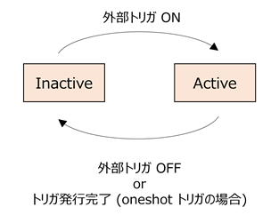

# 外部トリガ機能

## 概要
外部トリガ機能は，ADC に入力されるデータが特定の条件を満たしたとき，AWG の動作を開始する機能です．
この機能は，現在，Non-MTS BRAM 版 AWG SA デザインにのみ実装されており，そのアーキテクチャは下の図の様になります．

外部トリガの発行を制御する ADC データは，ADC 0 または ADC 4 から入力可能です．
外部トリガモジュールは，Active と Inactive の 2 つの状態を持っており，Active 状態のときに ADC サンプルデータがトリガ発行条件を満たせば，トリガ信号が全ての AWG に向けて送出されます．外部トリガモジュールの状態は，専用の Python API で変更可能です．

各 AWG は，トリガモードを変更することでスタート信号を選択することができます．
トリガモードは，「外部トリガ」と「マニュアルトリガ」を選択可能となっており，「外部トリガ」を選ぶと外部トリガモジュールのトリガ信号で動作を開始し，
「マニュアルトリガ」を選ぶと Python API (AwgSaCommand.start_wave_sequence) を呼んだ時に動作を開始します．

## 外部トリガ制御 API 
外部トリガ機能を扱うための主な Python API を以下に示します．
パラメータの詳細や使用例は、各メソッドの docstring やサンプルプログラム
 ([awg_x8_external_trigger_1.py](../examples/awg_x8_external_trigger/awg_x8_external_trigger_1.py)，
 [awg_x8_external_trigger_2.py](../examples/awg_x8_external_trigger/awg_x8_external_trigger_2.py)，
 [awg_continual_external_trigger.py](../examples/awg_continual_external_trigger/awg_continual_external_trigger.py)) を参照してください．

**`AwgSaCommand.set_trigger_mode(awg_id, trig_mode)`**

`awg_id` で指定したAWG のトリガモードを指定します．
トリガモードは、TriggerMode.MANUAL (マニュアルトリガ) と TriggerMode.EXTERNAL (外部トリガ) を指定できます．

***
**`AwgSaCommand.set_external_trigger_param(ext_trig_id, param_id, param)`**

`ext_trig_id` で指定した外部トリガモジュールにトリガ条件を制御するパラメータを指定します．
`param_id` はパラメータの番号で，現在の実装では 0 か 1 が指定可能となっており，0 がトリガ方式の設定で，1 が ADC サンプルデータの閾値 (-32768 ～ 32767) となっています．
`param` はそれぞれのパラメータに設定するパラメータ値です．

|トリガ方式|パラメータ値|
|:-:|:-:|
ADC サンプルデータが閾値以下になったときにトリガを発行する | 0
ADC サンプルデータが閾値以上になったときにトリガを発行する | 1
ADC サンプルデータが閾値を上から下に跨いだ時にトリガを発行する | 2
ADC サンプルデータが閾値を下から上に跨いだ時にトリガを発行する | 3

***
**`AwgSaCommand.external_trigger_on(*ext_trig_id_list, oneshot = True)`**

`ext_trig_id_list` で指定した全ての外部モジュールを Active 状態にします．
`oneshot` が `True` の場合，外部トリガモジュールはトリガを発行後，自動的に Inactive 状態になります．
`False` の場合，トリガ発行後も `Active` 状態にとどまるので，トリガ条件を満たせば連続してトリガを発行することができます．

***
**`AwgSaCommand.external_trigger_off(*ext_trig_id_list)`**

`ext_trig_id_list` で指定した全ての外部モジュールを Inactive 状態にします．
