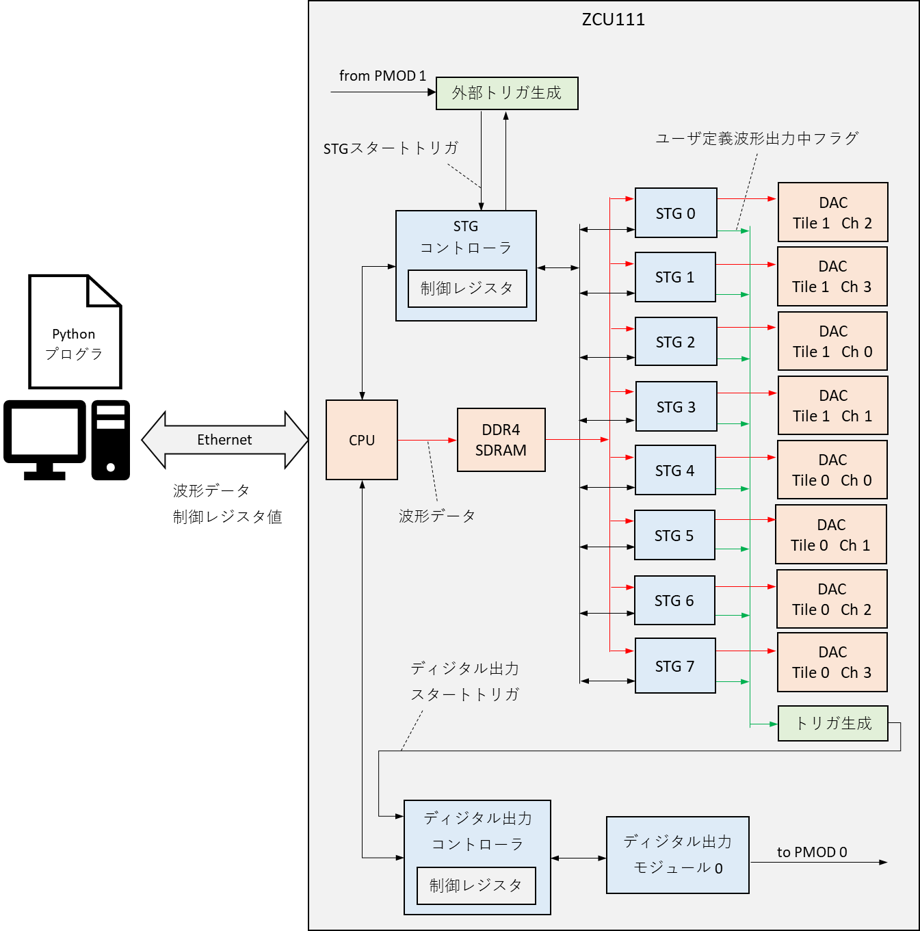

# ディジタル出力モジュールユーザマニュアル

本資料は，ZCU111 を利用したディジタル出力モジュールの利用者向けマニュアルです．

## 1. システム構成

ディジタル出力モジュールは ZCU111 の FPGA 上に実装されており，そのシステム構成は以下のようになります．
ディジタル出力モジュールの制御には専用の Python API を用います．
この API には Python で作成したディジタル出力値を FPGA に送信する機能や，ディジタル出力モジュールの動作完了を待つ機能などが含まれています．

ディジタル出力モジュールは本デザインに含まれる [Stimulus Generator](stimgen.md) (以下 STG) と連動して動作させることが可能です．



## 2. 出力ポート

ディジタル出力モジュール 0, 1 の出力値は ZCU111 の PMOD 0, 1 の電圧値として出力されます．
PMOD の各ポートには P0 ~ P7 の番号が以下の図のように割り当てられ，出力値の 0 ~ 7 ビット目の 0/1 が P0 ~ P7 の Lo/Hi に対応します．


**※ディジタルデータが出力されていないとき PMOD の各ポートの電圧値は Lo になります.**

## 3. ディジタル出力モジュール制御用 API の詳細

本章ではディジタル出力モジュールの操作に必要な Python API を手順ごとに説明します．

### 3.1. 初期化

ディジタル出力モジュールは，次節以降で述べる操作を行う前に必ず初期化しなければなりません．
初期化には DigitalOutCtrl クラスの initialize メソッドを使用します．

初期化のコード例を以下に示します．

```
from RftoolClient import client
import StimGen as sg
import common as cmn

# RftoolClient オブジェクトを作成する
with client.RftoolClient(logger) as rft:
    # ZCU111 に接続
    rft.connect(ZCU111_IP_ADDR)

    # FPGA コンフィギュレーション
    rft.command.ConfigFpga(cmn.FpgaDesign.STIM_GEN, 10)
    
    # RftoolClient オブジェクトから DigitalOutCtrl オブジェクトを取得
    dout_ctrl = rft.digital_out_ctrl

    # ディジタル出力モジュールの初期化
    dout_ctrl.initialize(sg.DigitalOut.U0, sg.DigitalOut.U1)
```

### 3.2. ディジタル出力データの設定

ディジタル出力データは，StimGen パッケージの DigitalOutputDataList クラスを用いて作成します．
同クラスの add メソッドに出力値と出力時間 (10 ns 単位) を設定します．
出力データをディジタル出力モジュールに設定するには DigitalOutCtrl クラスの set_output_data メソッドを使用します．

ディジタル出力データを設定するコード例を以下に示します．

```
# RftoolClient オブジェクトを作成する
with client.RftoolClient(logger) as rft:

    ### ディジタル出力モジュールの初期化 (省略) ###

    # ディジタル出力データの作成
    dout_data_list = sg.DigitalOutputDataList()
    (dout_data_list
        .add(0x01, 100)
        .add(0x02, 150)
        .add(0x04, 200))

    # 出力データをディジタル出力モジュールに設定
    dout_ctrl.set_output_data(dout_data_list, sg.DigitalOut.U0, sg.DigitalOut.U1)
```

このコードで定義される出力データは以下のようになります．


### 3.3. スタートトリガの有効化

ディジタル出力モジュールは，STG の波形出力開始に合わせて動作を開始する場合，スタートトリガを有効にしなければなりません．
スタートトリガの有効化には DigitalOutCtrl クラスの enable_start_trigger メソッドを使用します．

スタートトリガを有効化するコード例を以下に示します．

```
from RftoolClient import client
import StimGen as sg

# RftoolClient オブジェクトを作成する
with client.RftoolClient(logger) as rft:
    
    ### ディジタル出力モジュールの初期化 (省略) ###
    ### ディジタル出力データの設定 (省略) ###

    # スタートトリガの有効化
    # 以降 STG の波形出力開始に合わせてディジタル出力モジュール 0 と 1 が動作を開始する
    dout_ctrl.enable_start_trigger(sg.DigitalOut.U0, sg.DigitalOut.U1)
```

このスタートトリガは，何れかの STG の波形出力開始と同時にアサートされます．
StimGenCtrl クラスの start_stgs メソッドで複数の STG をスタートしてもスタートトリガは 1 度しかアサートされません．
STG に連動させずディジタル出力モジュールだけを動作させたい場合，**DigitalOutCtrl クラスの start_douts メソッド**を使用してください．このメソッドの引数に指定したディジタル出力モジュールは，スタートトリガの有効/無効に関係なく動作を開始します．
