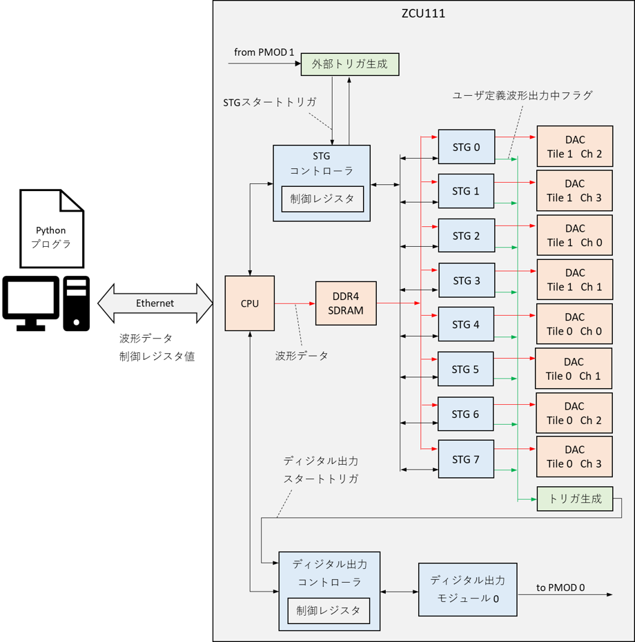
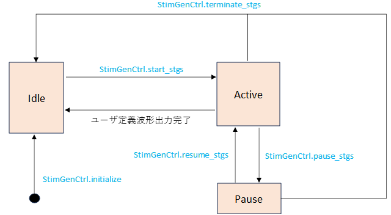
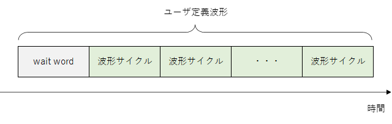
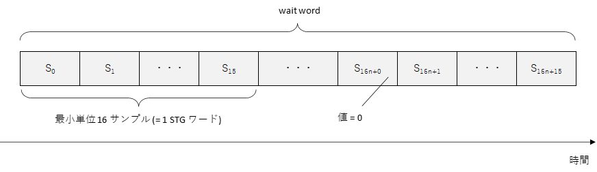
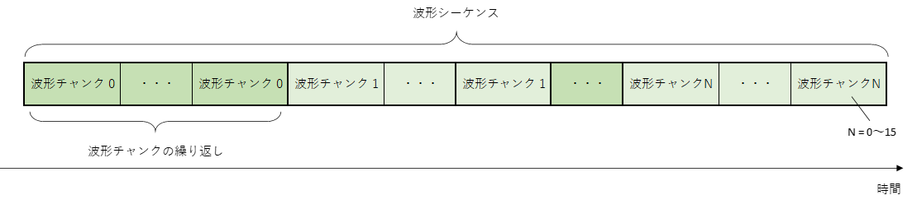
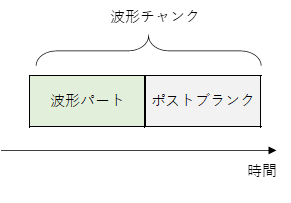
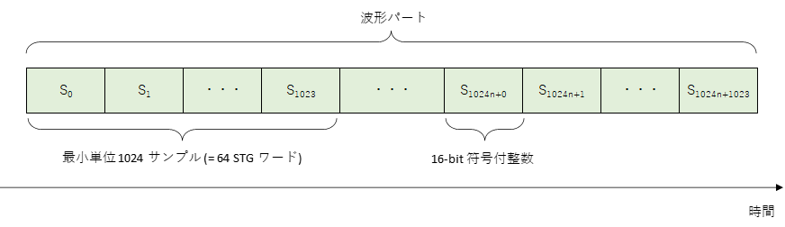
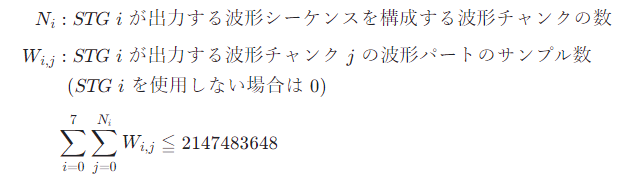
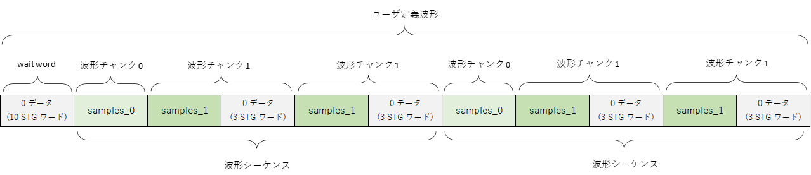

# Stimulus Generator ユーザマニュアル

本資料は，ZCU111 を利用した任意波形発生器 (Stimulus Generator) の利用者向けマニュアルです．

## 1. DAC パラメータ

Stimulus Generator で使用する DAC は以下のパラメータで固定となっており，ユーザが変更することはできません．

- サンプリングレート : 614.4 [Msps]
- I/Q ミキサ : 無効
- インタポレーション : なし

## 2. システム構成

Stimulus Generator (以下 STG) は ZCU111 の FPGA 上に実装されており，そのシステム構成は以下のようになります．
STG の制御には専用の Python API を用います．
この API には Python で作成した波形データを FPGA に送信する機能や，STG の動作完了を待つ機能などが含まれています．
本 FPGA デザインに含まれるディジタル出力モジュールの詳細は [こちら](./digital_output.md)  を参照してください．




## 3. STG の状態

STG は下図の状態を持ち，特定の Python API (図中の青字) が呼ばれたときか，ユーザ定義波形の出力が完了したときに状態遷移します．



**状態の説明**

| 状態名 | 説明 |
| --- | --- |
| Idle | 初期状態. |
| Active | ユーザ定義波形を出力します．|
| Pause | ユーザ定義波形の出力を一時停止します．<br> 停止中に STG から出力されるサンプル値は 0 です．|

<br>

## 4. 出力波形の構造

STG が出力可能な波形の構造と制約について説明します．

ユーザが各 STG に対して設定した出力波形全体を**ユーザ定義波形**と言います．
**ユーザ定義波形**は **wait word** と，その後に続く**波形シーケンス**の繰り返しで構成されます．
**波形シーケンス**は，最大 4294967295 回繰り返すことが可能です．
**wait word** は無くても問題ありません．



**wait word** は値が 0 のサンプルが並んだ波形です．
16 サンプルを 1 つの単位とする **STG ワード**単位で指定可能で，最大長は 4294967295 **STG ワード**となります



**波形シーケンス**は**波形チャンク**の繰り返しを並べたもので構成されます．
**波形チャンク**は最大 16 個まで定義でき，各チャンクは 4294967295 回まで繰り返すことが可能です．



**波形チャンク**は**波形パート**と**ポストブランク**で構成されます．
**ポストブランク**は無くても問題ありません．



**波形パート**は任意の値のサンプルが並んでおり，そのサンプル数は 1024 の倍数でなければなりません．



また，波形パートのサンプル数はストレージ (DDR4 SDRAM) 容量の都合上，以下の制約も満たさなければなりません． 



<!--
$$
\begin{align*}
N_i &: STG \;i\; が出力する波形シーケンスを構成する波形チャンクの数  \\[1ex]
W_{i,j} &: STG \;i\; が出力する波形チャンク \;j\; の波形パートのサンプル数 \\
& \;\;(STG \;i\; を使用しない場合は \; 0) \\[1ex]
&\displaystyle \sum_{i=0}^{7} \sum_{j=0}^{N_i} W_{i,j} \leqq 2147483648
\end{align*}
$$
-->

ポストブランクは値が 0 のサンプルが並んだ波形です．
16 サンプルを 1 つの単位とする STG ワード単位で指定可能で，最大長は 4294967295 STG ワードとなります．


## 5. STG 制御用 API の詳細

本章では STG の操作に必要な Python API を手順ごとに説明します．

### 5.1. STG と DAC の初期化

STG と DAC は，次節以降で述べる操作を行う前に必ず初期化しなければなりません．
初期化には StimGenCtrl クラスの setup_dacs, sync_dac_tiles, initialize メソッドを使用します．

初期化のコード例を以下に示します

```
from RftoolClient import client
import StimGen as sg
import common as cmn

# RftoolClient オブジェクトを作成する
with client.RftoolClient(logger) as rft:
    # ZCU111 に接続
    rft.connect(ZCU111_IP_ADDR)
    
    # FPGA コンフィギュレーション
    rft.command.ConfigFpga(cmn.FpgaDesign.STIM_GEN, 10)

    # RftoolClient オブジェクトから StimGenCtrl オブジェクトを取得
    stg_ctrl = rft.stg_ctrl

    # STG デザイン用に DAC を設定
    stg_ctrl.setup_dacs()

    # DAC タイル同期
    stg_ctrl.sync_dac_tiles()

    # STG 0 , STG 4 を初期化
    stg_ctrl.initialize(sg.STG.U0, sg.STG.U4)
```

### 5.2. 波形データの設定

STG に設定する波形データは，StimGen パッケージの Stimulus クラスを用いて作成します．
2 章で説明したユーザ定義波形の

- 波形シーケンスの繰り返し回数
- wait word の長さ

をコンストラクタで指定し

- 波形パートのサンプル値
- 波形チャンクの繰り返し回数
- ポストブランク長

を add_chunk メソッドで指定します．

波形データを作成するコードの例を以下に示します．

```
import StimGen as sg

stimulus = sg.Stimulus(
    num_wait_words = 10,  # wiat word の STG ワード数
    num_seq_repeats = 2)  # 波形シーケンスの繰り返し回数

# 波形チャンク 0 の定義
stimulus.add_chunk(
    samples = samples_0,  # サンプル値のリスト
    num_blank_words = 0,  # ポストブランクの STG ワード数
    num_repeats = 1)      # 波形チャンクの繰り返し回数

# 波形チャンク 1 の定義
stimulus.add_chunk(
    samples = samples_1,  # サンプル値のリスト
    num_blank_words = 3,  # ポストブランクの STG ワード数
    num_repeats = 2)      # 波形チャンクの繰り返し回数
```

上記のコードで定義されるユーザ定義波形は以下のようになります.



定義した波形を STG に設定するには StimGenCtrl クラスの set_stimulus メソッドを使用します．
set_stimulus メソッドは，呼び出すと以前設定した波形データが消えるので，使用する STG とその波形データを Python の Dict にまとめて一度に設定しなければなりません．

波形データを設定するコードの例を以下に示します．

```
from RftoolClient import client
import StimGen as sg

# RftoolClient オブジェクトを作成する
with client.RftoolClient(logger) as rft:

    ### STG / DAC 初期化 (省略) ###

    # 波形を設定したい STG の ID と波形データを持つ Stimulus オブジェクトの dict を作成する
    stg_to_stimulus = {
        sg.STG.U0 : sg.Stimulus(...),
        sg.STG.U4 : sg.Stimulus(...)
    }

    # 波形を設定する
    stg_ctrl.set_stimulus(stg_to_stimulus)
```

### 5.3. 波形の出力開始と完了待ち

STG の波形出力を開始するには StimGenCtrl クラスの start_stgs メソッドを使用します．
このメソッドで指定した全ての STG は同時にユーザ定義波形の出力を開始します．
STG の波形出力が完了するのを待つには StimGenCtrl クラスの wait_for_stgs_to_stop メソッドを使用します．
このメソッドは指定した全ての STG の波形出力が完了するか，タイムアウトまでコントロールを返しません．

波形の出力開始と完了待ちを行うコードの例を以下に示します．

```
from RftoolClient import client
import StimGen as sg

# RftoolClient オブジェクトを作成する
with client.RftoolClient(logger) as rft:

    ### STG / DAC 初期化 (省略) ###
    ### 波形データの設定 (省略) ###
    
    # STG 0 と STG 4 のユーザ定義波形出力スタート
    rft.stg_ctrl.start_stgs(sg.STG.U0, sg.STG.U4)
    
    # タイムアウト 5 秒で STG 0 と STG 4 の波形出力完了待ち
    rft.stg_ctrl.wait_for_stgs_to_stop(5, sg.STG.U0, sg.STG.U4)
```

### 5.4. 波形出力の一時停止

ユーザ定義波形の出力を一時停止するには StimGenCtrl クラスの pause_stgs メソッドを使用します．
このメソッドで指定した全ての STG は同時にユーザ定義波形の出力を一時停止します．

ユーザ定義波形の出力を一時停止するコードの例を以下に示します．

```
from RftoolClient import client
import StimGen as sg

# RftoolClient オブジェクトを作成する
with client.RftoolClient(logger) as rft:

    ### STG / DAC 初期化 (省略) ###
    ### 波形データの設定 (省略) ###  
    ### STG の波形出力スタート (省略) ###
    
    # STG 0 と STG 4 のユーザ定義波形の出力を一時停止
    rft.stg_ctrl.pause_stgs(sg.STG.U0, sg.STG.U4)
```

### 5.5. 波形出力の再開

ユーザ定義波形の出力を再開するには StimGenCtrl クラスの resume_stgs メソッドを使用します．
このメソッドで指定した全ての STG は同時にユーザ定義波形の出力を再開します．

ユーザ定義波形の出力を再開するコードの例を以下に示します．

```
from RftoolClient import client
import time
import StimGen as sg


# RftoolClient オブジェクトを作成する
with client.RftoolClient(logger) as rft:

    ### STG / DAC 初期化 (省略) ###
    ### 波形データの設定 (省略) ###  
    ### STG の波形出力スタート (省略) ###

    # STG 0 と STG 4 のユーザ定義波形の出力を一時停止
    rft.stg_ctrl.pause_stgs(sg.STG.U0, sg.STG.U4)

    time.sleep(2)

    # STG 0 と STG 4 のユーザ定義波形の出力を再開
    rft.stg_ctrl.resume_stgs(sg.STG.U0, sg.STG.U4)
```

