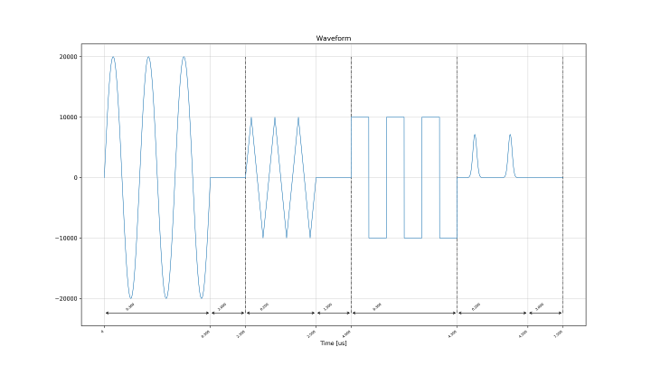
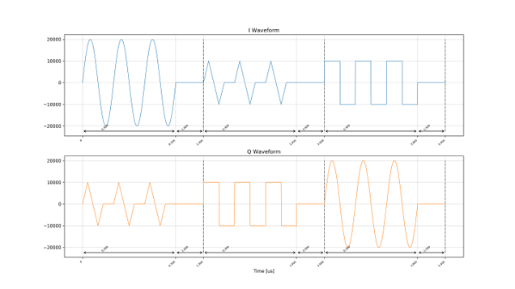
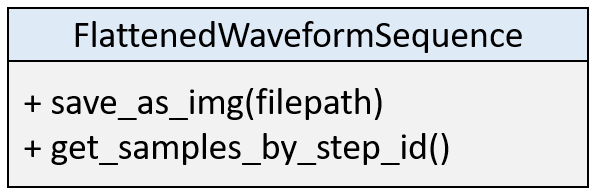

# 波形シーケンス可視化機能

波形シーケンス可視化機能を利用して，ユーザが定義した波形シーケンスをグラフとして保存できます．
波形シーケンス全体の波形と各波形ステップの開始時刻と終了時刻が示されます．

Realデータ波形シーケンスの例

I/Qデータ波形シーケンスの例

## 波形シーケンス可視化機能クラス

波形シーケンスの可視化には，`AwgSa` パッケージの `FlattenedWaveformSequence` クラスを使用します．
このクラスはユーザが直接インスタンス化するのではなく，`WaveSequence` クラスもしくは `AwgSaCommand` クラスのメソッドを呼んで，戻り値として取得します．

`save_as_img` は，波形シーケンスを図として保存するメソッドです．
`get_samples_by_step_id` は，ステップ ID をキーとして，その波形ステップのサンプル値の配列を保持する dict を返します．

