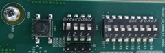

# ZCU111 の設定

本サポートパッケージのサンプルプログラムを動かすための ZCU111 の設定は以下の通りです．

- IP アドレス : 192.168.1.3
- UART baud rate : 115200 bps
- DIP switch 

IP アドレスは，初期値として ZCU 111 に設定済みです.
このアドレスは，SD カードの autostart.sh から変更可能ですが，変更した場合，サンプルスクリプト内の IP アドレスの設定を変更するか，実行時に環境変数 `ZCU111_IP_ADDR` でIPアドレスを指定する必要があります．

