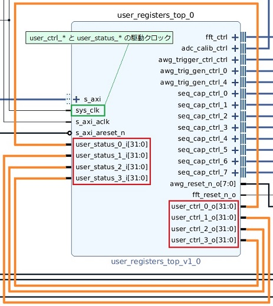

# FPGA デザイン拡張用レジスタにアクセスする

[awg_user_reg_access.py](./awg_add_in_reg_access.py) は，FPGA デザイン拡張用のレジスタにアクセスするスクリプトです。

FPGA デザイン拡張用レジスタには，`user_ctrl_*` と `user_status_*` の 2 種類があります．
`user_ctrl_*` は，ソフトウェアから FPGA に値を渡すためのレジスタで，`user_status_*` は，FPGA からソフトウェアに値を渡すためのレジスタです．
これらのレジスタは 2 値化デザインにのみ存在し，リリース時の構成は以下の図のように `user_ctrl_*` の出力が
`user_status_*` の入力となっています．

本スクリプトは，`user_ctrl_*` にランダムな値を書き込み `user_ctrl_*` と `user_status_*` から同じ値が読み出せることを確認します．



## セットアップ

次のようにADCとDACを接続します．


## 実行方法

以下のコマンドを実行します．

```
python awg_add_in_reg_access.py
```

各レジスタにアクセスした結果が以下のように表示されます．

```
[WR]  user ctrl   reg 0 : 0x335e6b70
[RD]  user ctrl   reg 0 : 0x335e6b70
[RD]  user status reg 0 : 0x335e6b70

[WR]  user ctrl   reg 1 : 0x398d381e
[RD]  user ctrl   reg 1 : 0x398d381e
[RD]  user status reg 1 : 0x398d381e

[WR]  user ctrl   reg 2 : 0x6e0e68ba
[RD]  user ctrl   reg 2 : 0x6e0e68ba
[RD]  user status reg 2 : 0x6e0e68ba

[WR]  user ctrl   reg 3 : 0x7d803296
[RD]  user ctrl   reg 3 : 0x7d803296
[RD]  user status reg 3 : 0x7d803296
```
