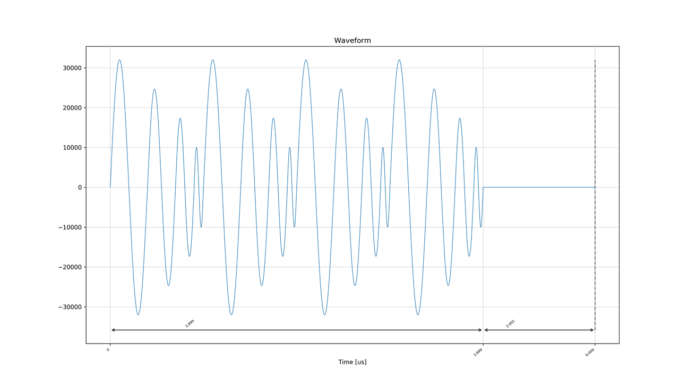
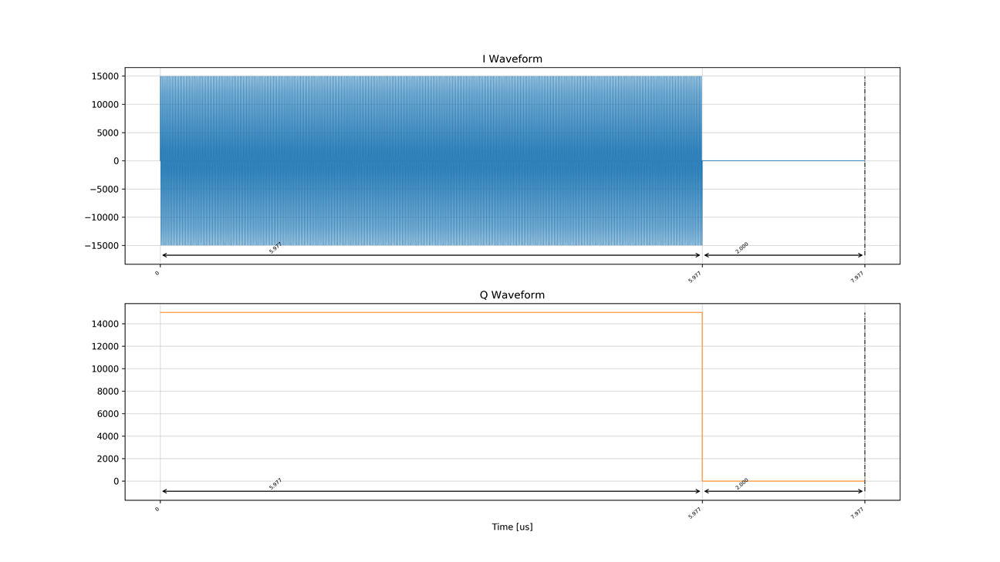
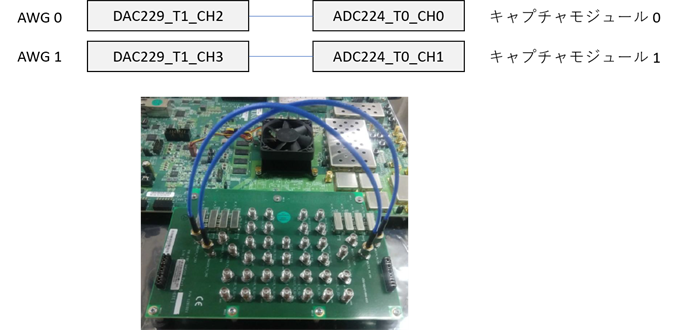
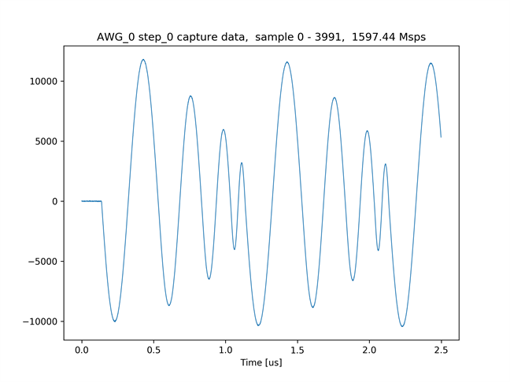
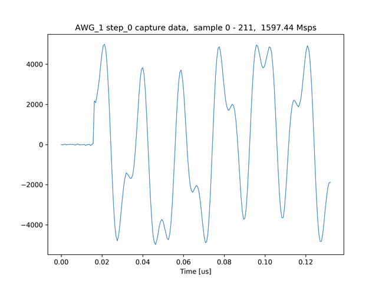
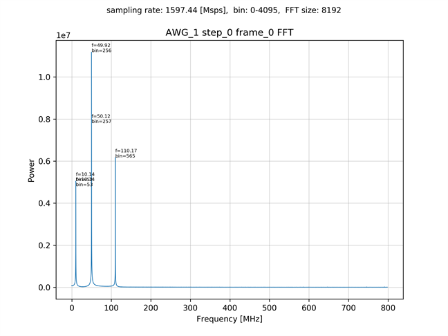

# 任意のサンプル値を持つ波形を出力する

[awg_any_wave_send_recv.py](../awg_any_wave_send_recv.py) は，Python スクリプト内でサンプル値を定義した波形を
AWG 0 と AWG 1 から出力し，キャプチャするスクリプトです．
AWG 0 は, 周波数と振幅が異なる 4 つの正弦波を 1 周期ずつ繰り返し出力します．
AWG 1 は，60 [MHz] の正弦波 である I データと，固定値の Q データに 50 [MHz] の IQ ミキサをかけて出力します．

AWG 0 の Real データ


AWG 1 の IQ データ


## セットアップ

次のように ADC と DAC を接続します．



## 実行手順と結果

以下のコマンドを実行します．

```
python awg_any_wave_send_recv.py
```

キャプチャモジュール 0 がキャプチャした波形のグラフと，キャプチャモジュール 1 がキャプチャした波形とそのスペクトルのグラフが，カレントディレクトリの下の `plot_awg_any_wave_send_recv` ディレクトリ以下に作成されます．
スペクトルのピークが現れる位置は，同スクリプトのファイルコメントを参照してください．

キャプチャモジュール 0 がキャプチャした波形 (先頭 3992 サンプル)


キャプチャモジュール 1 がキャプチャした波形 (先頭 212 サンプル)


キャプチャモジュール 1 がキャプチャした波形のスペクトル

