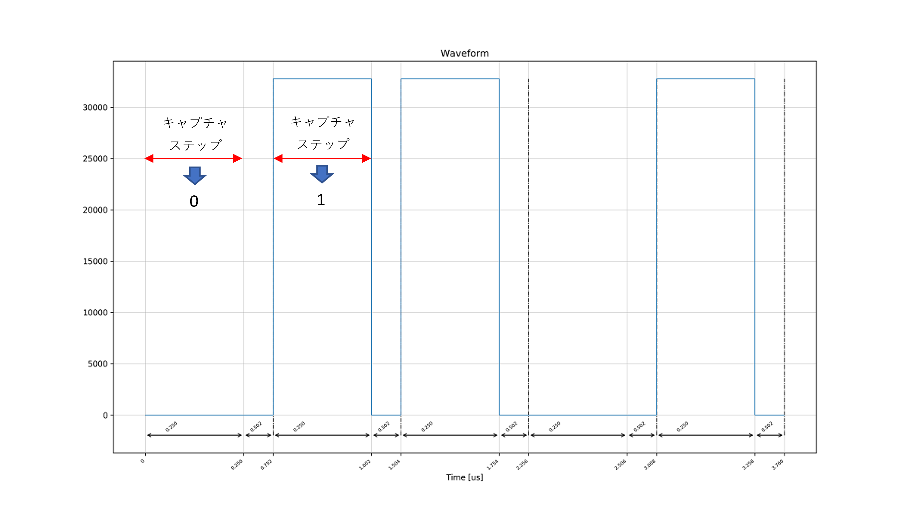
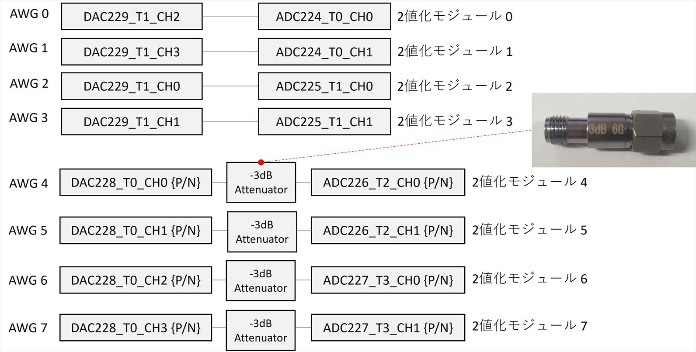
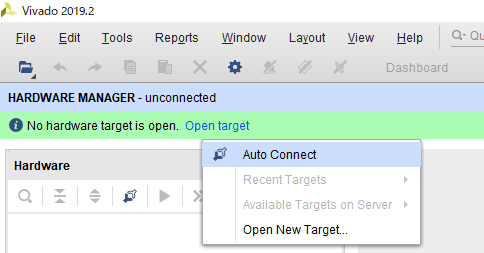
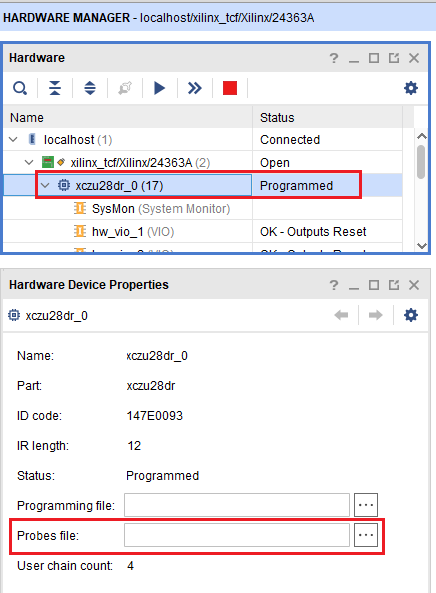
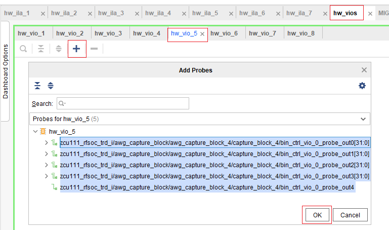
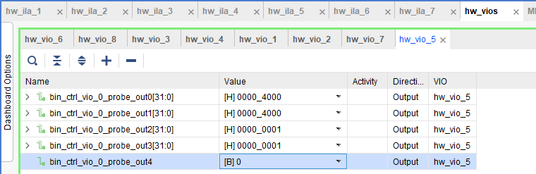

# Real データを 2 値化する

[awg_binarization_test.py](./awg_binarization_test.py) は，ADC から送信される リアルデータをキャプチャステップごとに 2 値化するスクリプトです．

処理の流れは以下の通りです．
1. AWG 4 が波形を出力する
2. ADC に入力された AWG 4 の波形を 2 値化する
3. 2 値化結果の期待値と実測値が一致するか確かめる

## 2値化される波形

AWG 4 が送信する波形は 64 ステップあり，各ステップは，デューティ比が 0 % か 100 % の矩形波となります．
このデューティ比はステップごとにランダムに決まります．

例として，5 ステップ分の出力波形を以下に示します．



各波形ステップが 2 値化の対象となるようにキャプチャステップを定義します．
これにより，閾値を適切に設定すると 2 値化結果は，デューティ比 0 % の部分で 0，100 % の部分で 1 となります．


## セットアップ

次のようにADCとDACを接続します．



AWG 4 ～ 7 と 2値化モジュール 4 ～ 7 を繋ぐ差動入出力には，-3dB の減衰器を取り付けます．

PC と ZCU111 を USB ケーブルで接続します．ZCU111 の USB ポートは，SD カードスロットの真横にあるものを使用します．

## 実行方法

以下のコマンドを実行します．

```
python awg_binarization_test.py
```

次のメッセージが表示されたら 2019.1 以降の Vivado を開きます．
```
Please configure the binarization modules with VIO.
```

Vivado を開いたら，上部メニューから「Flow」→「Open Hardware Manager」と選択します．
画面が変わったら下図を参考に「Opne target」→「Auto Connect」と選択します．



画面が変わったら「Hardware」ペインの「xczu28dr_0」を選択後，「Hardwave Device Properties」ペインの「Probes file」を選択します．



ファイル選択ダイアログが表示されたら，awg_binarization_test.py と同じディレクトリにある「zcu111_rfsoc_trd_wrapper.ltx」を選択します．
画面が変わったら画面上部の「hw_vios」タブを選択し，「hw_vio_1」 ～ 「hw_vio_8」 のタブがあるサブペインが見えること確認します．
「hw_vio_5」タブを選択後「＋」マークを押し，出てきた信号をすべて選択してから OK を押します．



「hw_vio_5」タブに追加された信号に 2値化モジュールのパラメータを設定します．
各信号とパラメータの対応関係は以下の通りです．

|  信号名  |  パラメータ  | 初期値
| ---- | ---- | ----
|  bin_ctrl_vio_probe_out0  |  I 波形 2値化モジュールの閾値  | 0
|  bin_ctrl_vio_probe_out1  |  Q 波形 2値化モジュールの閾値  | 0
|  bin_ctrl_vio_probe_out2  |  I 波形積算サンプル数 ÷ 8     | 1 (= 8サンプル積算)
|  bin_ctrl_vio_probe_out3  |  Q 波形積算サンプル数 ÷ 8     | 1 (= 8サンプル積算)



hw_vio_1 ～ 8 は，2値化モジュール 0 ～ 7 のパラメータに対応しています．

**「bin_ctrl_vio_0_probe_out4」は 1 → 0 と書き込むことで，2値化結果を格納するシフトレジスタをクリアできます．**
**測定開始前に適宜シフトレジスタをクリアしてください．**

2 値化パラメータの設定後，テストスクリプトを実行しているコンソール上で Enter を入力します．
`test succeeded` と表示されれば 2 値化結果の期待値と実測値が一致しています．
