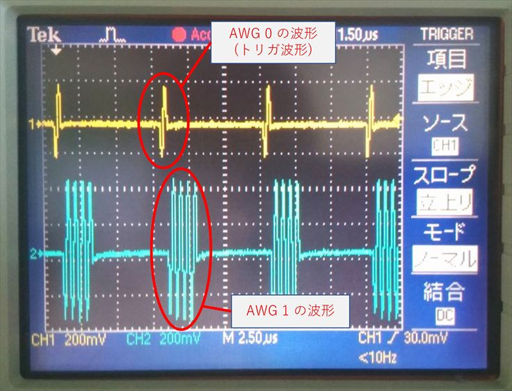
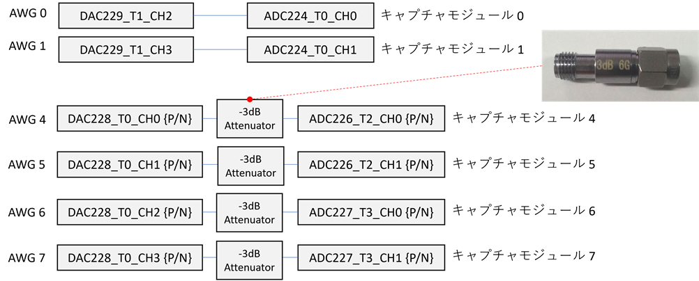
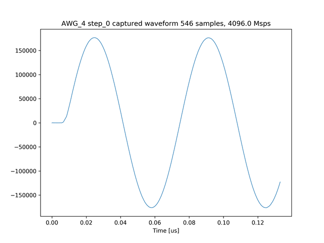
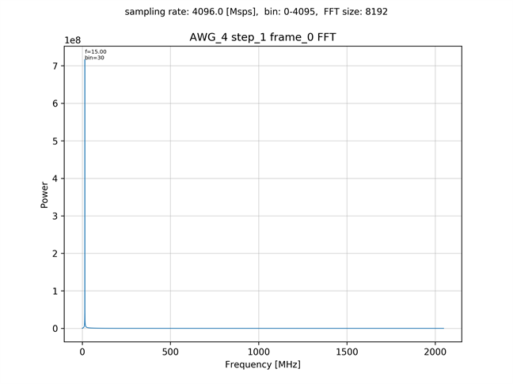
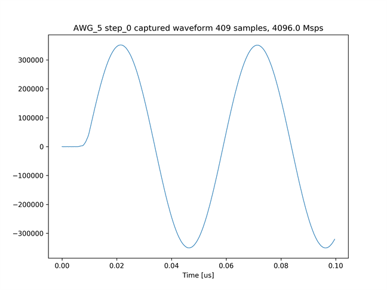
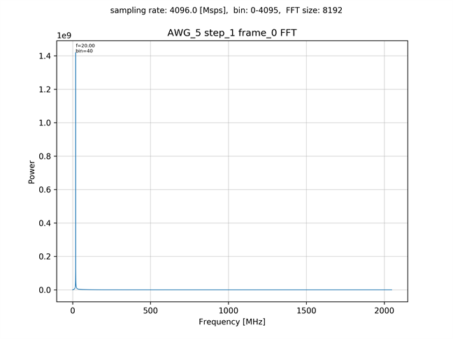

# 外部トリガで AWG を連続して起動する
[awg_continual_external_trigger.py](./awg_continual_external_trigger.py) は，AWG 0 から出力した波形を外部トリガモジュール 0 が読み取り，AWG 1，4 ～ 7 にトリガをかけるスクリプトです．
AWG 0 は一定の間隔で，トリガ波形 (2MHz の正弦波 1 サイクル) を出力します．
AWG 0 がトリガ波形を出力する度に，外部トリガモジュールが AWG 1，4 ～ 7 を起動し，波形の出力が始まります．
出力された波形は，AWG が起動される度にキャプチャモジュールで積算されて保存されます．

AWG 0 と AWG 1 の波形のタイミングを以下の図に示します．  


## セットアップ

次のようにADCとDACを接続します．



AWG 0, 1 と キャプチャモジュール 0, 1 は直結します．
AWG 4 ～ 7 と キャプチャモジュール 4 ～ 7 は，間に -3dB の減衰器を取り付けます．

## 実行方法

以下のコマンドを実行します．

```
python awg_continual_external_trigger.py [トリガ回数]
```

各 AWG から出力された波形のキャプチャデータとスペクトルが，カレントディレクトリの下の `plot_awg_continual_external_trigger/[トリガ回数]/AWG_*` 以下に作成されます．

AWG 4 のキャプチャデータ (トリガ回数 10)  


AWG 4 の波形のスペクトル (トリガ回数 10)  


AWG 5 のキャプチャデータ (トリガ回数 20)  


AWG 5 の波形のスペクトル (トリガ回数 20)  

