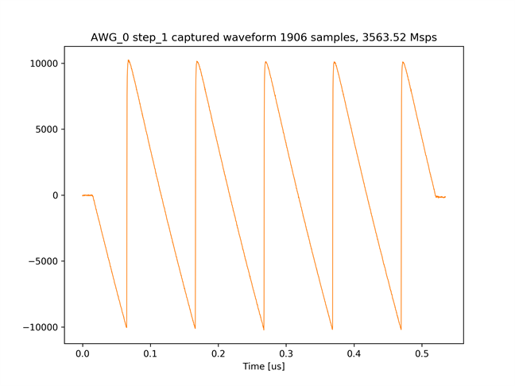
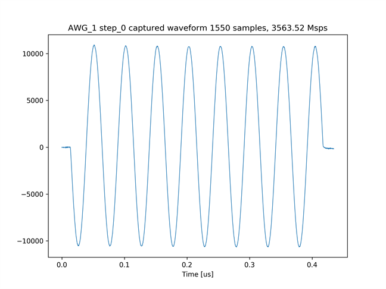
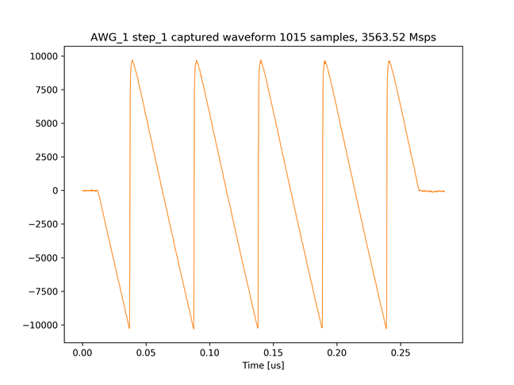

# DRAM からデータを読み出す

AWG SA 制御 API には，ユーザによるデザインの拡張用に，通常の波形生成と ADC データのキャプチャでは使用しないメソッドが含まれています．
[awg_dram_read.py](./awg_dram_read.py) では，そのようなメソッドのうち DRAM からデータを読み取るメソッド (AwgSaCommand.read_dram) と，キャプチャデータの格納先アドレスとデータサイズを取得するメソッド (AwgSaCommand.get_capture_section_info) を使用してキャプチャデータを取得します．

## セットアップ

次のようにADCとDACを接続します．  


## 実行手順と結果

以下のコマンドを実行します．

```
python awg_dram_read.py
```

キャプチャモジュール 0 がキャプチャした 2 つの波形のグラフと，キャプチャモジュール 1 がキャプチャした 2 つの波形のグラフが，カレントディレクトリの下の `plot_awg_dram_read` ディレクトリ以下に作成されます．

キャプチャモジュール 0 がキャプチャした波形 1  


キャプチャモジュール 0 がキャプチャした波形 2  


キャプチャモジュール 1 がキャプチャした波形 1  


キャプチャモジュール 1 がキャプチャした波形 2  

