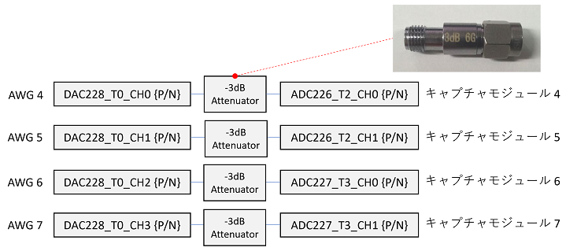

# キャプチャデータに対し信号処理を適用する

[awg_dsp_binalization.py](./awg_dsp_binalization.py) は，DSP デザインのグローバル DSP モジュールを使って，
DRAM に保存したキャプチャデータに信号処理を行うスクリプトです．
グローバル DSP については [DSP デザイン概要](../../docs/dsp-design.md) を参照してください．

## セットアップ

次のようにADCとDACを接続します．



## 実行方法

以下のコマンドを実行します．

```
python awg_dsp_binalization.py [二値化閾値]
```

グローバル DSP (二値化) 適用前と後のキャプチャデータのグラフが，カレントディレクトリの下の `plot_awg_dsp_binalization` ディレクトリ以下に AWG ごとに作成されます．
以下の図は，キャプチャモジュール 5 が取得した波形と，それを閾値 2×10<sup>7</sup> で二値化した結果のグラフです．

**キャプチャモジュール 5 が保存した波形**  


**キャプチャモジュール 5 が保存した波形に DSP (二値化) を適用した結果**  

