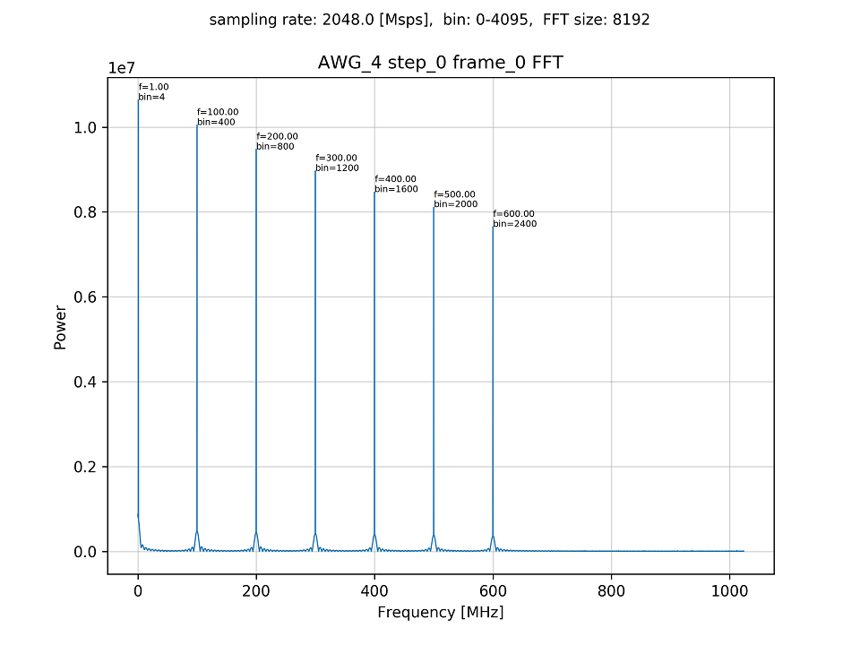
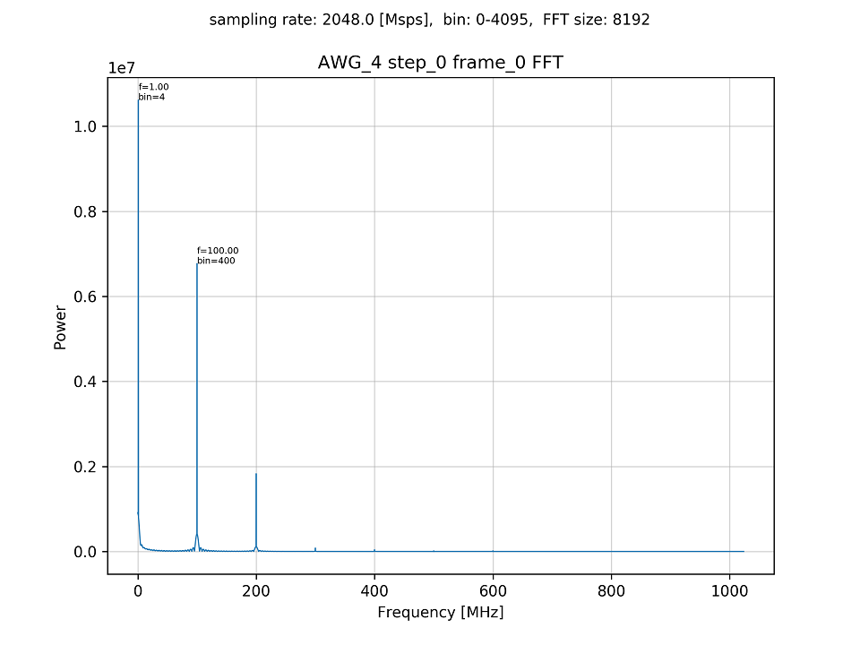

# 信号処理を適用したデータをキャプチャする

[awg_dsp_send_recv.py](./awg_dsp_send_recv.py) は，ADC データに信号処理を適用してキャプチャするスクリプトです.
ADC に入力される波形は，1 ～ 600 [MHz] までの異なる周波数の正弦波を 7 つ重ね合わせたもので，AWG から出力されます．
信号処理の機能は FIR フィルタとなっており，DSP デザインのローカル DSP モジュールが行います．
ローカル DSP モジュールについては [DSP デザイン概要](../../docs/dsp-design.md) を参照してください．

## セットアップ

次のようにADCとDACを接続します．


## 実行方法

まず，DSP を適用しない場合の出力波形のスペクトルを確認するために以下のコマンドを実行します．

```
python awg_dsp_send_recv.py no_dsp
```

4 つの AWG に対応するスペクトルのグラフが，カレントディレクトリの下の `plot_awg_no_dsp_send_recv` ディレクトリ以下に作成されます．

**AWG 4 から出力された波形のスペクトル**  


次に，出力波形に DSP (FIR フィルタ) を適用した場合のスペクトルを確認するために以下のコマンドを実行します．

```
python awg_dsp_send_recv.py
```

4 つの AWG に対応するスペクトルのグラフが，カレントディレクトリの下の `plot_awg_dsp_send_recv` ディレクトリ以下に作成されます．

**AWG 4 の出力波形に DSP (FIR フィルタ) を適用した波形のスペクトル**  


DSP デザインに組み込まれている FIR フィルタは，正規化遮断角周波数が 0.05 のローパスフィルタです．
また，本スクリプトの ADC のサンプリング周波数は 2048[Msps] であるため，100[MHz] 付近で FIR フィルタのゲインが 1/√2 (≒ 0.7) 倍となります．
上の二つのスペクトルのグラフを見比べると，フィルタ適用前の 100[MHz] のスペクトルの強度が約 1×10<sup>7</sup> であるのに対し，
フィルタ適用後の 100[MHz] のスペクトルの強度が約 0.7×10<sup>7</sup> となっており，それ以降の周波数のスペクトルの強度も小さくなっています．よって，設計通りの FIR フィルタが適用されていることが分かります．
