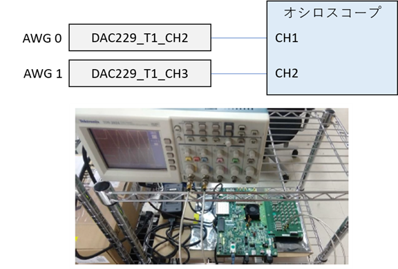
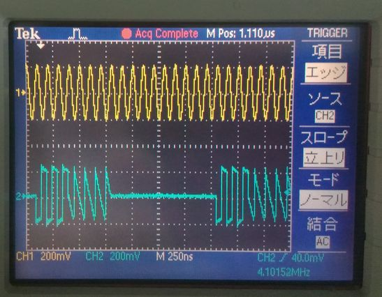
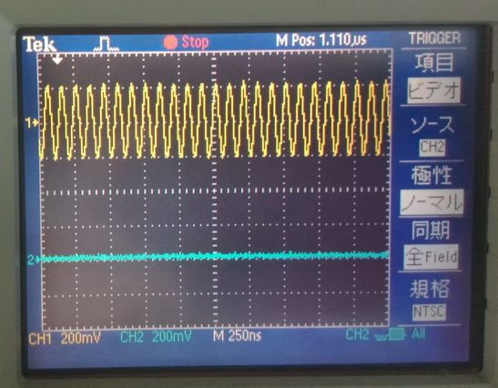
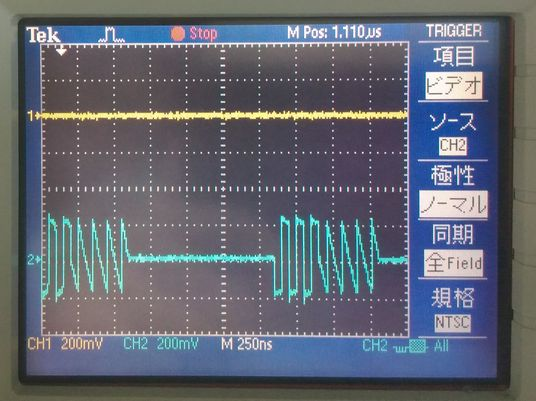
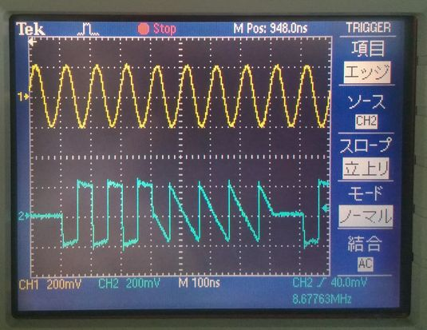
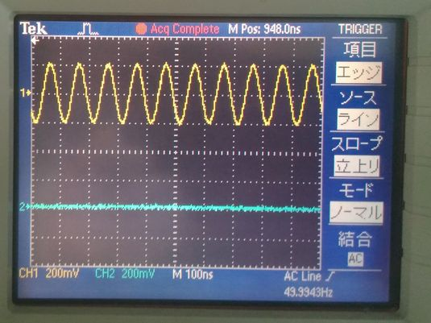
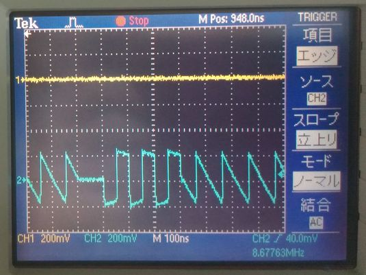

# AWG から波形を出力し続ける

各 AWG は，停止命令を受け取るまで，ユーザが指定した1つまたは複数の波形を繰り返し出力し続けることができます．
波形を出力し続ける方法は，(1) 特定の波形ステップを永久に繰り返す方法と (2) 波形シーケンスを永久に繰り返す方法の 2 つがあります．
方法 (1) を用いるには，`AwgWave` クラスによる波形の定義で，出力サイクル数に負の値を指定します．
方法 (2) を用いるには，`AwgSaCommand` クラスの `set_wave_sequence` メソッドで，シーケンスの繰り返し回数に負の値を指定します．
AWG を停止させる際は，`AwgSaCommand` クラスの `terminate_awgs` メソッドか，`terminate_all_awgs` を使用します．
それぞれのメソッドの詳細は，同メソッドの docstring を参照してください．

[awg_infinite_send.py](./awg_infinite_send.py) は，ユーザが停止命令を出すまで AWG から波形を出力し続けるスクリプトです．
AWG 0 は，正弦波を持つ波形ステップを繰り返し実行します．
AWG 1 は，矩形波とノコギリ波をそれぞれ波形ステップとして持つ波形シーケンスを繰り返し実行します．
コンソールに `Select AWG to stop` と表示された後，コンソールに `0`，`1` または `a` を入力すると指定した AWG が停止します．

## セットアップ

次のようにADCとDACを接続します．  



## DRAM キャプチャ版 Non-MTS AWG SA を使用する場合

以下のコマンドを実行します．

```
python awg_infinite_send.py
```

コンソールに `start all AWGs` と表示された後，テスト波形の出力が始まります．
オシロスコープで観測されるテスト波形は以下の図のようになります．

オシロスコープの波形 1 【黄色 : AWG 0，水色 : AWG 1】



オシロスコープの波形 2 【黄色 : AWG 0 ，水色 : AWG 1 (停止)】



オシロスコープの波形 3 【黄色 : AWG 0 (停止)，水色 : AWG 1】



## BRAM キャプチャ版 Non-MTS AWG SA を使用する場合

以下のコマンドを実行します．

```
python awg_infinite_send.py prv_cap_ram
```

コンソールに `start all AWGs` と表示された後，テスト波形の出力が始まります．
オシロスコープで観測されるテスト波形は以下の図のようになります．

オシロスコープの波形 1 【黄色 : AWG 0，水色 : AWG 1】



オシロスコープの波形 2 【黄色 : AWG 0 ，水色 : AWG 1 (停止)】



オシロスコープの波形 3 【黄色 : AWG 0 (停止)，水色 : AWG 1】



## MTS AWG SA を使用する場合

以下のコマンドを実行します．

```
python awg_infinite_send.py mts
```

コンソールに `start all AWGs` と表示された後，テスト波形の出力が始まります．
オシロスコープで観測されるテスト波形は BRAM キャプチャ版 Non-MTS AWG SA と同じです．
