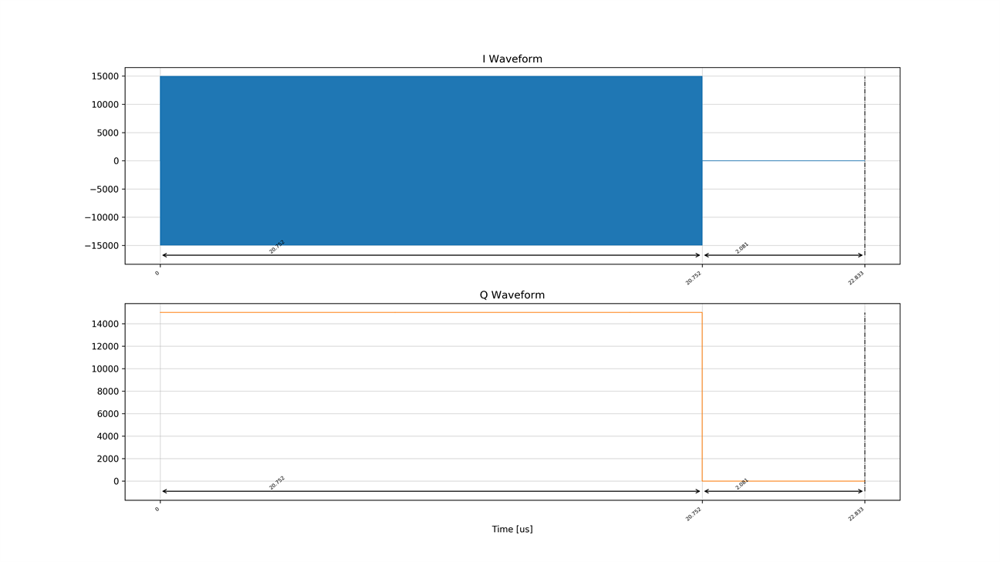
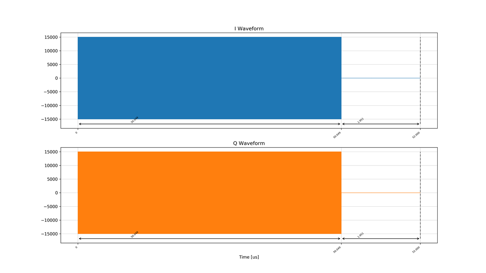
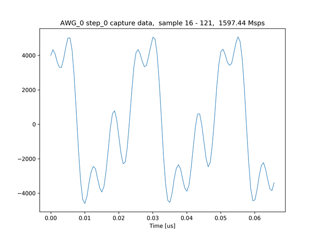
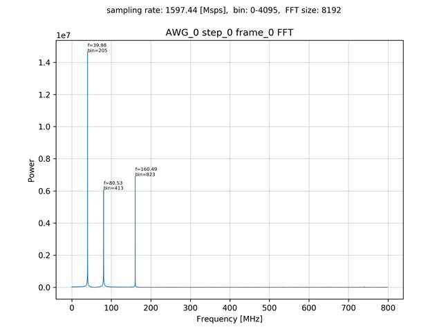
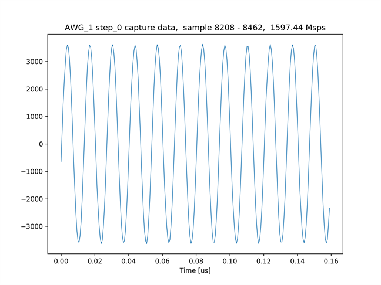
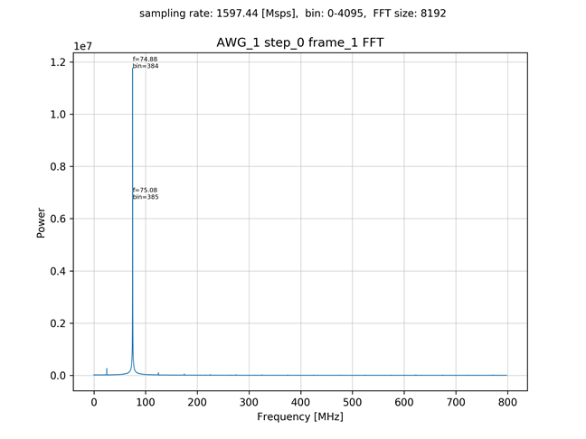

# AWG から IQ ミキシングした波形を出力する

[awg_iq_send_recv.py](../awg_iq_send_recv.py) は，IQ ミキシングしたデータをAWG 0 と AWG 1 から出力し，Real データとしてキャプチャするスクリプトです．
AWG 0 は，120 [MHz] の正弦波 である I データと，固定値の Q データに 40 [MHz] の IQ ミキサをかけて出力します．
AWG 1 は，50 [MHz] の余弦波 である I データと，50 [MHz] の正弦波に 25 [MHz] の IQ ミキサをかけて出力します．

AWG 0 の IQ データ  


AWG 1 の IQ データ  


## セットアップ

次のように ADC と DAC を接続します．  


## 実行手順と結果

以下のコマンドを実行します．

```
python awg_iq_send_recv.py
```

キャプチャモジュール 0 とキャプチャモジュール 1 がキャプチャした波形とそのスペクトルのグラフが，カレントディレクトリの下の `plot_awg_iq_send_recv` ディレクトリ以下に作成されます．
スペクトルのピークが現れる位置は，同スクリプトのファイルコメントを参照してください．

キャプチャモジュール 0 がキャプチャした波形 (16 ～ 121 番目のサンプル)  


キャプチャモジュール 0 がキャプチャした波形 (16 ～ 8207 番目のサンプル) のスペクトル  


キャプチャモジュール 1 がキャプチャした波形 (8208 ～ 8462 番目のサンプル)  


キャプチャモジュール 1 がキャプチャした波形 (8208 ～ 16399 番目のサンプル) のスペクトル  

