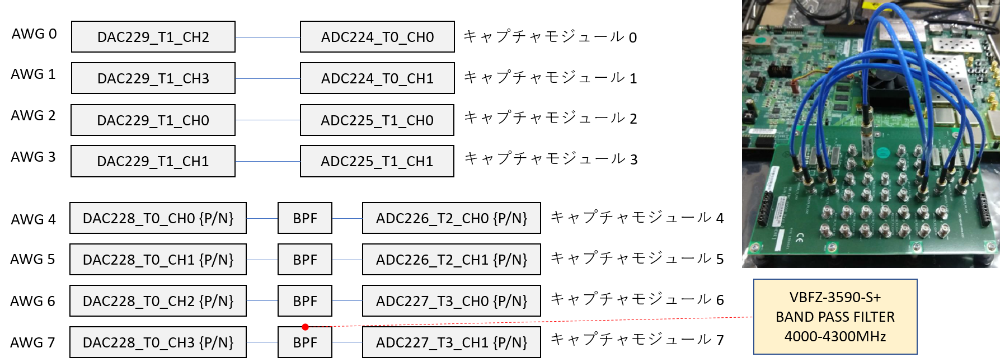

# キャプチャモジュールの後処理に必要な時間を計測する
[awg_measure_capture_end_proc.py](./awg_measure_capture_end_proc.py) は，キャプチャモジュールの後処理の時間を計測するスクリプトです.
複数の AWG から同時に波形を出力し, 対応するキャプチャモジュールでキャプチャを行います．
キャプチャモジュールの後処理の時間は，同モジュールに接続した ILA の波形を Vivado で観測して計測します．

## セットアップ

次のように ADC と DAC を接続します．  



差動入出力を接続する際は，付属の BPF を取り付けた SMA ケーブルで接続します．

## 実行手順

以下のコマンドを実行します．

```
python awg_measure_capture_end_proc.py
```
