# 波形ステップの空白期間を計測する

AWG は，隣り合う波形ステップの波形を連続的に出力するように設定しても，
波形ステップの変わり目に空白期間（波形が出力されない期間）が生じる場合があり，その幅は，波形ステップ全体の出力サンプル数によって変わります．
[awg_measure_wave_gap.py](./awg_measure_wave_gap.py) は, この空白期間が設計値通りかどうかを確かめるスクリプトです．
空白期間の設計値は，[出力波形設定手順](../../docs/awg-ja.md) の空白期間の計算式または [wave_gap_calc.xlsx](./wave_gap_calc.xlsx) を使って求めることができます．

本スクリプトでは，2 つの AWG から波形を出力します．
各 AWG に対して 3 つの波形ステップを定義し，それぞれのステップで以下の波形を出力します．

- 1 ステップ目 : 正弦波
- 2 ステップ目 : 方形波
- 3 ステップ目 : ノコギリ波

AWG によって出力波形の周波数とサイクル数は異なります．
AWG 0 では 3 種類の波形が連続して出力されるように設定してあり，AWG 1 では波形ステップ間に空白期間が生じるように設定してあります．

スクリプト内で定義される出力波形を以下の図に示します．
定義された段階では，波形ステップ間に空白期間が入っていないことに注意してください．
また，実際に DAC から出力される波形は，ZCU111 付属のバラン内部の回路の構成により変位が反転します．

AWG 0 の出力波形 (Non-MTS DRAM 版，Non-MTS BRAM 版)  
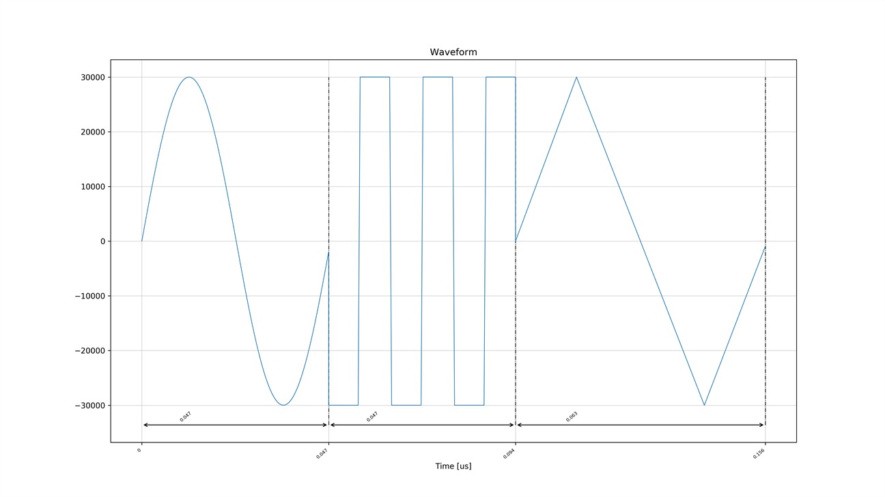

AWG 1 の出力波形 (Non-MTS DRAM 版，Non-MTS BRAM 版)  
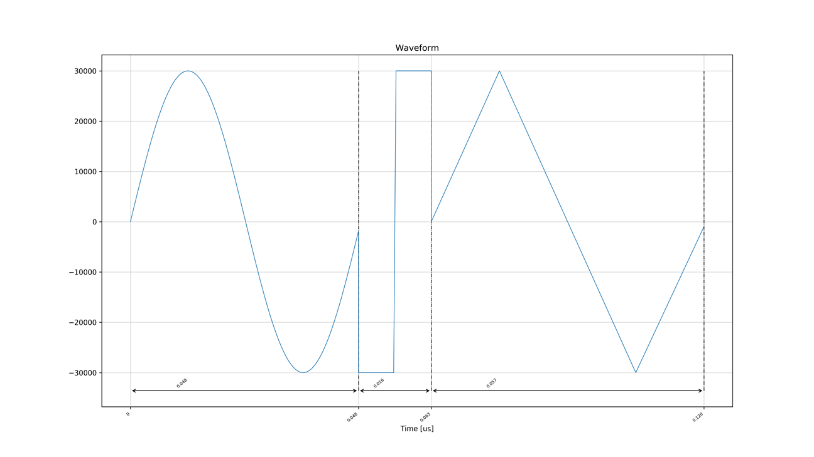

AWG 0 の出力波形 (MTS 版)  


AWG 1 の出力波形 (MTS 版)  
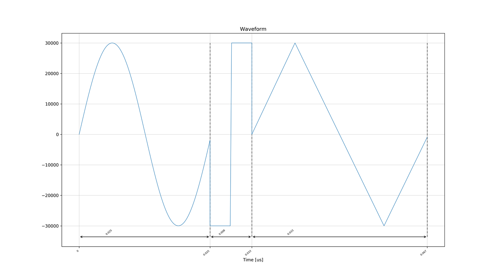

## セットアップ

次のようにADCとDACを接続します．  


## 実行手順と結果

### DRAM キャプチャ版 Non-MTS AWG SA を使用する場合

以下のコマンドを実行します．

```
python awg_measure_wave_gap.py
```

キャプチャモジュール 0 と 1 がキャプチャした波形のグラフが，
カレントディレクトリの下の `plot_awg_measure_wave_gap` ディレクトリ以下に作成されます．

1．キャプチャモジュール 0 がキャプチャした波形  
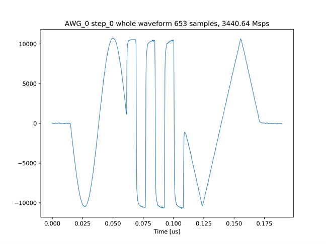

2．画像 1 のステップのつなぎ目付近を拡大した画像  
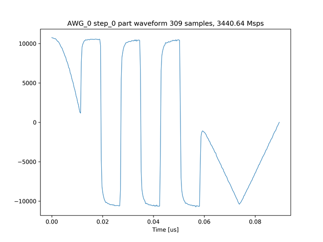

3．キャプチャモジュール 1 がキャプチャした波形  
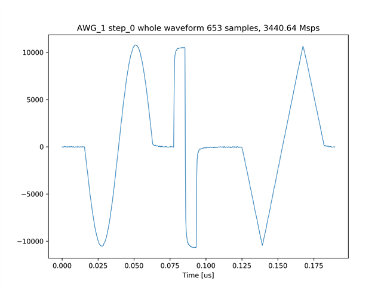

4．画像 3 のステップのつなぎ目付近を拡大した画像  
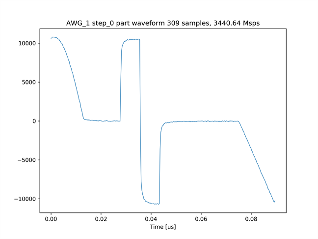


### BRAM キャプチャ版 Non-MTS AWG SA を使用する場合

以下のコマンドを実行します．

```
python awg_measure_wave_gap.py prv_cap_ram
```

キャプチャモジュール 0 と 1 がキャプチャした波形のグラフが，
カレントディレクトリの下の `plot_awg_measure_wave_gap_prv_cap_ram` ディレクトリ以下に作成されます．

5．キャプチャモジュール 0 がキャプチャした波形  
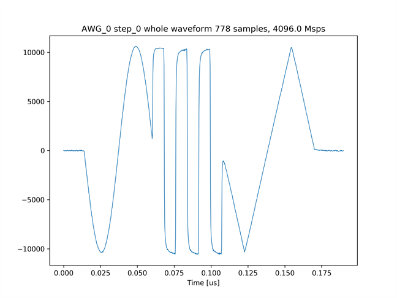

6．画像 5 のステップのつなぎ目付近を拡大した画像  
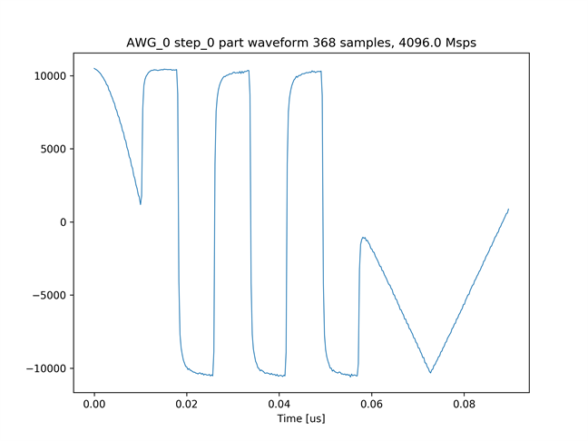

7．キャプチャモジュール 1 がキャプチャした波形  
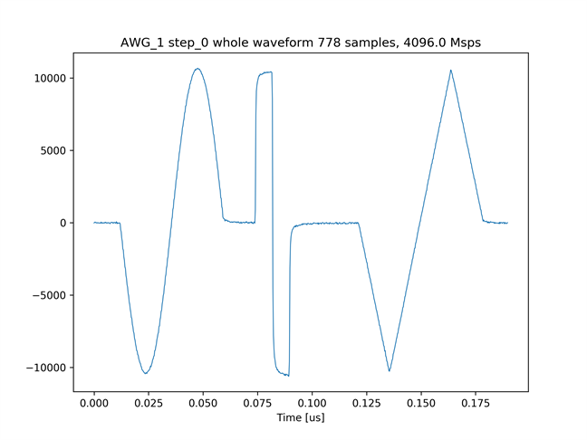

8．画像 7 のステップのつなぎ目付近を拡大した画像  
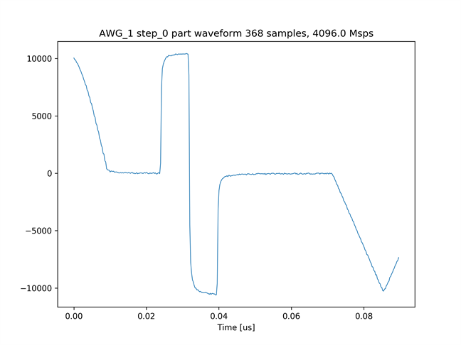


### MTS AWG SA を使用する場合

以下のコマンドを実行します．

```
python awg_measure_wave_gap.py mts
```

キャプチャモジュール 0 と 1 がキャプチャした波形のグラフが，
カレントディレクトリの下の `plot_mts_awg_measure_wave_gap` ディレクトリ以下に作成されます．

9．キャプチャモジュール 0 がキャプチャした波形  
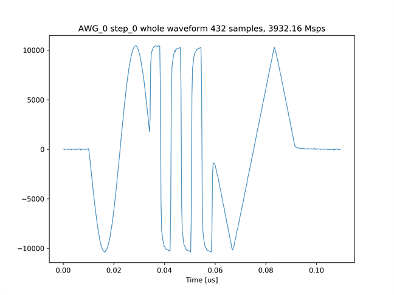

10．画像 9 のステップのつなぎ目付近を拡大した画像  
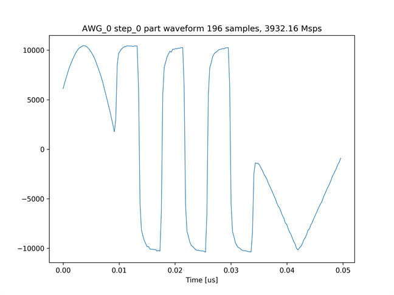

11．キャプチャモジュール 1 がキャプチャした波形  
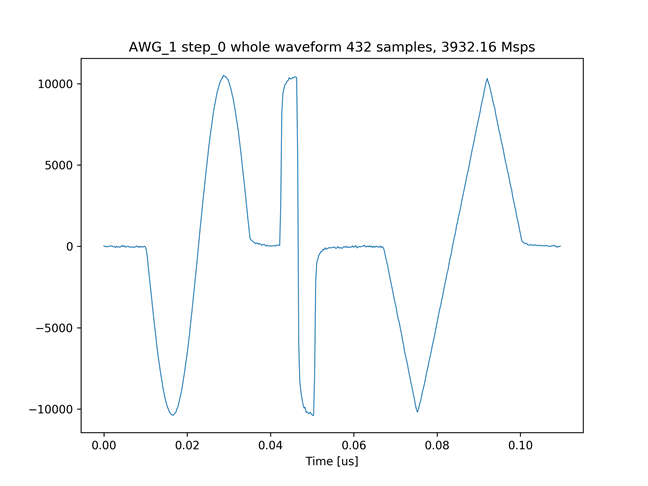

12．画像 11 のステップのつなぎ目付近を拡大した画像  
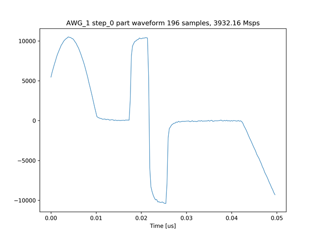
