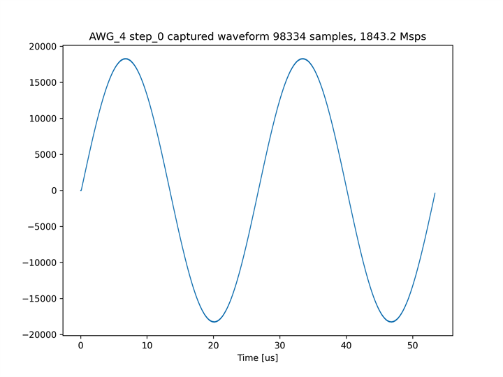
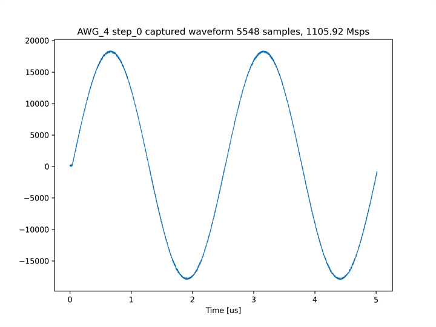

# 他の波形ステップを参照する波形ステップを定義する

本サンプル ([awg_ref_step.py](./awg_ref_step.py) と [mts_awg_ref_step.py](./mts_awg_ref_step.py)) では，各 AWG が 2 つの波形ステップからなる波形シーケンスを出力します．
この波形ステップのうち，2 番目の波形ステップが最初の波形ステップを参照するように定義されています．
参照元と参照先の波形ステップは同じ構成となるため、以下の図のように同じ波形が 2 回出力されます．

AWG 4 の出力波形例


他の波形ステップを参照する波形ステップの追加方法は，[出力波形設定手順](../../docs/awg-ja.md) の **波形シーケンスの定義** を参照してください．


## セットアップ

次のようにADCとDACを接続します．  


差動入出力を接続する際は，付属の BPF を取り付けた SMA ケーブルで接続します．


## DRAM キャプチャ版 Non-MTS AWG SA を使用する場合

以下のコマンドを実行します．

```
python awg_ref_step.py
```

カレントディレクトリの下の `plot_awg_ref_step` ディレクトリの中に，AWG ごとにキャプチャ波形のグラフが作成されます．

キャプチャモジュール 4 でキャプチャした波形のグラフ


キャプチャモジュール 5 でキャプチャした波形のグラフ


## BRAM キャプチャ版 Non-MTS AWG SA を使用する場合

以下のコマンドを実行します．

```
python awg_ref_step.py prv_cap_ram
```

カレントディレクトリの下の `plot_awg_ref_step_prv_cap_ram` ディレクトリの中に，AWG ごとにキャプチャ波形のグラフが作成されます．

キャプチャモジュール 4 でキャプチャした波形のグラフ


キャプチャモジュール 5 でキャプチャした波形のグラフ


## 低サンプリングレート MTS AWG SA を使用する場合

以下のコマンドを実行します．

```
python mts_awg_ref_step.py
```

カレントディレクトリの下の `plot_awg_ref_step_mts_low` ディレクトリの中に，AWG ごとにキャプチャ波形のグラフが作成されます．

キャプチャモジュール 4 でキャプチャした波形のグラフ


キャプチャモジュール 5 でキャプチャした波形のグラフ

