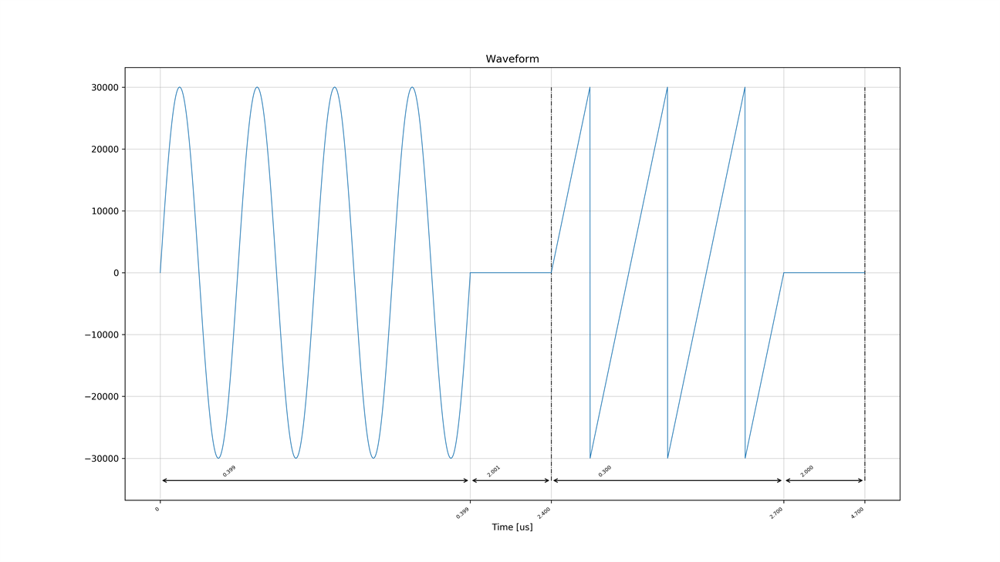
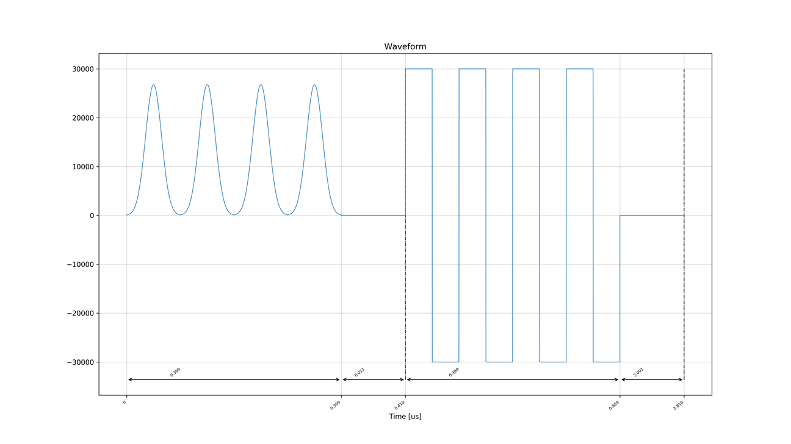
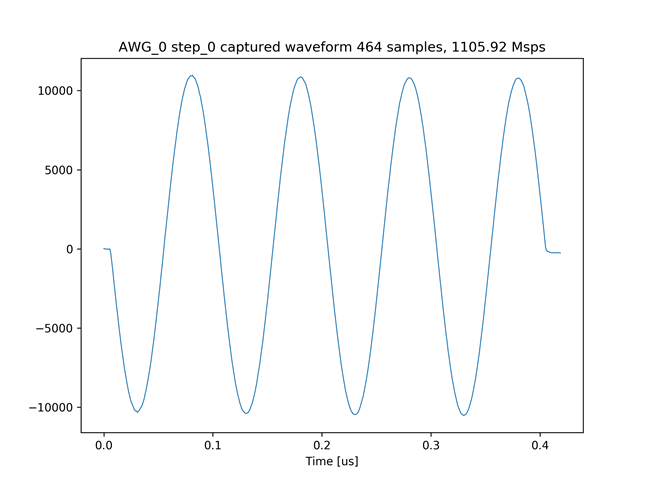
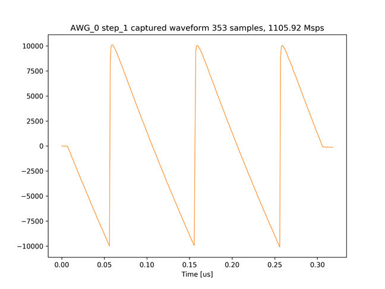
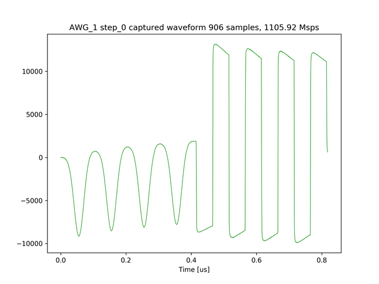

# 2 つの AWG から波形を出力しキャプチャする

[awg_send_recv.py](../awg_send_recv.py) は，2 つの AWG から出力した波形を，2 つのキャプチャモジュールでキャプチャするスクリプトです．各 AWG に対して設定した出力波形を以下の図に示します．実際には，ZCU111 付属のバラン内部の回路の構成により変位が反転した波形が出力されます．

AWG 0 の出力波形       


AWG 1 の出力波形       


## セットアップ

次のようにADCとDACを接続します．


## 実行手順と結果

以下のコマンドを実行します．

```
python awg_send_recv.py
```

キャプチャモジュール 0 がキャプチャした 2 つの波形のグラフと，キャプチャモジュール 1 がキャプチャした 1 つの波形のグラフが，カレントディレクトリの下の `plot_awg_send_recv` ディレクトリ以下に合計 3 枚作成されます．

キャプチャモジュール 0 がキャプチャした波形 1


キャプチャモジュール 0 がキャプチャした波形 2


AWG 1 がキャプチャした波形        

