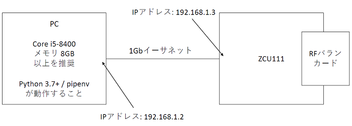

# AWG から送信する波形データの可視化

[awg_waveseq_visualize.py](./awg_waveseq_visualize.py) は，AWG から送信する波形データをグラフとして出力するスクリプトです．
送信波形のグラフ化にあたって，AWG SA API は 2 種類の機能を提供します．

1 つ目は，ユーザが Python スクリプト上で定義した波形をそのままグラフとして出力する機能です．
これは，Python スクリプト上で定義された波形の種類や周波数，post blank のなどの値を元にして，ハードウェアの制約を考慮せずにグラフを構築します．
そのため，このグラフの波形は，実際に AWG から出力される波形と若干異なる場合があります．
API の使い方は，同スクリプトの 134 行目付近を参照してください．

2 つ目は，実際に AWG が出力する波形をグラフとして出力する機能です．
こちらは，AWG が参照する波形のサンプル値を元に，ハードウェアの制約も考慮してグラフを構築します．
そのため，波形のサンプル値と出力期間が，DAC への入力値と AWG の波形出力期間と一致します．
ただし，波形と波形の間にある無波形の期間は，出力する波形の長さによっては正確でない場合があります．
API の使い方は，同スクリプトの line.140 付近を参照してください．

## セットアップ

以下の図のようにホスト PC と ZCU 111 をイーサネットケーブルで接続し IP アドレスを設定します．
ZCU 111 の IP アドレスの初期設定は，192.168.1.3 となっています．  



## 実行手順と結果

以下のコマンドを実行します．

```
python awg_waveseq_visualize.py
```

カレントディレクトリの下の `plot_awg_waveseq_visualize` ディレクトリの中に，送信波形のグラフが以下のファイル名で保存されます．\* には，その波形を設定した AWG の ID (0 or 1) が入ります．
- user_def_seq_*_waveform.png (ユーザが定義した波形)
- actual_seq_*_waveform.png (実際に AWG が出力する波形)

ユーザが定義した AWG 0 の波形  


実際に AWG 0 が出力する波形  


ユーザが定義した AWG 1 の波形  


実際に AWG 1 が出力する波形  

