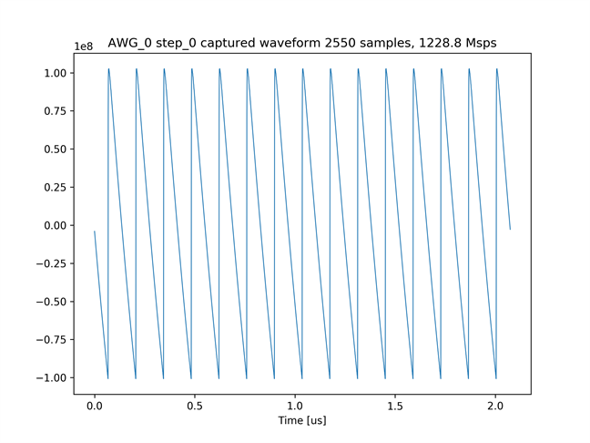
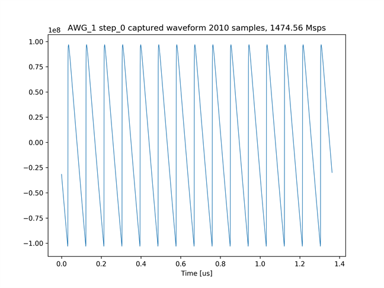

# ウィンドウ単位でキャプチャデータを積算する

[awg_windowed_capture.py](./awg_windowed_capture.py) は，ウィンドウ付きキャプチャのテストを行うスクリプトです．
ウィンドウ付きキャプチャの説明は，[キャプチャ設定手順](../../docs/capture-ja.md) を参照してください．
本スクリプトでは，AWG 0 と AWG 1 が，それぞれ周波数の異なるノコギリ波を出力し，
キャプチャモジュールが，ノコギリ波 10 周期分のウィンドウサイズでキャプチャします．
キャプチャデータの形状と振幅から，10 周期分のノコギリ波がズレることなく積算できていることが確認できます．

## セットアップ

次のようにADCとDACを接続します．


## 実行手順と結果

以下のコマンドを実行します．

```
python awg_windowed_capture.py
```

キャプチャモジュール 0 と 1 がキャプチャした波形のグラフが，カレントディレクトリの下の `plot_awg_windowed_capture` ディレクトリ以下に作成されます．

キャプチャモジュール 0 がキャプチャした波形



キャプチャモジュール 1 がキャプチャした波形


