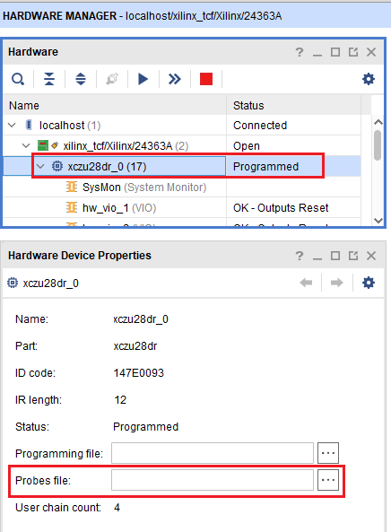

# I/Q データを 2 値化する

[awg_x8_binarization.py](./awg_x8_binarization.py) は，ADC から送信される I/Q データをキャプチャステップごとに
2値化するスクリプトです．

処理の流れは以下の通りです。
1. AWG 0 が波形を出力する
2. ADC に入力された AWG 0 の波形を，外部トリガモジュール 0 が読み取って外部トリガを発行する
3. 外部トリガにより AWG 4 ～ 7 が波形の出力を開始する
4. ADC に入力された AWG 4 ～ 7 の波形が I/Q ミキシングされ，2値化モジュール 4 ～ 7 が I 波形と Q 波形をそれぞれ2値化する

本スクリプトでは，AWG 1 ～ 3 と 2値化モジュール 1 ～ 3 は使用しませんが，他の AWG と 2値化モジュールと同じように使用できます．

## 2値化される波形

2値化デザインにはキャプチャモジュールが無いため，2値化対象となる ADC データを保存することができません．
代わりに他のデザインでキャプチャしたデータのグラフを載せておきます．


ADC が出力する I 波形と Q 波形は，それぞれ 500[KHz] の余弦波と正弦波となります (※2値化開始時の位相は，図の通りになるとは限りません)．
テストスクリプトでは，この波形の 1/4 周期のキャプチャステップを 20 ステップ分定義してしています．
2値化モジュールは，キャプチャステップごとに 1 か 0 の 2値化結果を 1 つ算出するので，波形シーケンス終了後，ADC チャネル 1 つあたり 20 bit のビットベクタが生成されます．


## セットアップ

次のようにADCとDACを接続します．


AWG 4 ～ 7 と 2値化モジュール 4 ～ 7 を繋ぐ差動入出力には，-3dB の減衰器を取り付けます．

PC と ZCU111 を USB ケーブルで接続します．ZCU111 の USB ポートは，SD カードスロットの真横にあるものを使用します．

## 実行方法

以下のコマンドを実行します．

```
python awg_x8_binarization.py
```

次のメッセージが表示されたら 2019.1 以降の Vivado を開きます．
```
Please configure the binarization modules with VIO.
```

Vivado を開いたら，上部メニューから「Flow」→「Open Hardware Manager」と選択します．
画面が変わったら下図を参考に「Opne target」→「Auto Connect」と選択します．


画面が変わったら「Hardware」ペインの「xczu28dr_0」を選択後，「Hardwave Device Properties」ペインの「Probes file」を選択します．



ファイル選択ダイアログが表示されたら，awg_x8_binarization.py と同じディレクトリにある「zcu111_rfsoc_trd_wrapper.ltx」を選択します．
画面が変わったら画面上部の「hw_vios」タブを選択し，「hw_vio_1」 ～ 「hw_vio_8」 のタブがあるサブペインが見えること確認します．
「hw_vio_5」タブを選択後「＋」マークを押し，出てきた信号をすべて選択してから OK を押します．


「hw_vio_5」タブに追加された信号に 2値化モジュールのパラメータを設定します．
各信号とパラメータの対応関係は以下の通りです．

|  信号名  |  パラメータ  | 初期値
| ---- | ---- | ----
|  bin_ctrl_vio_probe_out0  |  I 波形 2値化モジュールの閾値  | 0
|  bin_ctrl_vio_probe_out1  |  Q 波形 2値化モジュールの閾値  | 0
|  bin_ctrl_vio_probe_out2  |  I 波形積算サンプル数 ÷ 8     | 1 (= 8サンプル積算)
|  bin_ctrl_vio_probe_out3  |  Q 波形積算サンプル数 ÷ 8     | 1 (= 8サンプル積算)


hw_vio_1 ～ 8 は，2値化モジュール 0 ～ 7 のパラメータに対応しています．
awg_x8_binarization.py では，2値化モジュール 4 ～ 7 を使用するため，hw_vio_6 ～ 8 でも同様にパラメータを設定します．
なお，なにも設定しなかった場合のパラメータは，上表の初期値の通りです．

**「bin_ctrl_vio_0_probe_out4」は 1 → 0 と書き込むことで，2値化結果を格納するシフトレジスタをクリアできます．**
**測定開始前に適宜シフトレジスタをクリアしてください．**

2値化パラメータの設定後，テストスクリプトを実行しているコンソール上で Enter を入力します．
各 2値化モジュールの結果が，I と Q それぞれ 20 個ずつ表示されます．

```
Binarization 4 Result
I[  0] = 0,   Q[  0] = 1
I[  1] = 0,   Q[  1] = 1
I[  2] = 1,   Q[  2] = 1
I[  3] = 0,   Q[  3] = 0
I[  4] = 0,   Q[  4] = 1
I[  5] = 0,   Q[  5] = 1
I[  6] = 1,   Q[  6] = 1
I[  7] = 0,   Q[  7] = 0
I[  8] = 0,   Q[  8] = 1
I[  9] = 0,   Q[  9] = 1
I[ 10] = 1,   Q[ 10] = 1
I[ 11] = 0,   Q[ 11] = 0
I[ 12] = 0,   Q[ 12] = 1
I[ 13] = 0,   Q[ 13] = 1
I[ 14] = 1,   Q[ 14] = 1
I[ 15] = 0,   Q[ 15] = 0
I[ 16] = 0,   Q[ 16] = 1
I[ 17] = 0,   Q[ 17] = 1
I[ 18] = 1,   Q[ 18] = 1
I[ 19] = 0,   Q[ 19] = 0
```
