# 外部トリガから AWG を起動する

[awg_x8_external_trigger_1.py](./awg_x8_external_trigger_1.py) と 
[awg_x8_external_trigger_2.py](.awg_x8_external_trigger_2.py) は，1つの AWG から出力した波形を外部トリガモジュールが読み取り，残りの AWG にトリガをかけるスクリプトです．
[awg_x8_external_trigger_1.py](./awg_x8_external_trigger_1.py) は，
AWG 0 がトリガ条件を満たす波形を出力し，外部トリガモジュール 0 が読み取ります．
[awg_x8_external_trigger_2.py](./awg_x8_external_trigger_2.py) は，
AWG 4 がトリガ条件を満たす波形を出力し，外部トリガモジュール 4 が読み取ります．
外部トリガで駆動された AWG の波形は，対応するキャプチャモジュールでキャプチャされます．

## セットアップ

次のようにADCとDACを接続します．

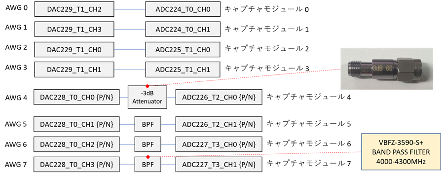

AWG 4 と キャプチャモジュール 4 を繋ぐ差動入出力には，-3dB の減衰器を取り付けます．
それ以外の差動入出力には，付属の BPF を取り付けます．

## 外部トリガモジュール 0 からトリガをかける場合

以下のコマンドを実行します．

```
python awg_x8_external_trigger_1.py
```

AWG 0 が外部トリガ発行のために出力した波形のキャプチャデータが，カレントディレクトリの下の `plot_awg_x8_external_trigger_1/AWG_0` 以下に作成されます．
外部トリガで駆動した AWG 1 ～ 7 の波形のキャプチャデータとスペクトルが，カレントディレクトリの下の `plot_awg_x8_external_trigger_1` ディレクトリ以下に AWG ごとに作成されます．

AWG 0 のキャプチャデータ  
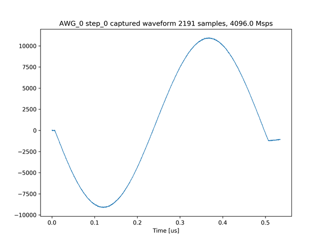

AWG 1 のキャプチャデータ  
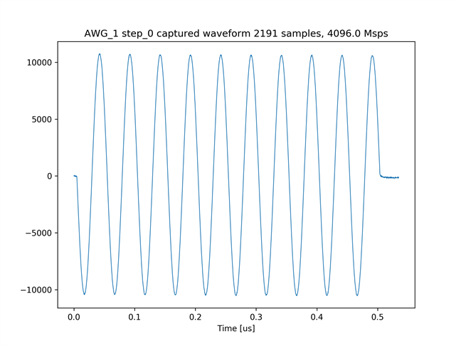

AWG 1 の波形のスペクトル  
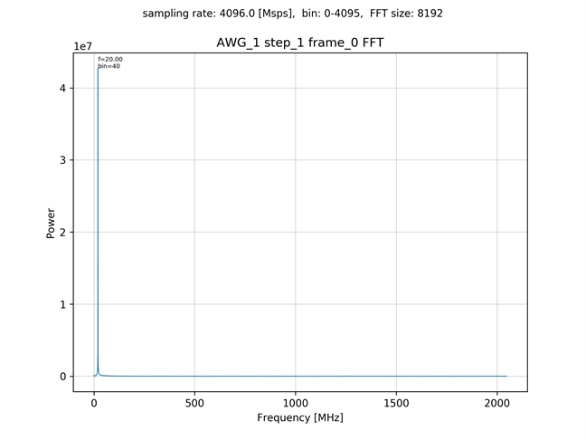

AWG 2 のキャプチャデータ  
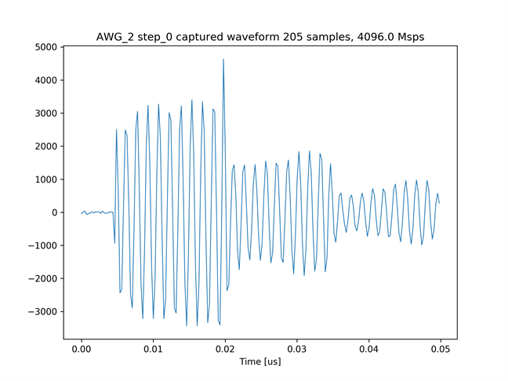

AWG 2 の波形のスペクトル  
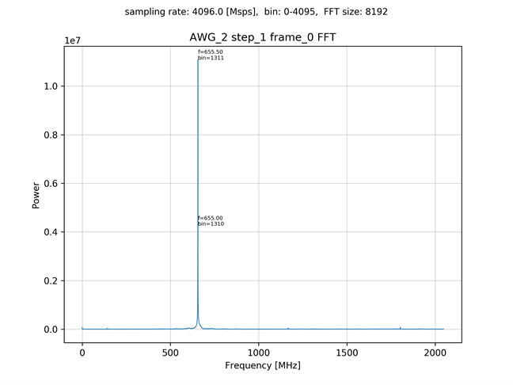

## 外部トリガモジュール 4 からトリガをかける場合

以下のコマンドを実行します．

```
python awg_x8_external_trigger_2.py
```

AWG 4 が外部トリガ発行のために出力した波形のキャプチャデータが，カレントディレクトリの下の `plot_awg_x8_external_trigger_2/AWG_4` 以下に作成されます．
外部トリガで駆動した AWG 0 ～ 3，5 ～ 7 の波形のキャプチャデータとスペクトルが，カレントディレクトリの下の `plot_awg_x8_external_trigger_2` ディレクトリ以下に AWG ごとに作成されます．

AWG 4 のキャプチャデータ (先頭 2.5[us])  
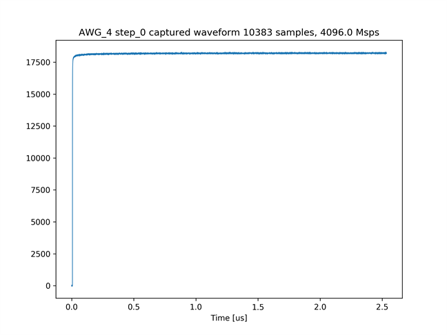

AWG 3 のキャプチャデータ  
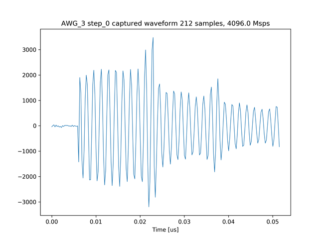

AWG 3 の波形のスペクトル  
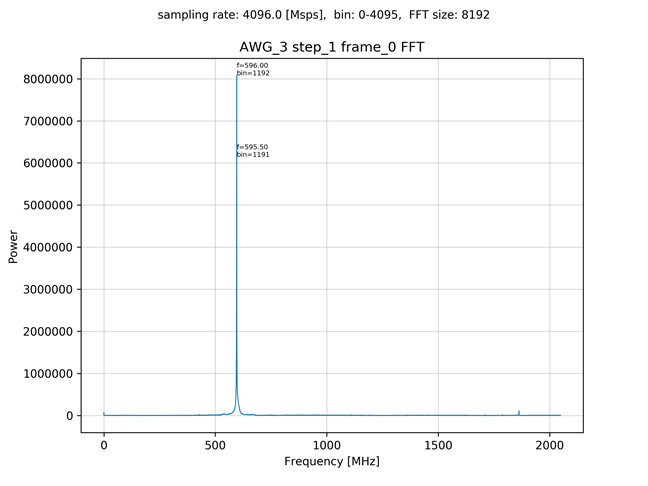

AWG 5 のキャプチャデータ  
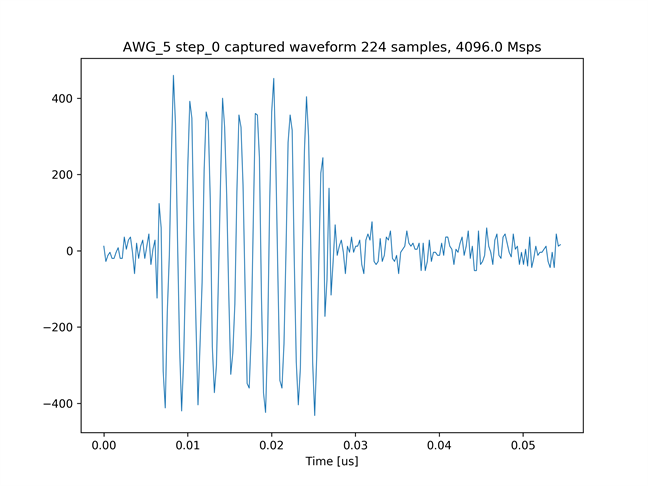

AWG 5 の波形のスペクトル  
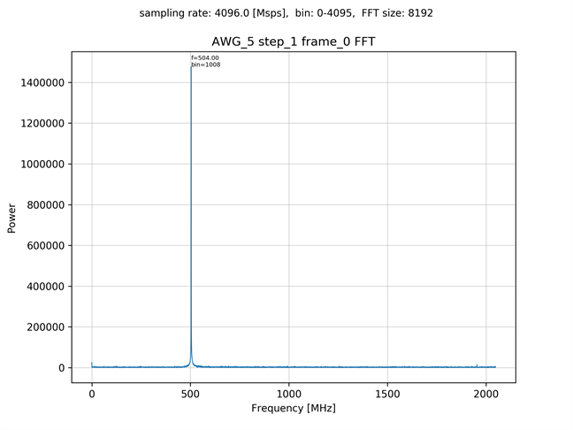
　　　   