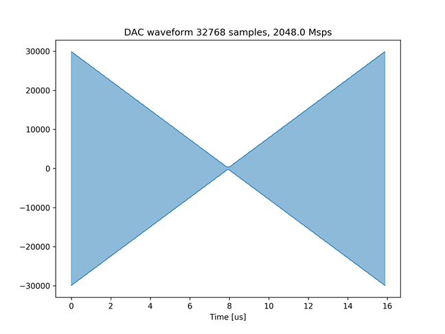
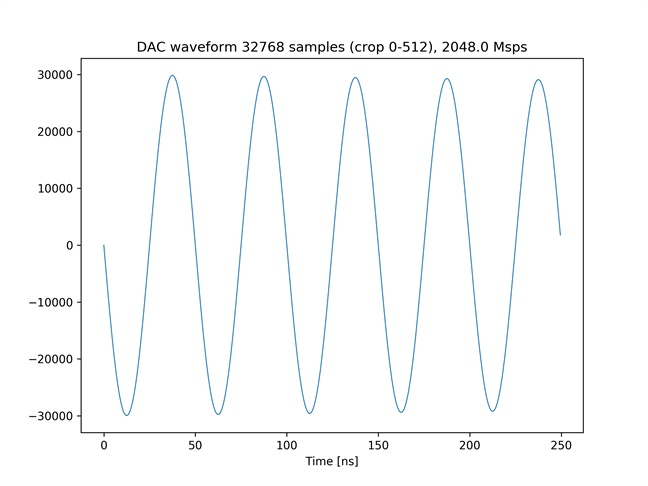
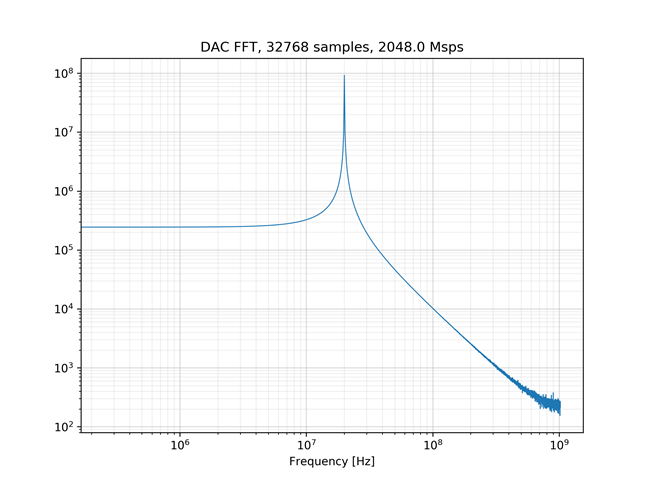
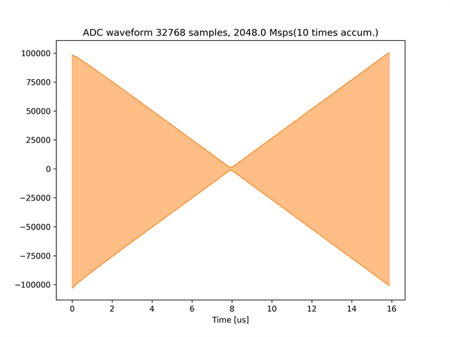
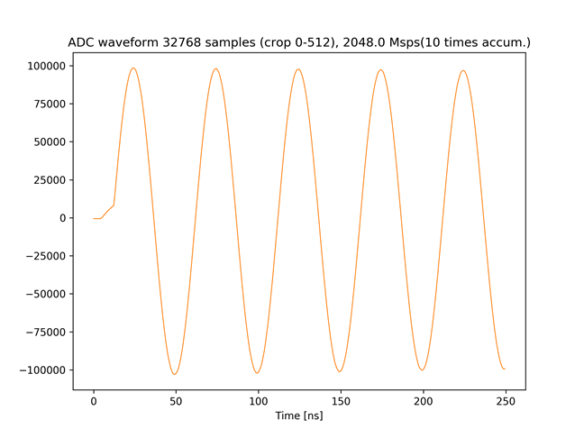
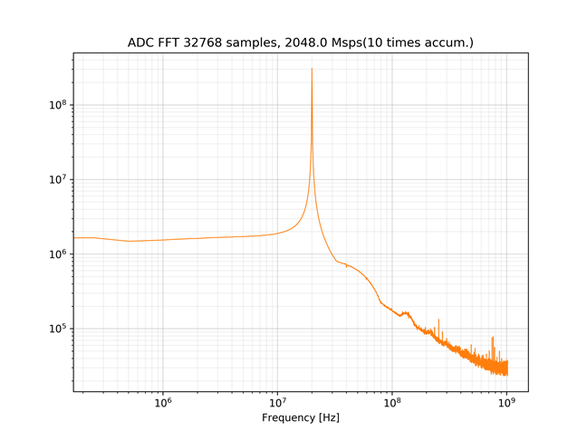
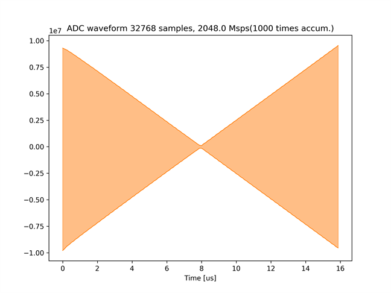
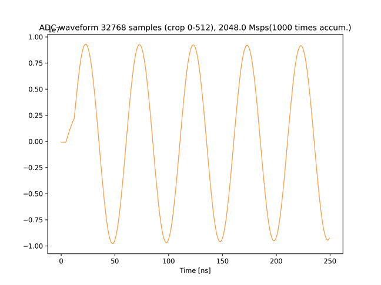
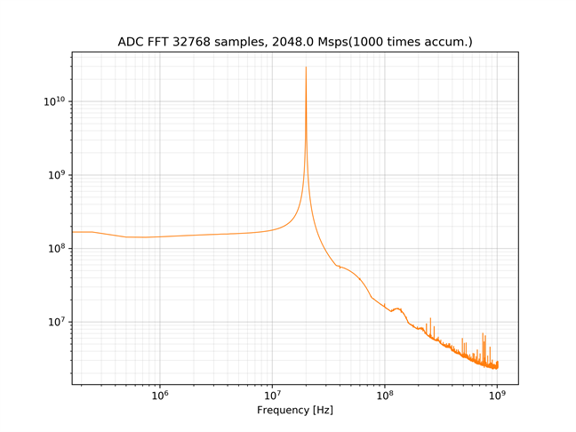

# BRAM を使った波形データの積算 (振幅が変化する正弦波)

[bram_accum_send_recv.py](./bram_accum_send_recv.py) は，2 つの DAC チャネルから同じ波形を繰り返し出力し，
2 つの ADC チャネルで波形同士を積算しながらキャプチャするスクリプトです．

## セットアップ

次のように ADC と DAC を接続します．  


## 実行手順と結果

以下のコマンドを実行します．
積算回数は 1 から 32768 までの整数を指定できます．

```
python bram_accum_send_recv.py <積算回数>
```

カレントディレクトリの下の `plot_bram_accum_send_recv/<積算回数>` ディレクトリの中に，送信波形のグラフおよびスペクトルが以下のファイル名で保存されます．
- bram_send.png (送信波形全体)
- bram_send_crop.png (送信波形の先頭 512 サンプル)
- bram_send_fft.png (送信波形の周波数スペクトル)

受信信号の波形およびスペクトルは，ADC チャネルごとに以下のファイル名で保存されます．
\* には，その波形をキャプチャした ADC のチャネル番号 (0 or 1) が入ります．
- bram_recv_*.png (受信波形全体)
- bram_recv_*_crop.png (受信波形の先頭 512 サンプル)
- bram_recv_*_fft.png (受信波形の周波数スペクトル)

送信波形全体  


送信波形の先頭 512 サンプル  


送信波形の周波数スペクトル  


ADC チャネル 0 の受信波形全体 (10 回積算)  


ADC チャネル 0 の受信波形の先頭 512 サンプル (10 回積算)  


ADC チャネル 0 の受信波形の周波数スペクトル (10 回積算)  


ADC チャネル 0 の受信波形全体 (1000 回積算)  


ADC チャネル 0 の受信波形の先頭 512 サンプル (1000 回積算)  


ADC チャネル 0 の受信波形の周波数スペクトル (1000 回積算)  


受信波形のグラフより，積算回数が増えると受信波形の振幅が増加していることが確認できます．
