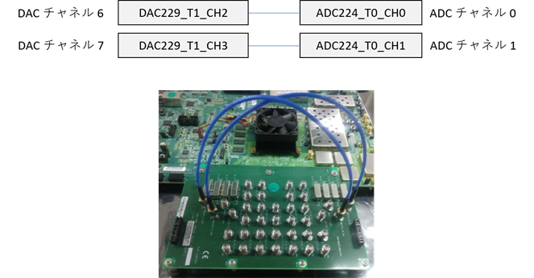
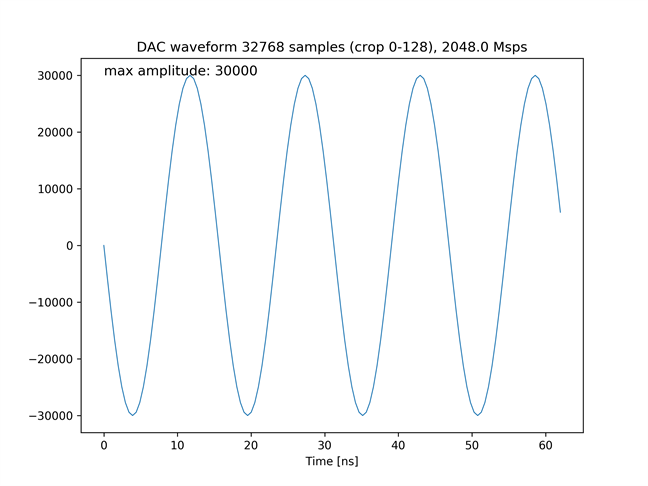
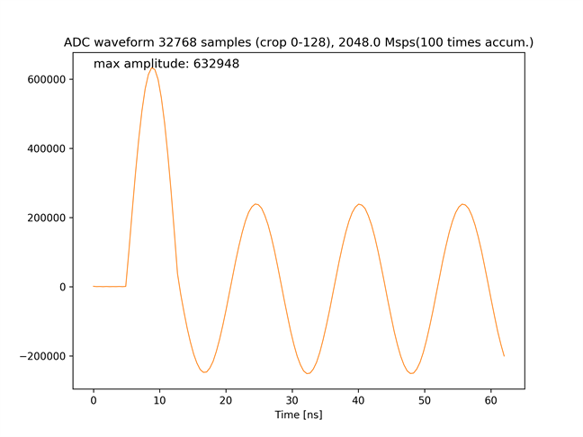

# BRAM を使った波形データの積算 (正弦波)

[bram_accum_send_recv_sine.py](./bram_accum_send_recv_sine.py) は，2 つの DAC チャネルから長さ 16[us]，周波数 64[MHz] の波形を繰り返し出力し，2 つの ADC チャネルで波形同士を積算しながらキャプチャするスクリプトです．

## セットアップ

次のように ADC と DAC を接続します．  


## 実行手順と結果

以下のコマンドを実行します．
積算回数は 1 から 32768 までの整数を指定できます．

```
python bram_accum_send_recv_sine.py <積算回数>
```

カレントディレクトリの下の `plot_bram_accum_send_recv_sine/<積算回数>` ディレクトリの中に，送信波形と受信波形のグラフが以下のファイル名で保存されます．
- bram_send_crop.png (送信波形の先頭 128 サンプル)
- bram_recv_0_crop.png (ADC チャネル 0 の受信波形の先頭 128 サンプル)
- bram_recv_1_crop.png (ADC チャネル 1 の受信波形の先頭 128 サンプル)

送信波形の先頭 128 サンプル  


ADC チャネル 0 の受信波形の先頭 128 サンプル (100 回積算)  


ADC チャネル 1 の受信波形の先頭 128 サンプル (100 回積算)  

