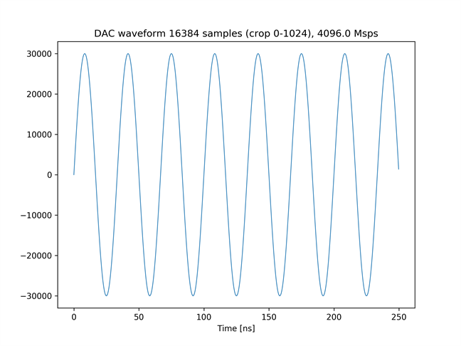
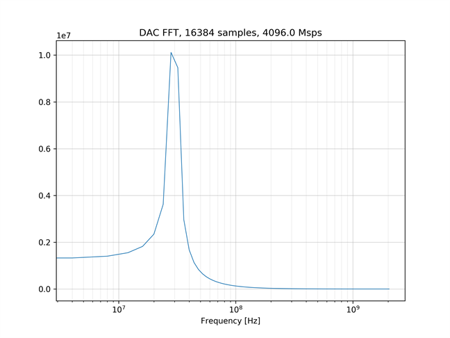
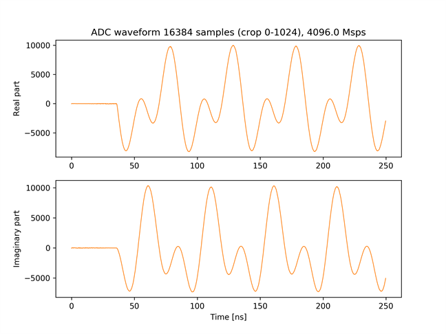
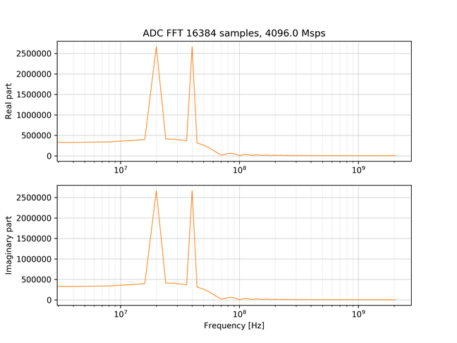

# BRAM を使った IQ データの受信

[bram_iq_send_recv.py](./bram_iq_send_recv.py) は，DAC から正弦波を出力し，
ADC の IQ ミキサを有効にしてキャプチャするスクリプトです．
一般的に，A [Hz] の正弦波に B [Hz] の IQミキサをかけたとき，ミキシング後の波形の周波数成分は，
I データ，Q データ共に A±B [Hz] になります．
本サンプルでは，DAC から 30 [MHz] の正弦波を出力し，ADC で 10 [MHz] の I/Q ミキサをかけてキャプチャするので，
キャプチャされた波形の周波数成分は，I データ，Q データ共に 20 [MHz] と 40 [MHz] になります．
これは，FFT のスペクトルのグラフから確認できます．

## セットアップ

次のように ADC と DAC を接続します．  


## 実行手順と結果

以下のコマンドを実行します．

```
python bram_iq_send_recv.py
```

カレントディレクトリの下の `plot_bram_iq_send_recv` ディレクトリの中に，送信波形のグラフおよびスペクトルが以下のファイル名で保存されます．

- bram_send_crop.png (送信波形全体)
- bram_send_crop.png (送信波形の先頭 1024 サンプル)
- bram_send_fft.png (送信波形の周波数スペクトル)

受信信号の波形およびスペクトルは，ADC チャネルごとに以下のファイル名で保存されます．
\* には，その波形をキャプチャした ADC のチャネル番号 (0 or 1) が入ります．
- bram_recv_*.png (受信波形全体)
- bram_recv_*_crop.png (受信波形の先頭 1024 サンプル)
- bram_recv_*_fft.png (受信波形の周波数スペクトル)

送信波形の先頭 1024 サンプル  


送信波形の周波数スペクトル  


ADC チャネル 0 の受信波形の先頭 1024 サンプル  


ADC チャネル 0 の受信波形の周波数スペクトル  

