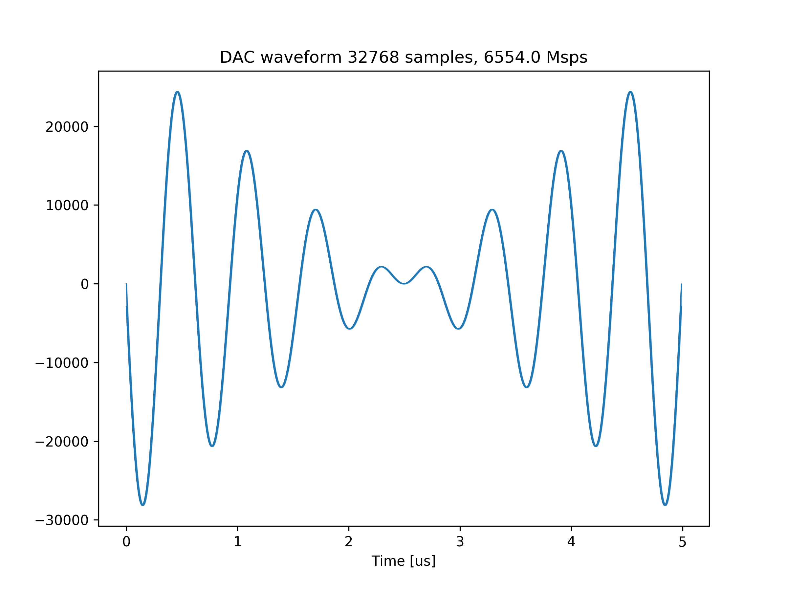
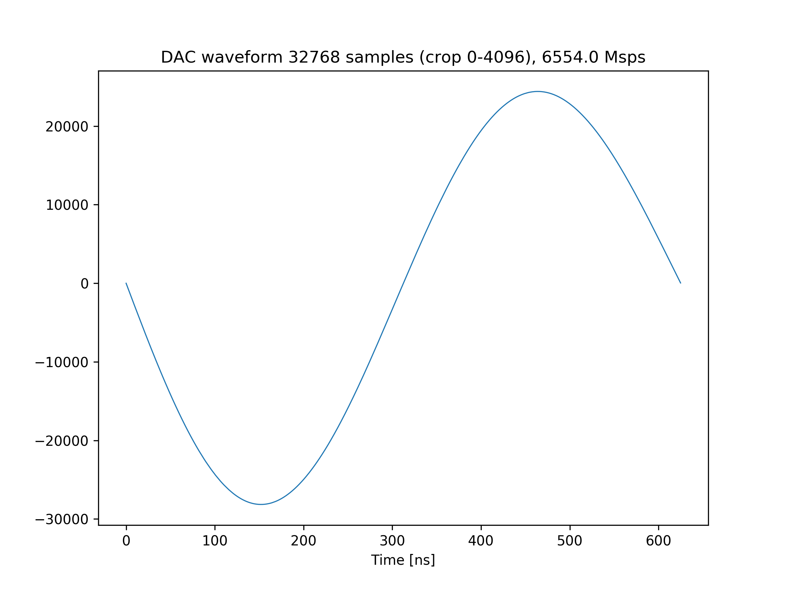
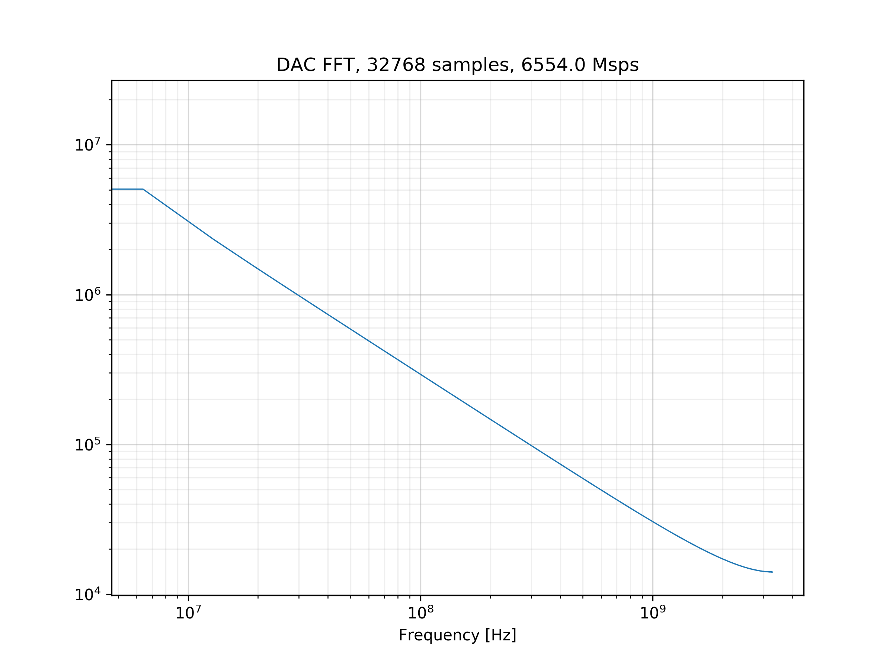
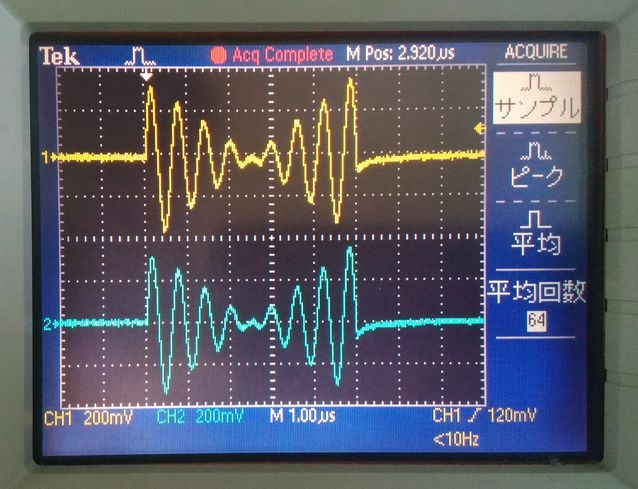

# DAC の最大サンプリングレートでの波形データの送信

[bram_send_max_sampling_rate.py](./bram_send_max_sampling_rate.py) は，2 つの DAC チャネルから最大サンプリングレート (6554 [Msps]) で，
波形を出力するスクリプトです．出力する波形のデータは，BRAM に格納されます．

## セットアップ

次のように DAC とオシロスコープを接続します．  


## 実行手順と結果

以下のコマンドを実行します．

```
python bram_send_max_sampling_rate.py
```

カレントディレクトリの下の `plot_bram_send_max_sampling_rate` ディレクトリの中に，送信波形のグラフおよびスペクトルが以下のファイル名で保存されます．
- dram_send.png (送信波形全体)
- dram_send_crop.png (送信波形の先頭 4096 サンプル)
- dram_send_fft.png (送信波形の周波数スペクトル)

送信波形全体  


送信波形の先頭 4096 サンプル  


送信波形の周波数スペクトル  


オシロスコープで観測される波形を以下に示します．
黄色のグラフが DAC チャネル 6 に対応しており，水色のグラフが DAC チャネル 7 に対応しています．
上の送信波形と比べ，変位が反転していますが，これは ZCU111 付属のバラン内部の回路の構成によるものです．

オシロスコープ観測波形 (全体)  

