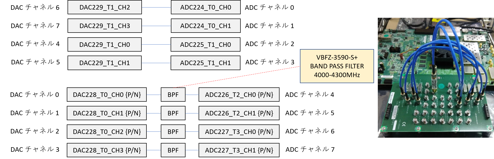
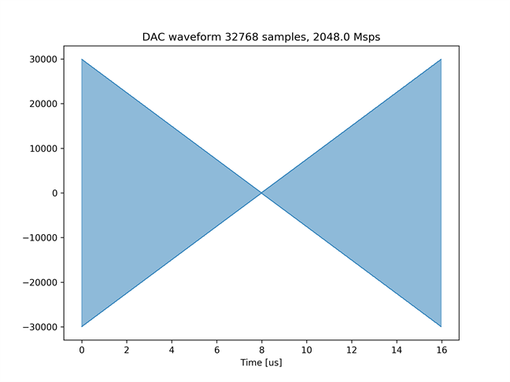
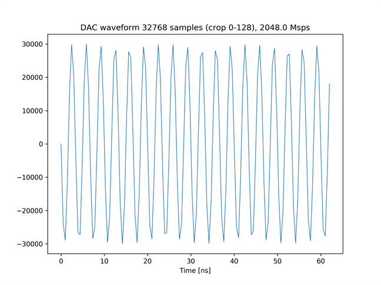
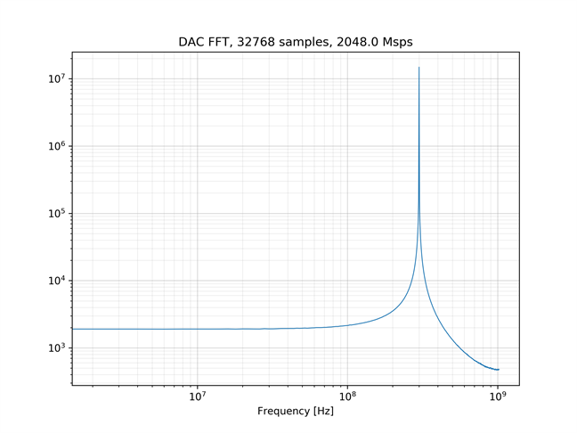
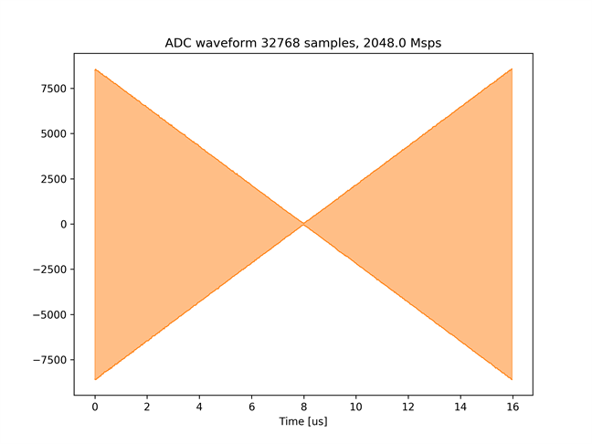
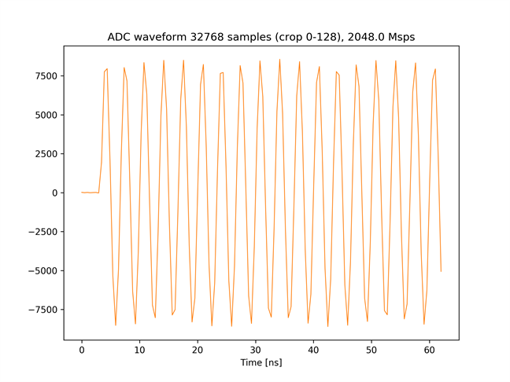
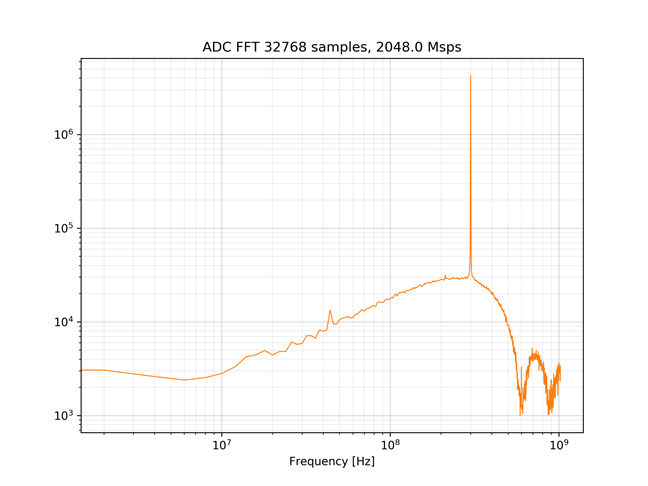

# BRAM を使った波形データの送受信

[bram_send_recv_labrad.py](./bram_send_recv_labrad.py) は，全 DAC チャネルから振幅が変化する 300[MHz] の正弦波を出力し，全 ADC チャネルでキャプチャするスクリプトです．
DAC から出力する波形データと ADC で取得した波形データは，どちらも BRAM に格納されます．

## セットアップ

次のようにADCとDACを接続します．  



差動入出力を接続する際は，付属の BPF を取り付けた SMA ケーブルで接続します．

## 実行手順と結果

LabRAD サーバの起動後，以下のコマンドを実行します．実行後，`username` と `LabRAD password` の入力を求められますが，どち
らも何も入力せずに Enter を押します．
LabRAD サーバの起動方法は，[LabRAD サーバを起動する](../rftool_labrad_server/README.md) を参照してください．

```
python bram_send_recv.py
```

カレントディレクトリの下の `plot_bram_send_recv` ディレクトリの中に，送信波形のグラフおよびスペクトルが以下のファイル名で保存されます．
- bram_send.png (送信波形全体)
- bram_send_crop.png (送信波形の先頭 128 サンプル)
- bram_send_fft.png (送信波形の周波数スペクトル)

受信信号の波形およびスペクトルは，ADC チャネルごとに以下のファイル名で保存されます．
\* には，その波形をキャプチャした ADC のチャネル番号 (0 ～ 7) が入ります．
- bram_recv_*.png (受信波形全体)
- bram_recv_*_crop.png (受信波形の先頭 128 サンプル)
- bram_recv_*_fft.png (受信波形の周波数スペクトル)

送信波形全体  


送信波形の先頭 128 サンプル  


送信波形の周波数スペクトル  


ADC チャネル 0 の受信波形全体  


ADC チャネル 0 の受信波形の先頭 128 サンプル  


ADC チャネル 0 の受信波形の周波数スペクトル  

