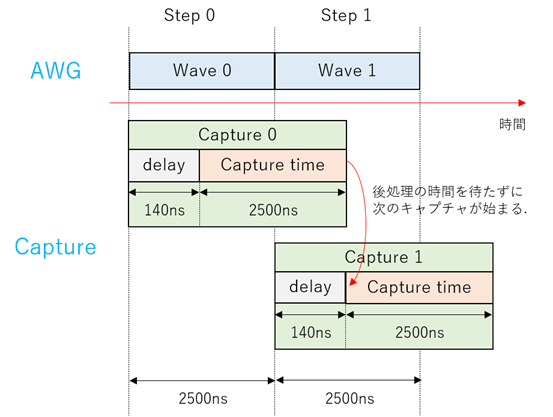
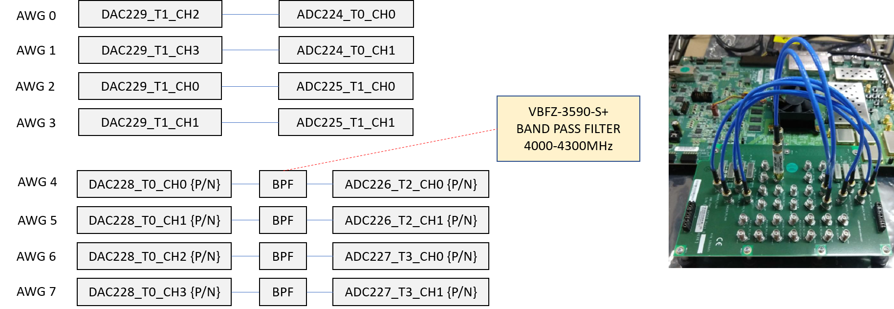
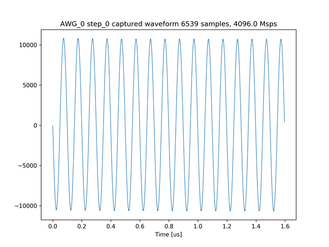
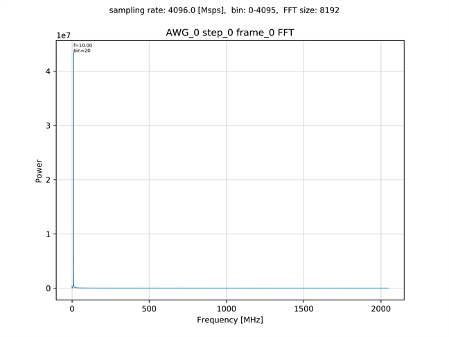
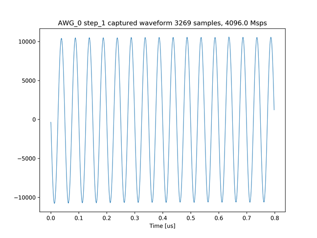
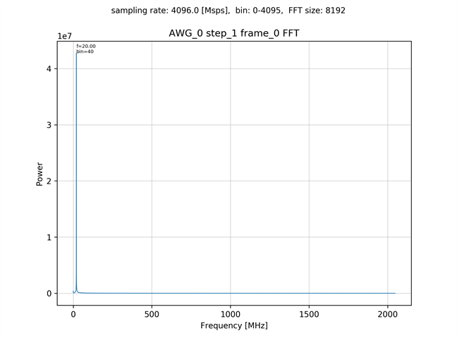
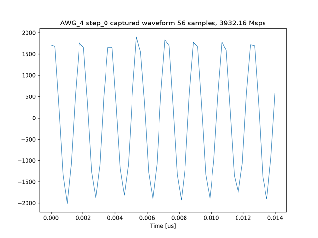
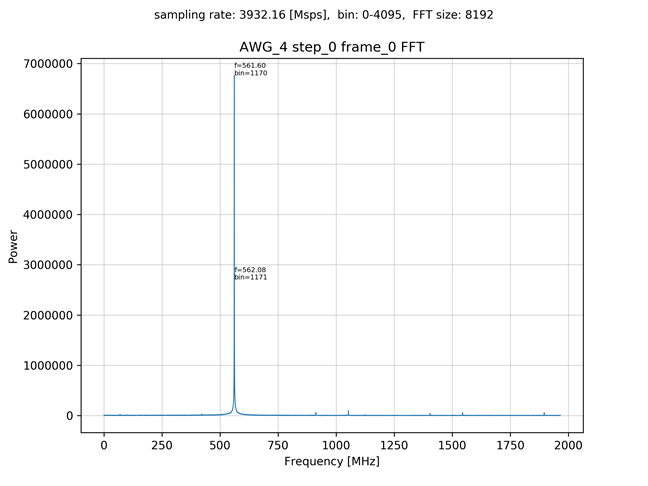
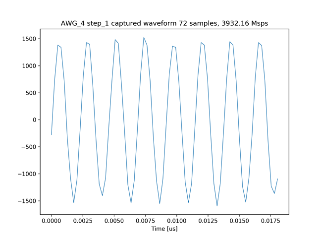
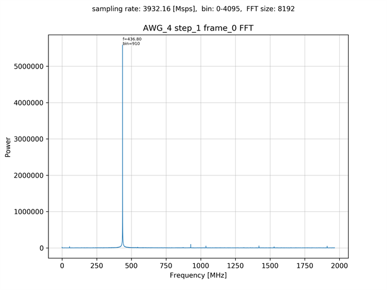

# 8つのAWGから異なる周波数の正弦波を連続で出力しキャプチャする

通常，波形データのキャプチャには後処理が存在するため，連続でキャプチャを実行することはできませんが，
「BRAM キャプチャ版 Non-MTS AWG SA」 と 「MTS AWG SA」 の 2 つのデザインでは，
サンプリングレートやキャプチャ時間などの条件によっては，連続キャプチャが可能です．
設定した波形ステップやキャプチャステップのパラメータで正常にキャプチャが行えるかどうかは，
添付のエクセルファイル ([capture_params_checker.xlsx](./capture_params_checker.xlsx)) を参照してください．

本サンプル ([awg_x8_continuous_send_recv.py](./awg_x8_continuous_send_recv.py) と [mts_awg_x8_continuous_send_recv.py](./mts_awg_x8_continuous_send_recv.py)) は，
連続する 2 つの波形ステップで異なる周波数の正弦波を出力し，それを各ステップごとにキャプチャするものです.
[awg_x8_continuous_send_recv.py](./awg_x8_continuous_send_recv.py) が，「BRAM キャプチャ版 Non-MTS AWG SA」 デザイン用で，[mts_awg_x8_continuous_send_recv.py](./mts_awg_x8_continuous_send_recv.py) が「MTS AWG SA」デザイン用になります．

[awg_x8_continuous_send_recv.py](./awg_x8_continuous_send_recv.py) のキャプチャのタイミングのイメージは以下の図のようになります．
実際の波形の長さなどは，AWG のチャネルによって若干異なります．
[mts_awg_x8_continuous_send_recv.py](./mts_awg_x8_continuous_send_recv.py) のタイミングもディレイの長さ以外は同じです．



## セットアップ

次のようにADCとDACを接続します．  


差動入出力を接続する際は，付属の BPF を取り付けた SMA ケーブルで接続します．

## BRAM キャプチャ版 Non-MTS AWG SA を使用する場合

以下のコマンドを実行します．

```
python awg_x8_continuous_send_recv.py
```

カレントディレクトリの下の `plot_awg_x8_continuous_send_recv_prv_cap_ram` ディレクトリの中に，
AWG ごとにキャプチャ波形とスペクトルのグラフが作成されます．

キャプチャモジュール 0 でキャプチャした波形ステップ 0 のグラフ  


キャプチャモジュール 0 でキャプチャした波形ステップ 0 のスペクトル  


キャプチャモジュール 0 でキャプチャした波形ステップ 1 のグラフ  


キャプチャモジュール 0 でキャプチャした波形ステップ 1 のスペクトル  


## MTS AWG SA を使用する場合

以下のコマンドを実行します．

```
python mts_awg_x8_continuous_send_recv.py
```

カレントディレクトリの下の `plot_mts_awg_x8_continuous_send_recv_prv_cap_ram` ディレクトリの中に，
AWG ごとにキャプチャ波形とスペクトルのグラフが作成されます．

キャプチャモジュール 4 でキャプチャした波形ステップ 0 のグラフ  


キャプチャモジュール 4 でキャプチャした波形ステップ 0 のスペクトル  


キャプチャモジュール 4 でキャプチャした波形ステップ 1 のグラフ  


キャプチャモジュール 4 でキャプチャした波形ステップ 1 のスペクトル  

