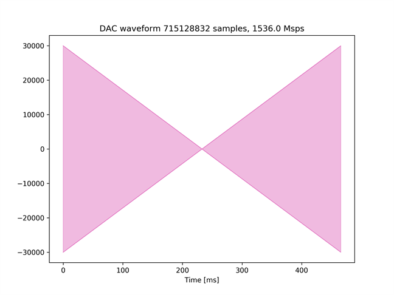
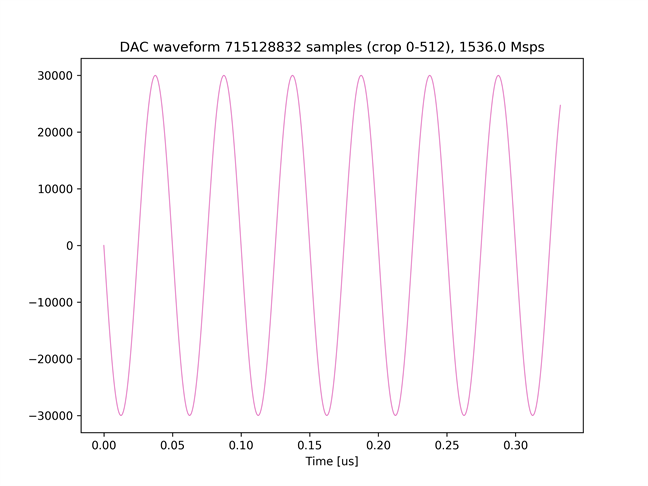
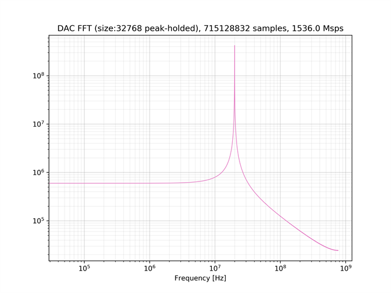
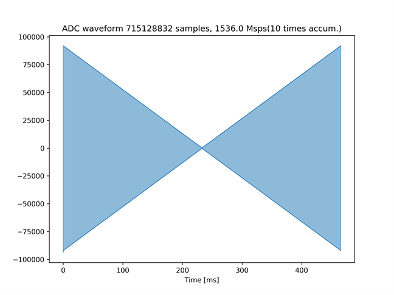
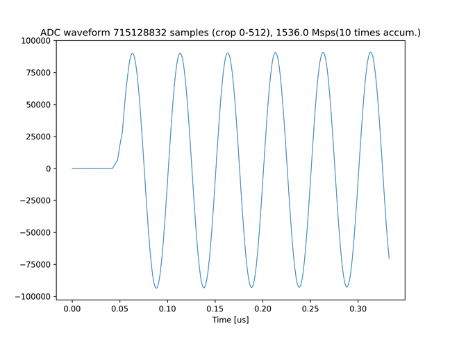
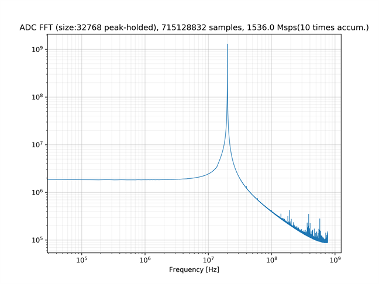
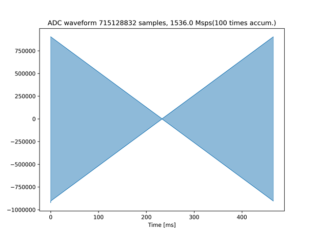
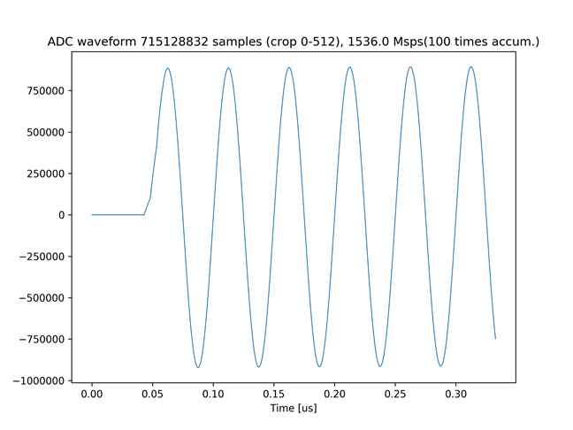
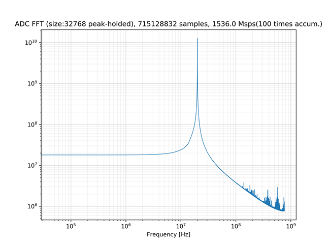

# DRAM を使った波形データの積算

[dram_accum_send_recv.py](./dram_accum_send_recv.py) は，DAC チャネル 6 から同じ波形を繰り返し出力し，
ADC チャネル 0 で波形同士を積算しながらキャプチャするスクリプトです．

## セットアップ

次のように ADC と DAC を接続します．


## 実行手順と結果

以下のコマンドを実行します．
積算回数は 1 から 32768 までの整数を指定できます．
100 回以上の積算を行う場合は，スクリプトの `TRIG_BUSY_TIMEOUT` 変数の値を `0.5 * 積算回数` 以上になるように設定してください．

```
python dram_accum_send_recv.py <積算回数>
```

カレントディレクトリの下の `plot_dram_accum_send_recv/<積算回数>` ディレクトリの中に，送信波形のグラフおよびスペクトルが以下のファイル名で保存されます．
- dram_send_6.png (送信波形全体)
- dram_send_6_crop.png (送信波形の先頭 512 サンプル)
- dram_send_6_fft.png (送信波形の周波数スペクトル)

受信信号の波形およびスペクトルは，以下のファイル名で保存されます．
- dram_recv_0.png (受信波形全体)
- dram_recv_0_crop.png (受信波形の先頭 512 サンプル)
- dram_recv_0_fft.png (受信波形の周波数スペクトル)

送信波形全体　　　　   


送信波形の先頭 512 サンプル     


送信波形の周波数スペクトル       


ADC チャネル 0 の受信波形全体 (10 回積算)　　　　　


ADC チャネル 0 の受信波形の先頭 512 サンプル (10 回積算)


ADC チャネル 0 の受信波形の周波数スペクトル (10 回積算)


ADC チャネル 0 の受信波形全体 (100 回積算)　　　　　


ADC チャネル 0 の受信波形の先頭 512 サンプル (100 回積算)


ADC チャネル 0 の受信波形の周波数スペクトル (100 回積算)


受信波形のグラフより，積算回数が増えると受信波形の振幅が増加していることが確認できます．
