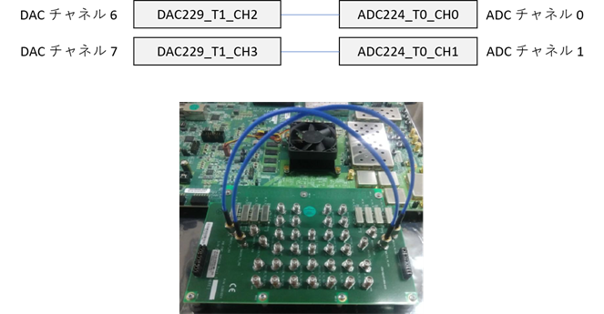

# DRAM を使った IQ データの送受信

[dram_iq_send_recv.py](./dram_iq_send_recv.py) は，2 つの DAC チャネルと ADC チャネルの IQ ミキサを有効にして，波形の出力とキャプチャを行うスクリプトです．DAC から出力する IQ データと ADC で取得した IQ データは，どちらも DRAM に格納されます．

## セットアップ

次のように ADC と DAC を接続します．  



## 実行手順と結果

以下のコマンドを実行します．

```
python dram_iq_send_recv.py
```

カレントディレクトリの下の `plot_dram_iq_send_recv` ディレクトリの中に，送信波形のグラフおよびスペクトルが以下のファイル名で保存されます．

- dram_iq_send.png (送信波形全体)
- dram_iq_send_crop.png (送信波形の先頭 512 サンプル)
- dram_iq_send_fft.png (送信波形の周波数スペクトル)

受信信号の波形およびスペクトルは，ADC チャネルごとに以下のファイル名で保存されます．
\* には，その波形をキャプチャした ADC のチャネル番号 (0 or 1) が入ります．
- dram_iq_recv_*.png (受信波形全体)
- dram_iq_recv_*_crop.png (受信波形の先頭 512 サンプル)
- dram_iq_recv_*_fft.png (受信波形の周波数スペクトル)

送信波形全体  


送信波形の先頭 512 サンプル  


送信波形の周波数スペクトル  


ADC チャネル 0 の受信波形全体  


ADC チャネル 0 の受信波形の先頭 512 サンプル  


ADC チャネル 0 の受信波形の周波数スペクトル  

