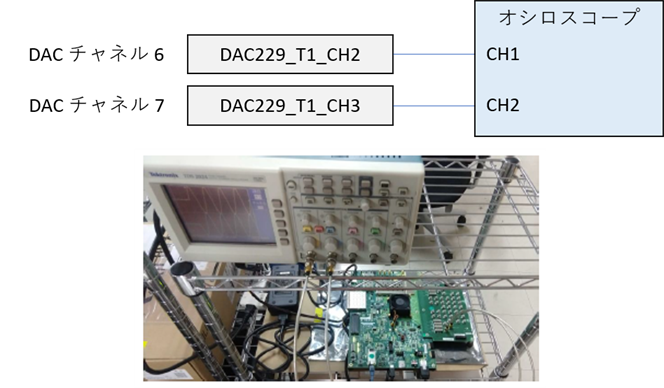

# DRAM を使った波形データの送信

[dram_send_2ch_250ms.py](./dram_send_2ch_250ms.py) は，2 つの DAC チャネルから振幅が変化する 20[MHz] の正弦波信号を約 1 秒間隔で繰り返し出力するスクリプトです．出力する波形のデータは，DRAM に格納されます．

## セットアップ

次のように DAC とオシロスコープを接続します．  


## 実行手順と結果

以下のコマンドを実行します．

```
python dram_send_2ch_250ms.py
```

カレントディレクトリの下の `plot_dram_send_2ch_250ms` ディレクトリの中に，送信波形のグラフおよびスペクトルが以下のファイル名で保存されます．
- dram_send_0.png (DAC チャネル 6 の送信波形全体)
- dram_send_0_crop.png (DAC チャネル 6 の送信波形の先頭 512 サンプル)
- dram_send_0_fft.png (DAC チャネル 6 の送信波形の周波数スペクトル)
- dram_send_1.png (DAC チャネル 7 の送信波形全体)
- dram_send_1_crop.png (DAC チャネル 7 の送信波形の先頭 512 サンプル)
- dram_send_1_fft.png (DAC チャネル 7 の送信波形の周波数スペクトル)

DAC チャネル 6 の送信波形全体  


DAC チャネル 6 の送信波形の先頭 512 サンプル  


DAC チャネル 6 の送信波形の周波数スペクトル  


オシロスコープで観測される波形を以下に示します．
黄色のグラフが DAC チャネル 6 に対応しており，水色のグラフが DAC チャネル 7 に対応しています．
上の送信波形と比べ，変位が反転していますが，これは ZCU111 付属のバラン内部の回路の構成によるものです．

オシロスコープ観測波形 (全体)  


オシロスコープ観測波形 (先頭)  

