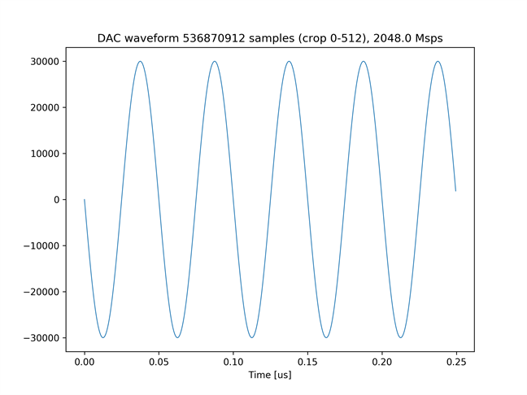
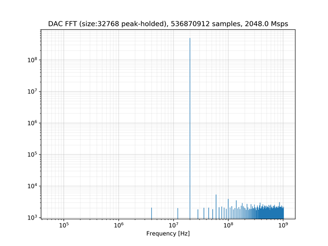
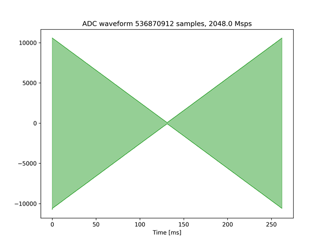
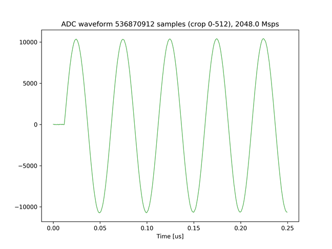
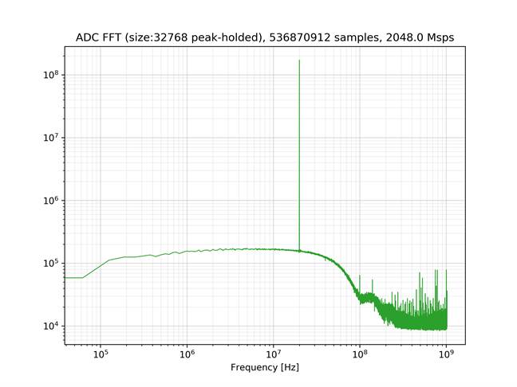

# DRAM を使った波形データの送受信

[dram_send_recv_2ch_250ms_labrad.py](./dram_send_recv_2ch_250ms_labrad.py) は，2 つの DAC チャネルから振幅が変化する 20[MHz] の正弦波を出力し，2つの ADC チャネルでキャプチャするスクリプトです．
DAC から出力する波形データと ADC で取得した波形データは，どちらも DRAM に格納されます．

## セットアップ

次のように ADC と DAC を接続します．  


## 実行手順と結果

LabRAD サーバの起動後，以下のコマンドを実行します．実行後，`username` と `LabRAD password` の入力を求められますが，どち
らも何も入力せずに Enter を押します．
LabRAD サーバの起動方法は，[LabRAD サーバを起動する](../rftool_labrad_server/README.md) を参照してください．

```
python dram_send_recv_2ch_250ms_labrad.py
```

カレントディレクトリの下の `plot_dram_send_recv_2ch_250ms` ディレクトリの中に，送信波形のグラフおよびスペクトルが以下のファイル名で保存されます．
\* には 0 か 1 が入り，それぞれ，DAC チャネル 6 と DAC チャネル 7 の送信波形のファイルとなります．

- dram_send_*.png (送信波形全体)
- dram_send_*_crop.png (送信波形の先頭 512 サンプル)
- dram_send_*_fft.png (送信波形の周波数スペクトル)

受信信号の波形およびスペクトルは，ADC チャネルごとに以下のファイル名で保存されます．
\* には，その波形をキャプチャした ADC のチャネル番号 (0 or 1) が入ります．
- dram_recv_*.png (受信波形全体)
- dram_recv_*_crop.png (受信波形の先頭 512 サンプル)
- dram_recv_*_fft.png (受信波形の周波数スペクトル)

DAC チャネル 6 の送信波形全体  


DAC チャネル 6 の送信波形の先頭 512 サンプル  


DAC チャネル 6 の送信波形の周波数スペクトル  


ADC チャネル 0 の受信波形全体  


ADC チャネル 0 の受信波形の先頭 512 サンプル  


ADC チャネル 0 の受信波形の周波数スペクトル  

