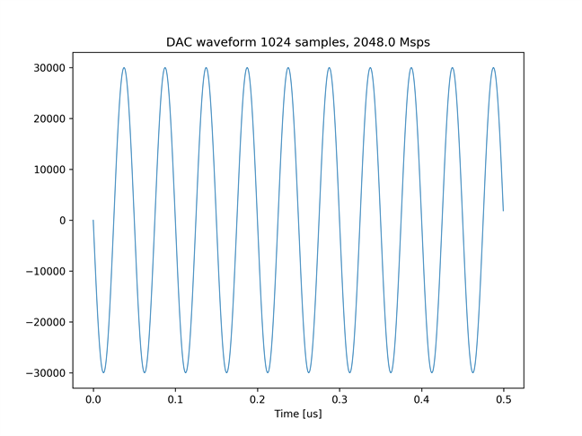
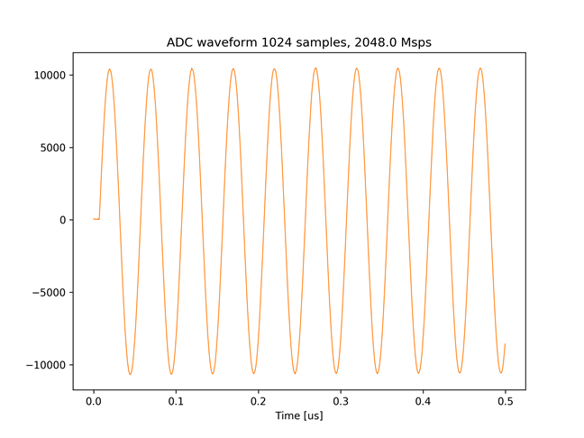
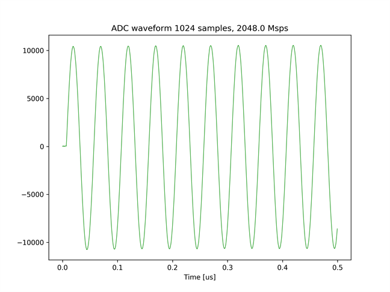

# Feedback システムのテスト 1

[feedback_test_1.py](./feedback_test_1.py) は，ADC がキャプチャした波形に応じて，DAC が出力する波形が変わるシステム (Feedback システム) のテストを行うスクリプトです．
本サンプルでは，まず，DAC チャネル 7 が波形を送信し，ADC チャネル 0 がキャプチャします．
次に，DAC チャネル 6 が波形を送信し，ADC チャネル 1 がキャプチャします．

## セットアップ

次のようにADCとDACを接続します．  


## 実行手順と結果

以下のコマンドを実行します．

```
python feedback_test_1.py
```

カレントディレクトリの下の `plot_feedback_test_2` ディレクトリの中に，以下のファイルが保存されればテスト成功です．
- bram_send.png (DAC チャネル 6, 7 送信波形)
- bram_recv_0.png (ADC チャネル 0 キャプチャ波形)
- bram_recv_1.png (ADC チャネル 1 キャプチャ波形)

DAC チャネル 6, 7 送信波形  


ADC チャネル 0 キャプチャ波形  


ADC チャネル 1 キャプチャ波形  

