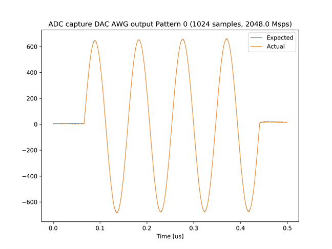
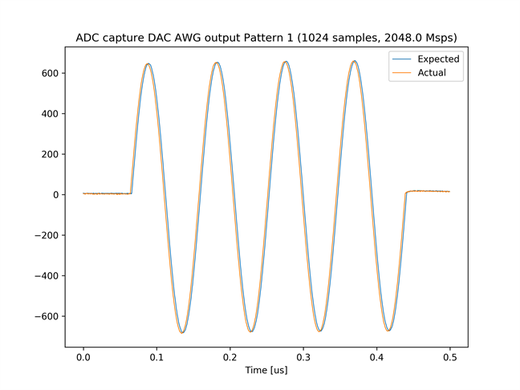
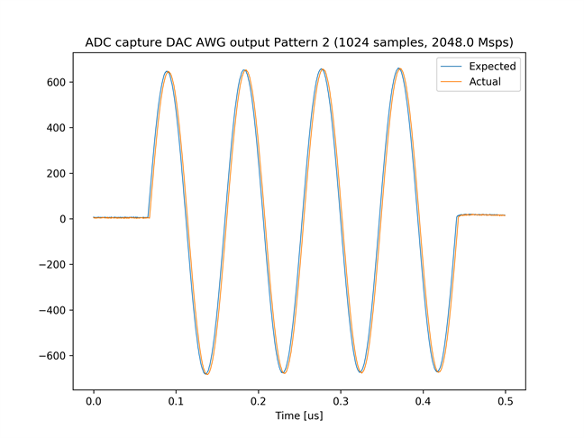
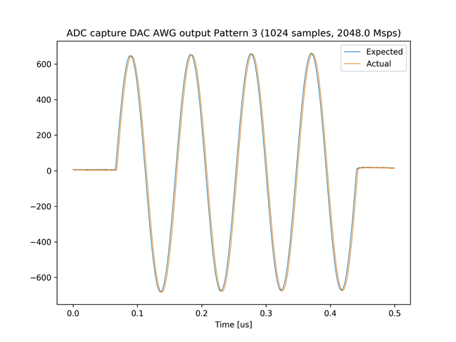
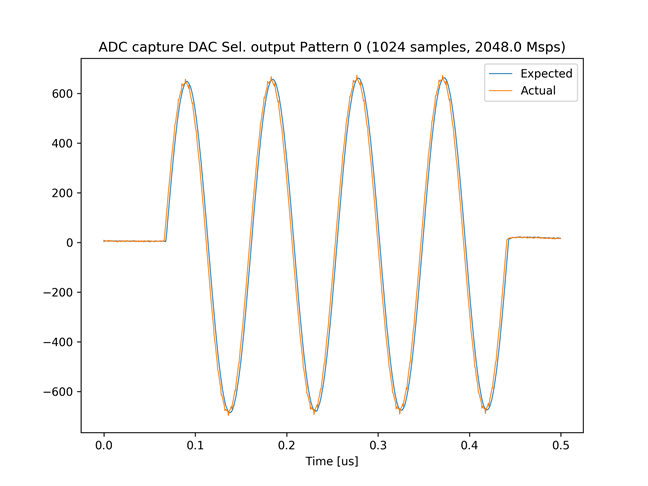
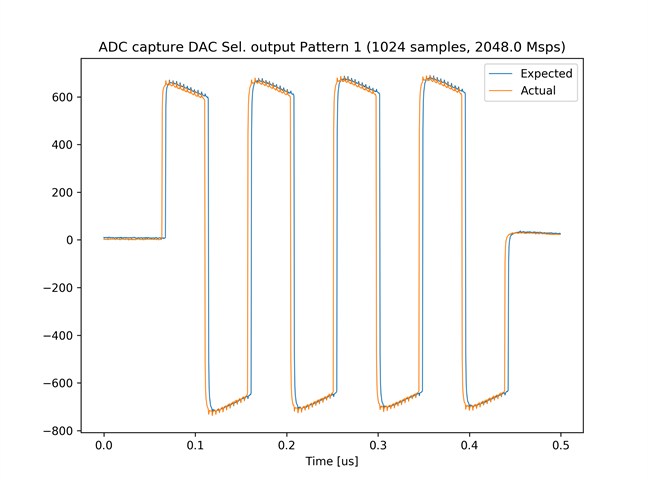
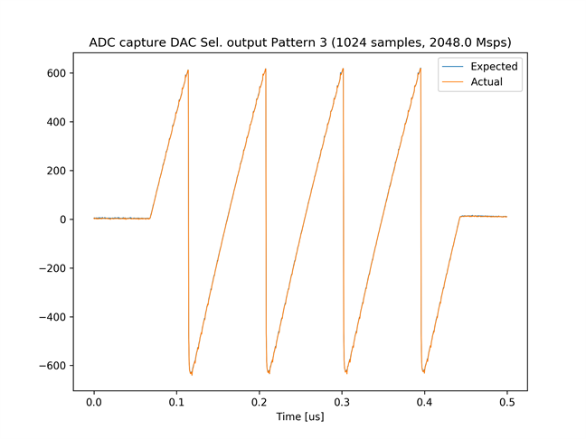

# Feedback システムのテスト 2

[feedback_test_2.py](./feedback_test_2.py) は，ADC がキャプチャした波形に応じて，DAC が出力する波形が変わるシステム (Feedback システム) のテストを行うスクリプトです．

## セットアップ

次のようにADCとDACを接続します．  


## 実行手順と結果

以下のコマンドを実行します．

```
python feedback_test_2.py
```
カレントディレクトリの下の `plot_feedback_test_2` ディレクトリの中に，以下のファイルが保存されます．
\* には，0 ～ 3 の数字が入ります．
adc_cap_dacsel_pattern_*.png の Expected と Actual の波形が一致していればテスト成功です．
- adc_cap_awg_pattern_*.png
- adc_cap_dacsel_pattern_*.png

adc_cap_awg_pattern_0.png  


adc_cap_awg_pattern_1.png  


adc_cap_awg_pattern_2.png  


adc_cap_awg_pattern_3.png  


adc_cap_dacsel_pattern_0.png  


adc_cap_dacsel_pattern_1.png  


adc_cap_dacsel_pattern_2.png  


adc_cap_dacsel_pattern3.png  

