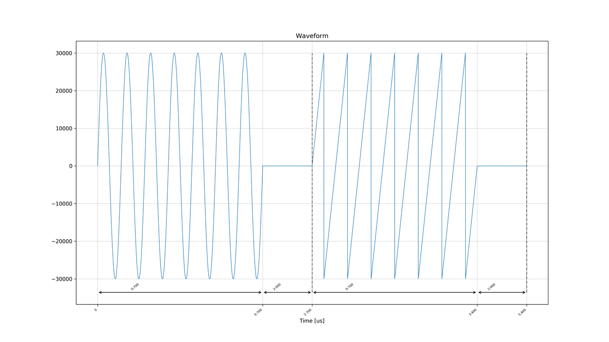
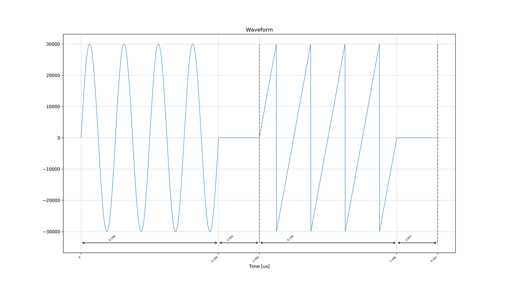
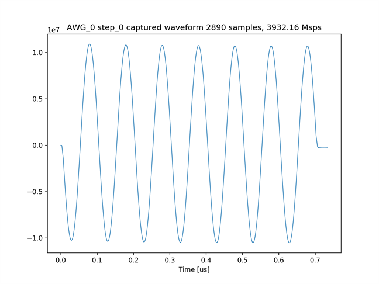
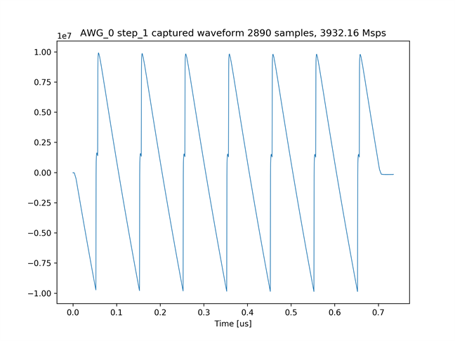
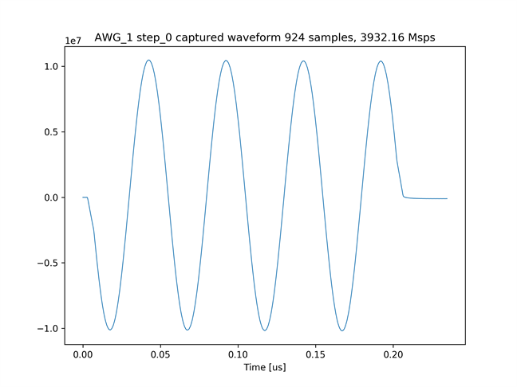
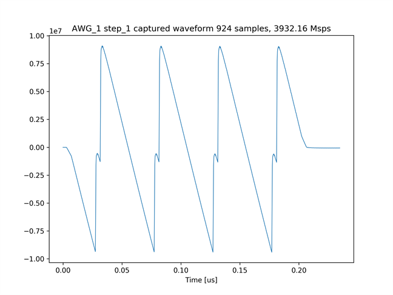

# AWG から出力した波形を積算しながらキャプチャする (MTS 版)

[mts_awg_accum_send_recv.py](../awg_accum_send_recv.py) は，2 つの AWG から同じ波形を 1000 回繰り返し出力し，2 つのキャプチャモジュールで波形同士を積算しながらキャプチャするスクリプトです．各 AWG に設定する出力波形を以下の図に示します．実際には，ZCU111 付属のバラン内部の回路の構成により変位が反転した波形が出力されます．

AWG 0 の出力波形  


AWG 1 の出力波形  


## セットアップ

次のように ADC と DAC を接続します．  


## 実行手順と結果

以下のコマンドを実行します．

```
python mts_awg_accum_send_recv.py
```

キャプチャモジュール 0 がキャプチャした 2 つの波形と，キャプチャモジュール 1 がキャプチャした 2 つの波形のグラフが，
カレントディレクトリの下の `plot_mts_accum_send_recv_prv_cap_ram` ディレクトリ以下に作成されます．

キャプチャモジュール 0 がキャプチャした波形 1  


キャプチャモジュール 0 がキャプチャした波形 2  


キャプチャモジュール 1 がキャプチャした波形 1  


キャプチャモジュール 1 がキャプチャした波形 2  

