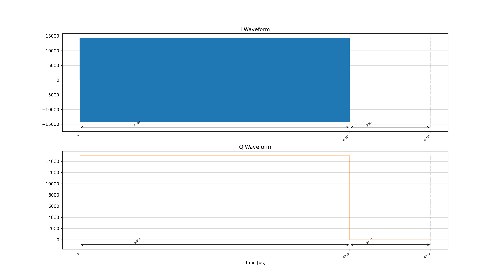
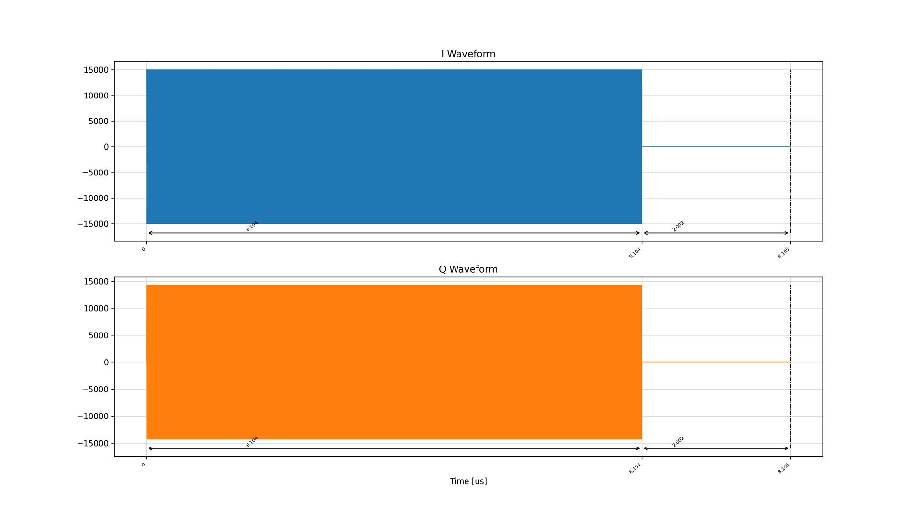
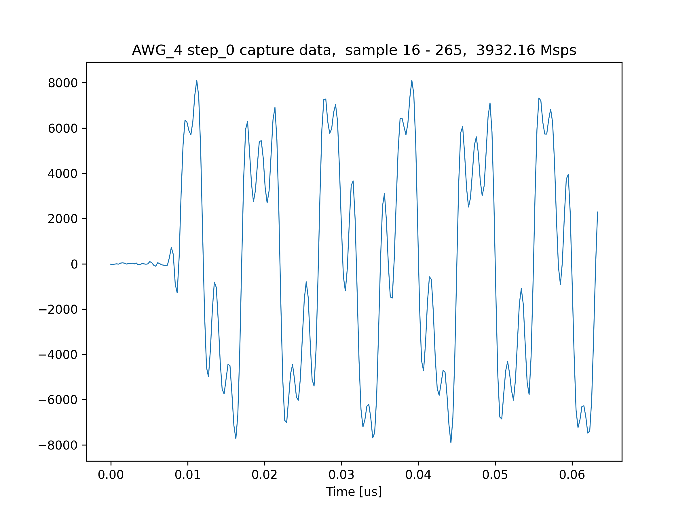
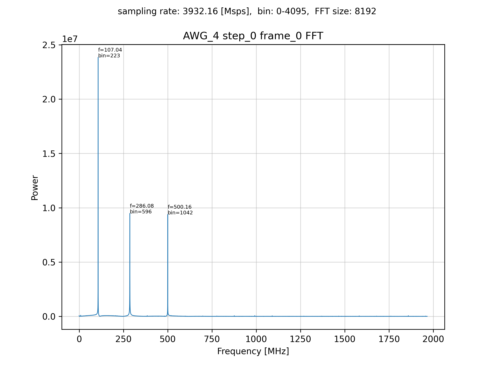
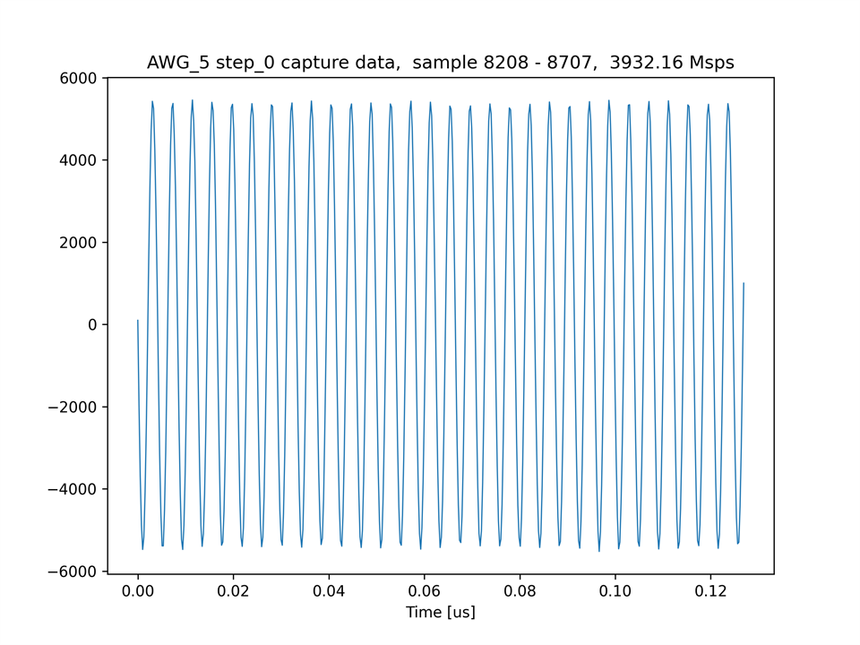
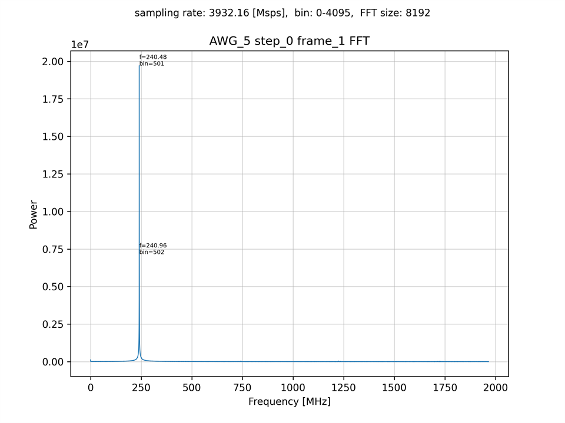
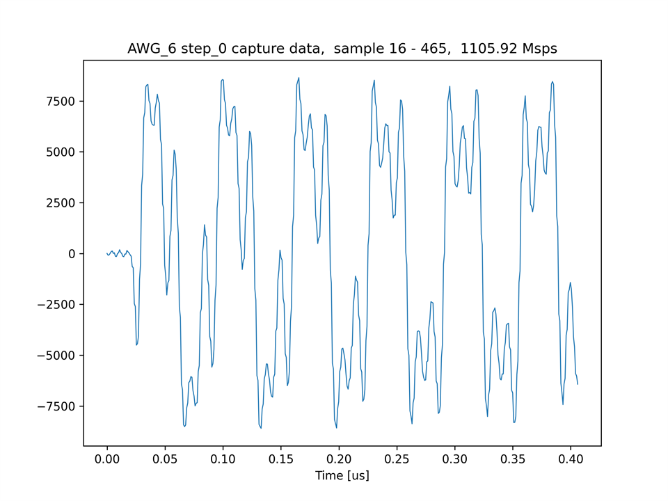
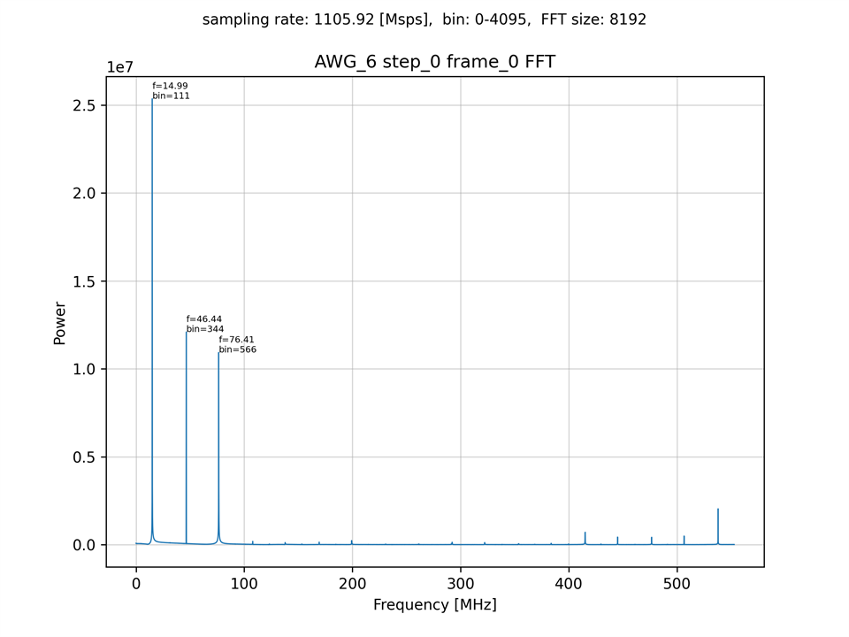
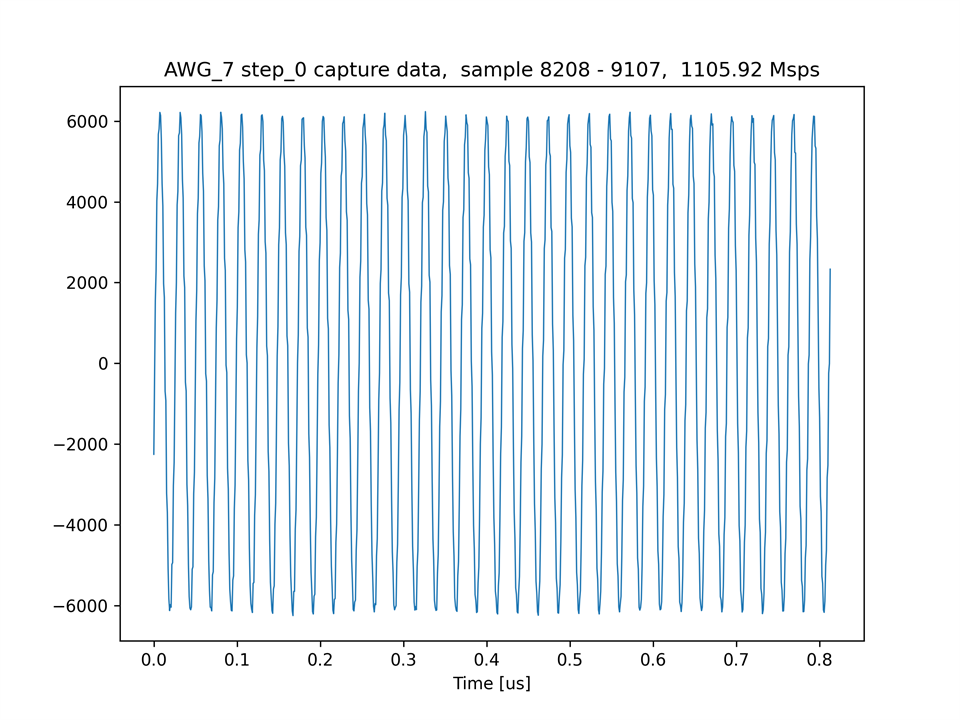
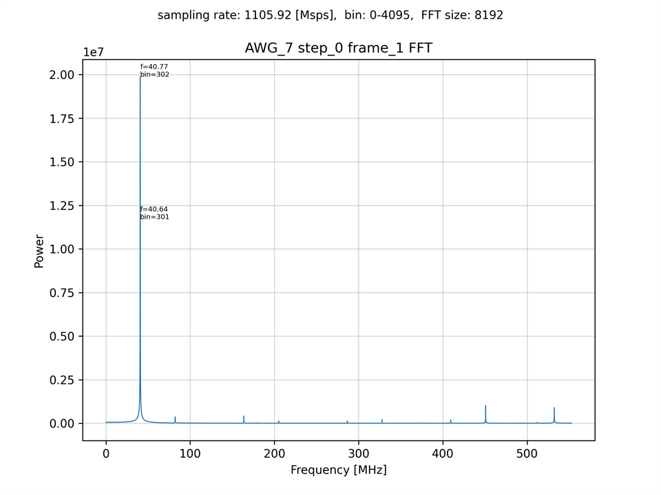

# AWG から IQ ミキシングした波形を出力する

[mts_awg_iq_send_recv.py](./mts_awg_iq_send_recv.py) は，IQ ミキシングしたデータを AWG 4 ~ 7 から出力し，Real データとしてキャプチャするスクリプトです．

AWG 4, AWG 6 の IQ データ (高サンプリングレート版)


AWG 5, AWG 7 の IQ データ (高サンプリングレート版)


## セットアップ

次のように ADC と DAC を接続します．  


## 実行手順と結果 (高サンプリングレート版)

以下のコマンドを実行します．

```
python mts_awg_iq_send_recv.py
```

キャプチャモジュール 4 ~ 7 がキャプチャした波形とそのスペクトルのグラフが，カレントディレクトリの下の `plot_mts_awg_iq_send_recv` ディレクトリ以下に作成されます．
スペクトルのピークが現れる位置は，同スクリプトのファイルコメントを参照してください．

キャプチャモジュール 4 がキャプチャした波形 (16 ～ 265 番目のサンプル)  


キャプチャモジュール 4 がキャプチャした波形 (16 ～ 8207 番目のサンプル) のスペクトル  


キャプチャモジュール 5 がキャプチャした波形 (8208 ～ 8707 番目のサンプル)  


キャプチャモジュール 5 がキャプチャした波形 (8208 ～ 16399 番目のサンプル) のスペクトル  


## 実行手順と結果 (低サンプリングレート版)

以下のコマンドを実行します．

```
python mts_awg_iq_send_recv.py low
```

キャプチャモジュール 4 ~ 7 がキャプチャした波形とそのスペクトルのグラフが，カレントディレクトリの下の `plot_mts_low_awg_iq_send_recv` ディレクトリ以下に作成されます．
スペクトルのピークが現れる位置は，同スクリプトのファイルコメントを参照してください．

キャプチャモジュール 6 がキャプチャした波形 (16 ～ 465 番目のサンプル)  


キャプチャモジュール 6 がキャプチャした波形 (16 ～ 8207 番目のサンプル) のスペクトル  


キャプチャモジュール 7 がキャプチャした波形 (8208 ～ 9107 番目のサンプル)  


キャプチャモジュール 7 がキャプチャした波形 (8208 ～ 16399 番目のサンプル) のスペクトル  

