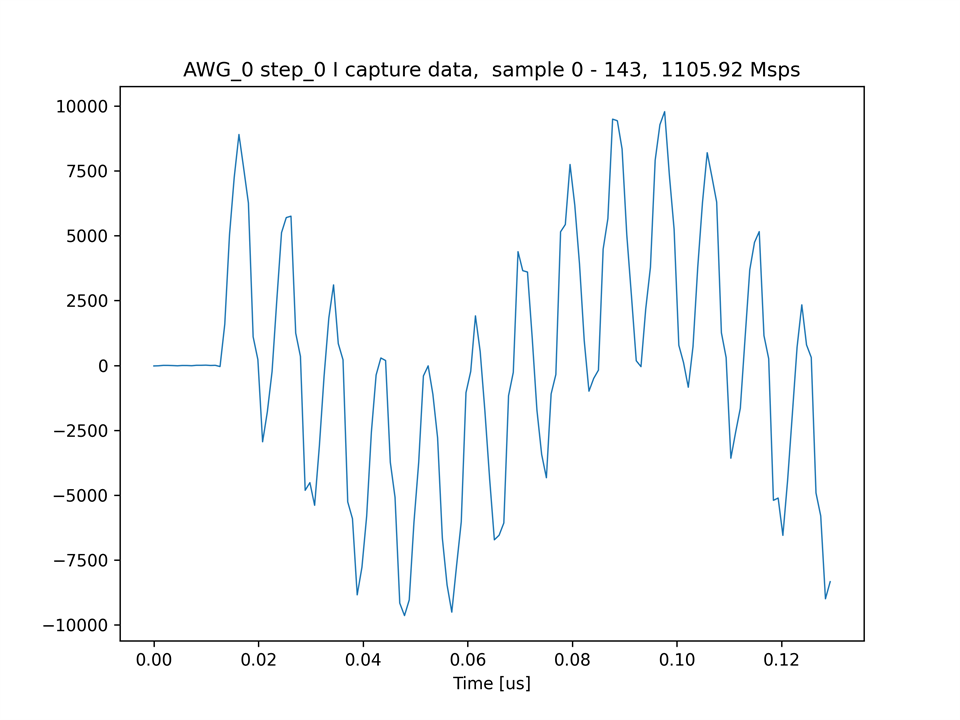
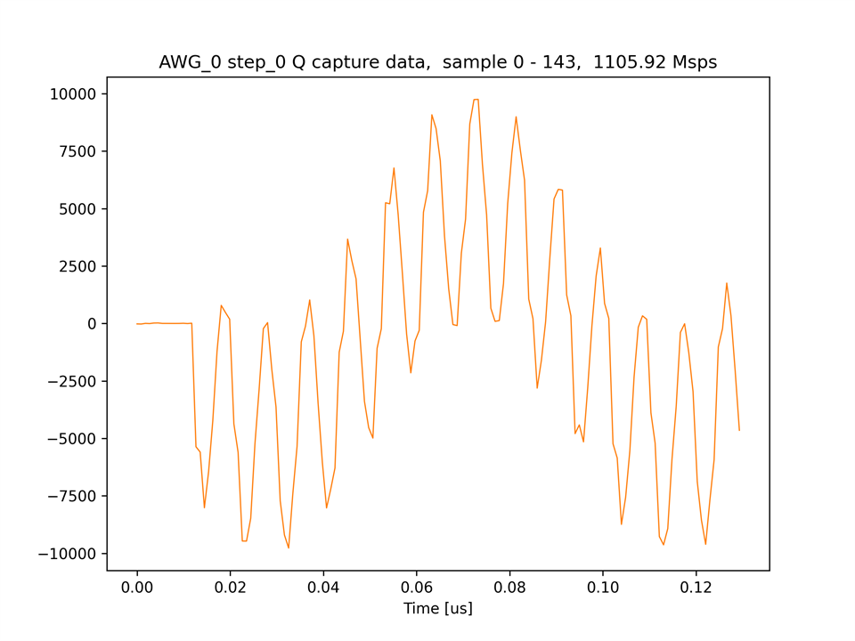
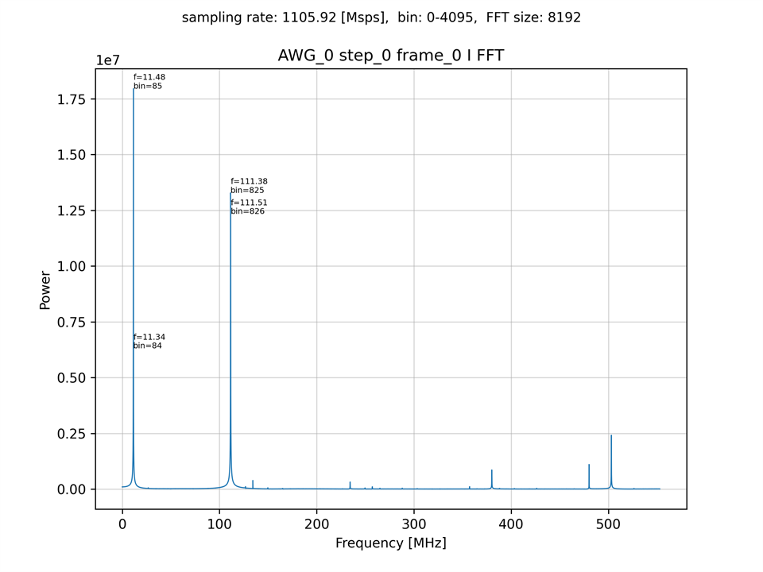
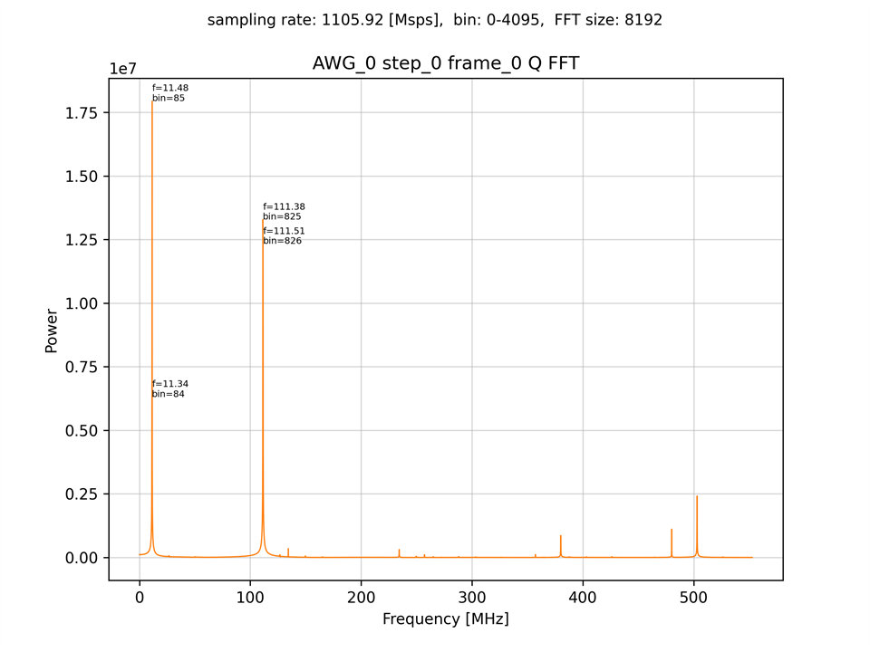

# キャプチャモジュールで IQ ミキシングした波形をキャプチャする

[mts_awg_send_iq_recv.py](./mts_awg_send_iq_recv.py) は，AWG 0, 1, 4 ~ 7 から 61.4 [MHz] の正弦波を出力し，
キャプチャモジュール 0, 1, 4 ~ 7 で 50 [MHz] の IQ ミキサをかけてキャプチャするスクリプトです．

AWG 0 の出力波形  


## セットアップ

次のように ADC と DAC を接続します．  


## 実行手順と結果

以下のコマンドを実行します．

```
python mts_awg_send_iq_recv.py
```

各キャプチャモジュールがキャプチャした I データおよび Q データの波形とそのスペクトルのグラフが，カレントディレクトリの下の `plot_mts_low_awg_send_iq_recv` ディレクトリ以下に作成されます．
スペクトルのピークが現れる位置は，同スクリプトのファイルコメントを参照してください．

キャプチャモジュール 0 がキャプチャした I データの波形 (先頭 144 サンプル)  


キャプチャモジュール 0 がキャプチャした Q データの波形 (先頭 144 サンプル)  


キャプチャモジュール 0 がキャプチャした I データ (先頭 8192 サンプル) のスペクトル  


キャプチャモジュール 0 がキャプチャした Q データ (先頭 8192 サンプル) のスペクトル  

