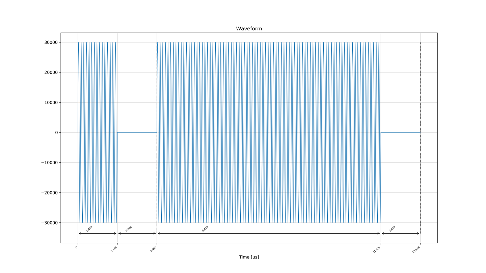
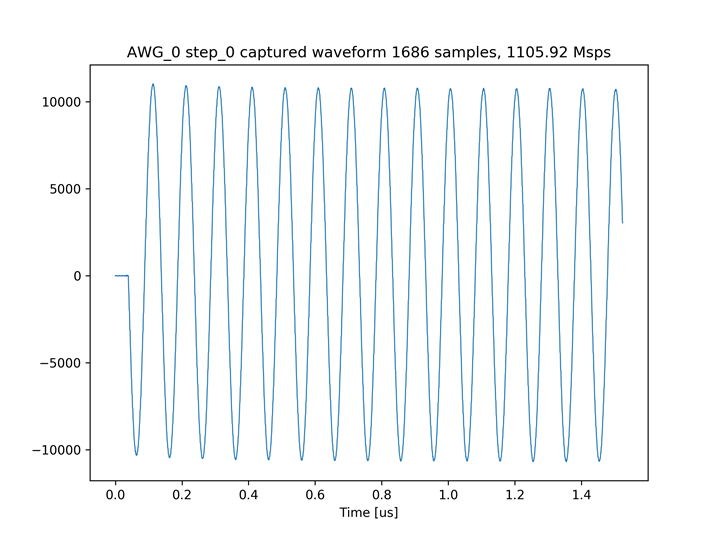
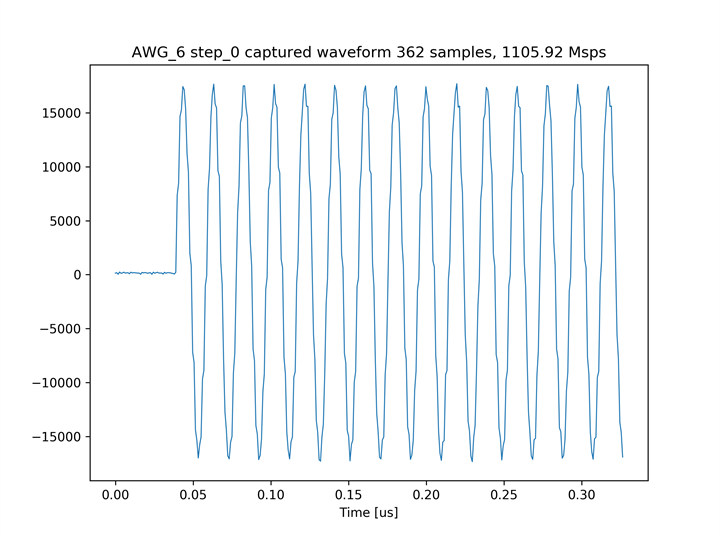
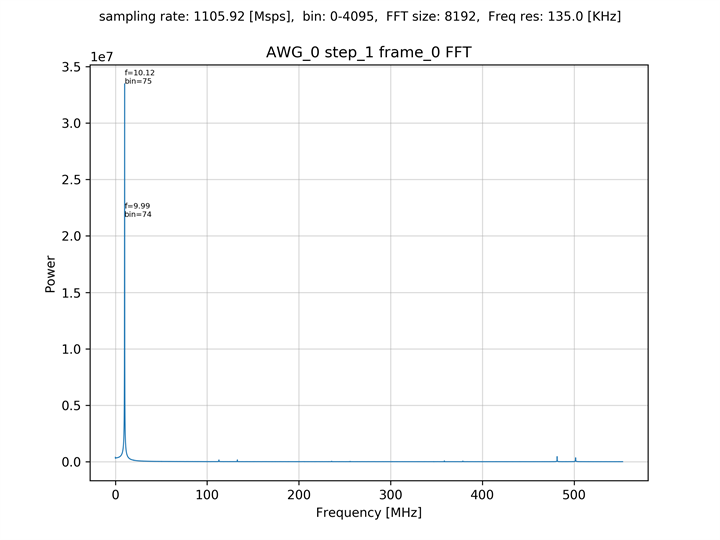
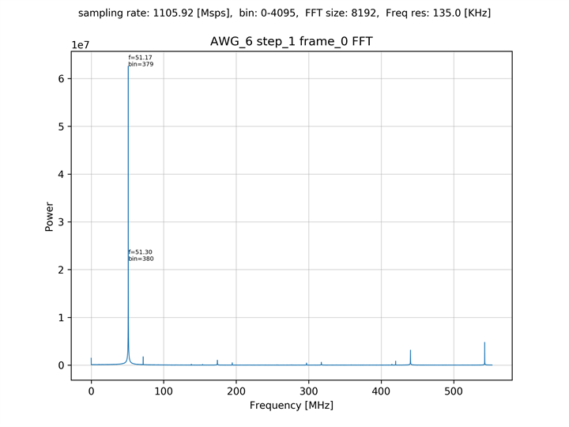

# 6つのAWGから15サイクルの正弦波を出力しキャプチャする (低サンプリングレート MTS)

[mts_awg_x8_low_sampling_rate.py](./mts_awg_x8_low_sampling_rate.py) は，6 つの AWG から特定の周波数の波形を出力し，6 つのキャプチャモジュールでキャプチャするスクリプトです．
出力される波形は，15 サイクルの正弦波と出力期間 10[us] の正弦波で，どちらも周波数は同じです．
キャプチャデータのうち，15 サイクルの正弦波はそのままグラフとして出力され，10[us] の正弦波は FFT スペクトルの計算に使用されます．

AWG 0 から出力される波形  


## セットアップ

次のように ADC と DAC を接続します．  


AWG 0, 1 と キャプチャモジュール 0, 1 は直結します． AWG 4 ～ 7 と キャプチャモジュール 4 ～ 7 は，間に -3dB の減衰器を取り付けます．

## 実行手順と結果

以下のコマンドを実行します．

```
python mts_awg_x8_low_sampling_rate.py
```

6 つの AWG に対応するキャプチャ波形とスペクトルのグラフが，カレントディレクトリの下の `plot_mts_awg_x8_low_sampling_rate` ディレクトリ以下に作成されます．

<br>

AWG 0 (LPF 内蔵ポート) の波形のキャプチャデータ 


AWG 6 (差動入出力ポート) の波形のキャプチャデータ 


AWG 0 (LPF 内蔵ポート) の波形のスペクトル 


AWG 6 (差動入出力ポート) の波形のスペクトル 

