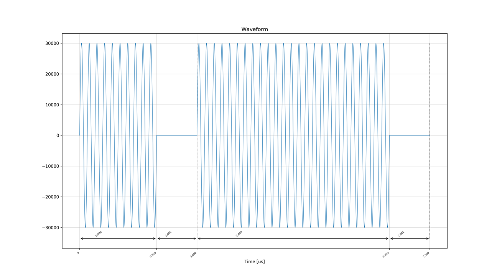
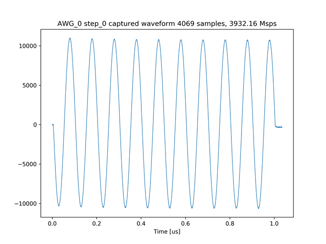
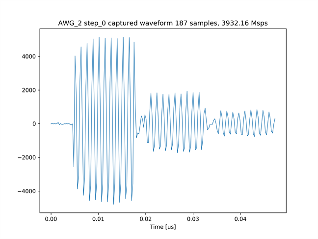
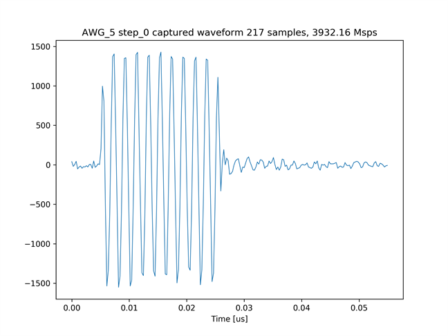
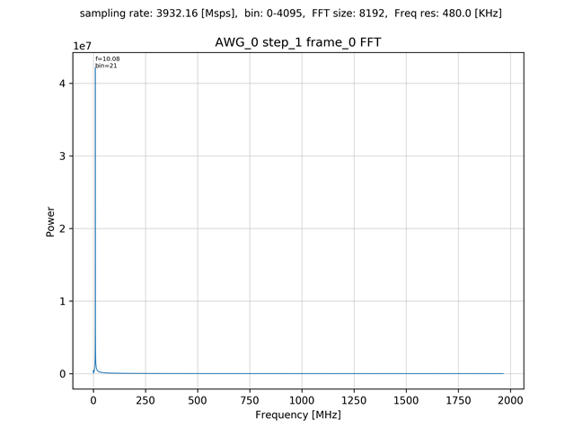
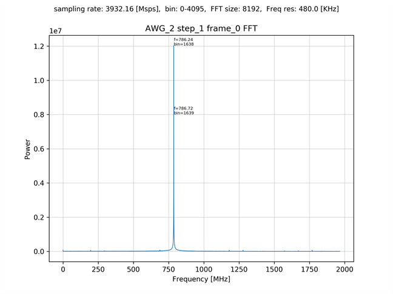
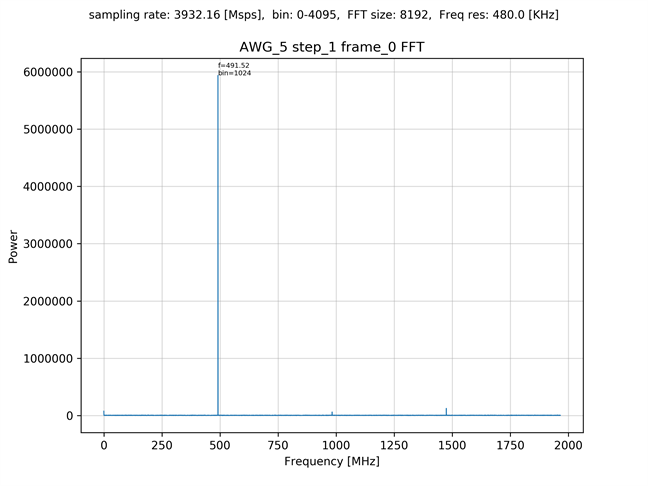

# 8つのAWGから10サイクルの正弦波を出力しキャプチャする (MTS 版)

[mts_awg_x8_send_recv.py](./mts_awg_x8_send_recv.py) は，8つの AWG から特定の周波数の波形を出力し，8 つのキャプチャモジュールでキャプチャするスクリプトです．
出力される波形は，10サイクルの正弦波と出力期間 2.5[us] の正弦波で，どちらも周波数は同じです．
キャプチャデータのうち，10サイクルの正弦波はそのままグラフとして出力され，2.5[us] の正弦波は FFT スペクトルの計算に使用されます．

AWG 0 から出力される波形  


## セットアップ

次のように ADC と DAC を接続します．  


差動入出力を接続する際は，付属の BPF を取り付けた SMA ケーブルで接続します．

## 実行手順と結果

以下のコマンドを実行します．

```
python mts_awg_x8_send_recv.py
```

8つの AWG に対応するキャプチャ波形とスペクトルのグラフが，カレントディレクトリの下の `plot_mts_awg_x8_send_recv_prv_cap_ram` ディレクトリ以下に作成されます．

AWG 0 (LPF 内蔵ポート) の波形のキャプチャデータ  


AWG 2 (HPF 内蔵ポート) の波形のキャプチャデータ  


AWG 5 (差動入出力ポート) の波形のキャプチャデータ  


AWG 0 (LPF 内蔵ポート) の波形のスペクトル  


AWG 2 (HPF 内蔵ポート) の波形のスペクトル  


AWG 5 (差動入出力ポート) の波形のスペクトル  

