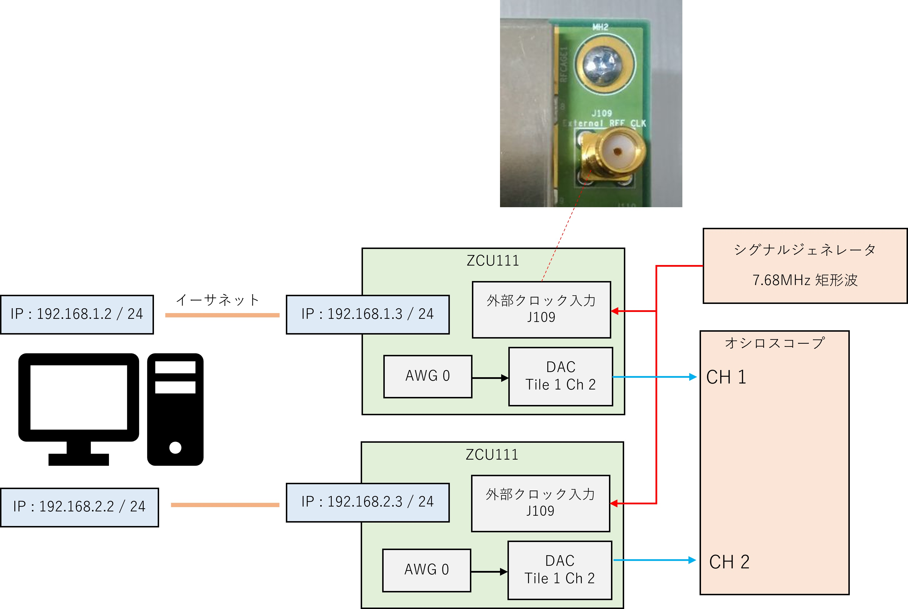

# 2 つの ZCU111 の DAC を同期させる


ZCU111 では，DAC と ADC の動作クロック (下図の緑の信号) は，ボード上のオシレータもしくはボード外部から入力したクロックから生成できます．
[mts_external_clock.py](./mts_external_clock.py) は，2つの ZCU111 に外部から共通のクロックを入力し，異なるボード上の DAC を同期させて波形を出力するスクリプトです．

 

## セットアップ

次のように PC，ZCU111，オシロスコープ，シグナルジェネレータを接続します．
シグナルジェネレータの波形は，7.68MHz の矩形波にしてください．

 

IP アドレス 192.168.2.3 を指定する ZCU111 の SD カードの中にある autostart.sh を以下の様に書き換えます．
```
#!/bin/sh
mount -o ro,remount /run/media/mmcblk0p1

if [ -e /run/media/mmcblk0p1/module/plmem.ko ]; then
  echo 'load user-built plmem.ko'
  insmod /run/media/mmcblk0p1/module/plmem.ko
fi

ifconfig -a | grep eth0
RESULT=$?
if [ $RESULT -eq 0 ]; then
  ifconfig eth0 192.168.2.3
fi

if [ -e /run/media/mmcblk0p1/app/rftool-mod ]; then
  echo 'start user-built rftool-mod'
  /run/media/mmcblk0p1/app/rftool-mod
else
  /usr/bin/rftool-mod
fi
```


## 非同期的な DAC の動作を確認する

以下のコマンドを実行します．

```
python mts_external_clock.py async
```

`async` オプションを付けて mts_external_clock.py を実行すると，DAC の動作クロックをボード上のオシレータから生成するので，異なるボード上の DAC は同期しません．
このとき，同じ構成の DAC から同じ波形 (10MHz の正弦波) を出力しても，時間と共に位相差が変化します．


## 同期的な DAC の動作を確認する

以下のコマンドを実行します．

```
python mts_external_clock.py
```

`async` オプションを付けずに mts_external_clock.py を実行すると，DAC の動作クロックを外部クロックから生成するので，異なるボード上の DAC が同期します．
このとき，異なるボード上の DAC から位相差が変化しない 2つの波形 (10MHz の正弦波) が観察されます．


## ソースクロック選択 API

DAC および ADC のソースクロック選択機能の Python API を以下に示します．
パラメータの詳細や使用例は，各メソッドの docstring やサンプルプログラム（[mts_external_clock.py](./mts_external_clock.py)） を参照してください．

***
**`AwgSaCommand.select_src_clk(clk_sel)`**

|clk_sel|クロックソース|
|:-:|:-:|
ClockSrc.INTERNAL | ボード上のオシレータ
ClockSrc.EXTERNAL | 外部クロック
***
**`AwgSaCommand.get_src_clk()`**

現在選択されているソースクロックを取得します．
***

FPGA のデザインを変更した後と `AwgSaCommand` クラスの `initialize_awg_sa` メソッドを呼んだ後のソースクロックは，ボード上のオシレータになります．
