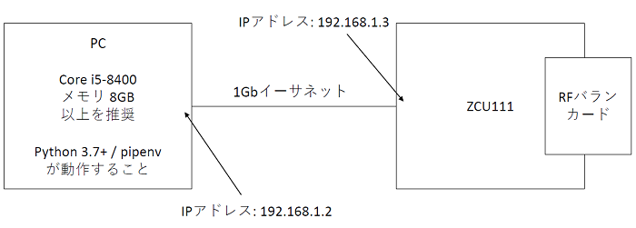

# ホスト PC と ZCU 111 の接続を確認する

[setup_verify.py](./setup_verify.py) は，ホスト PC と ZCU 111 の接続を確認するスクリプトです．

## セットアップ

以下の図のようにホスト PC と ZCU 111 をイーサネットケーブルで接続し IP アドレスを設定します．
ZCU 111 の IP アドレスの初期設定は，192.168.1.3 となっています．  


## 実行手順と結果

以下のコマンドを実行します．

```
python setup_verify.py
```

接続に成功した場合，ターミナルに以下のメッセージが表示されます．
```
connection test succeeded
```

接続に失敗した場合，ターミナルに以下のメッセージが表示されます．
```
exception: timed out
Connection test failed
```
